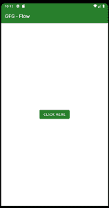

# 什么是 Kotlin 中的 Flow，如何在 Android 项目中使用？

> 原文:[https://www . geeksforgeeks . org/什么是 kotlin 中的流以及如何在 android 中使用它-project/](https://www.geeksforgeeks.org/what-is-flow-in-kotlin-and-how-to-use-it-in-android-project/)

为了异步构建一个应用程序，我们必须使用 RxJava，这也是安卓开发中最重要的主题之一。但是现在在科特林，喷气大脑想出了流量应用编程接口。有了 Kotlin 中的 Flow，我们现在可以按顺序处理数据流了。Flow 是由 JetBrains 开发的 Kotlin 中的一个流处理 API。它是 Reactive Stream 规范的一个实现，该倡议的目标是为顺序执行的异步提供一个标准。喷气大脑在科特林科罗廷的基础上建立了科特林流。在 Kotlin 中，Coroutine 只是 RxJava 的调度程序部分，但现在有了 Flow APIs，它可以成为安卓系统中 RxJava 的替代品。

### **本文我们要构建什么？**

在这篇文章中，我们将学习什么是 Kotlin 中的流，我们还将构建一个简单的安卓应用程序，其中我们将集成 Kotlin 流应用程序接口。

### **科特林的流动是什么？**

Kotlin Flow API 是异步处理按顺序执行的数据流的更好方法。通过使用 Flow 处理值流，我们可以通过编写少量代码，以复杂的多线程方式转换数据。在科特林。

### **分步实施**

**第一步:创建新项目**

要在安卓工作室创建新项目，请参考如何在安卓工作室创建/启动新项目。请注意，选择 Kotlin 作为编程语言。

**第二步:在你的等级文件中添加依赖关系。**

导航到**梯度脚本>构建.梯度(模块:应用)**并添加以下代码。

```kt
implementation "org.jetbrains.kotlinx:kotlinx-coroutines-core:1.3.3"
implementation "org.jetbrains.kotlinx:kotlinx-coroutines-android:1.3.3"
```

导航到**梯度脚本>构建.梯度(模块:项目)**并添加以下代码。

```kt
classpath "org.jetbrains.kotlin:kotlin-gradle-plugin:1.3.61"
```

**步骤 3:使用 activity_main.xml 文件**

导航到 **app > res >布局> activity_main.xml** 并将下面的代码添加到该文件中。下面是**activity _ main . XML**文件的代码。

## 可扩展标记语言

```kt
<?xml version="1.0" encoding="utf-8"?>
<androidx.constraintlayout.widget.ConstraintLayout 
    xmlns:android="http://schemas.android.com/apk/res/android"
    xmlns:app="http://schemas.android.com/apk/res-auto"
    xmlns:tools="http://schemas.android.com/tools"
    android:layout_width="match_parent"
    android:layout_height="match_parent"
    tools:context=".MainActivity">

    <!-- Added a button in constraint layout -->
    <Button
        android:id="@+id/button"
        android:layout_width="wrap_content"
        android:layout_height="wrap_content"
        app:layout_constraintBottom_toBottomOf="parent"
        android:text="Launch Kotlin Flow"
        app:layout_constraintLeft_toLeftOf="parent"
        app:layout_constraintRight_toRightOf="parent"
        app:layout_constraintTop_toTopOf="parent"
        android:backgroundTint="237E26"/>

</androidx.constraintlayout.widget.ConstraintLayout>
```

**第 4 步:使用 MainActivity.kt 文件**

在活动的 onCreate()函数中，创建两个名为**begin flow()**&**btnClicks()的函数。**在 beginFlow()函数中，我们将定义流，在 btnClicks()函数中，我们将单击按钮显示从流中发出的数据。

## 我的锅

```kt
package com.mrtechy.gfg_flow

import android.content.ContentValues.TAG
import androidx.appcompat.app.AppCompatActivity
import android.os.Bundle
import android.util.Log
import android.widget.Button
import kotlinx.coroutines.CoroutineScope
import kotlinx.coroutines.Dispatchers
import kotlinx.coroutines.delay
import kotlinx.coroutines.flow.Flow
import kotlinx.coroutines.flow.collect
import kotlinx.coroutines.flow.flow
import kotlinx.coroutines.flow.flowOn
import kotlinx.coroutines.launch

class MainActivity : AppCompatActivity() {

    // declared a lateinit variable of Flow of Int type
    lateinit var flow: Flow<Int>

    override fun onCreate(savedInstanceState: Bundle?) {
        super.onCreate(savedInstanceState)
        setContentView(R.layout.activity_main)

          // beginFlow function called
        beginFlow()

          // btnClick function called
        btnClicks()
    }

    // declared beginFlow()
    private fun beginFlow() {
        flow = flow {
            Log.d(TAG, "flow Start")
            (0..10).forEach {
                // Emit items with 500 milliseconds delay
                delay(500)
                Log.d(TAG, "Emitting value $it")
                emit(it)

            }
        }.flowOn(Dispatchers.Default)
    }

    // declared btnClicks()
    private fun btnClicks() {
        val button = findViewById<Button>(R.id.button)
        button.setOnClickListener {
            CoroutineScope(Dispatchers.Main).launch {
                flow.collect {
                    Log.d(TAG, it.toString())
                }
            }
        }
    }
}
```

**beginFlow()描述:**

*   它会以 500 毫秒的延迟发出从 0 到 10 的值。
*   emit()函数用于发出数字。它是可用作接收器的流量收集器的一部分。
*   flowOn()类似于 RxJava 中的 subscribeOn()
*   上面写的代码将在后台运行。

**BTN nick()描述:**

*   flow.collect 现在将作为 Dispatchers 在主线程上开始从流中提取值。Main 用于在 CoroutineScope 中启动 coroutine 构建器
*   当我们点击按钮时，它会一个接一个地打印数值。

### **输出:**

每当你点击**点击这里**按钮，你会在你的日志窗口看到如下输出。



**对数猫输出：**

```kt
flow Start
Emitting value 0
0
Emitting value 1
1
Emitting value 2
2
Emitting value 3
3
Emitting value 4
4
Emitting value 5
5
Emitting value 6
6
Emitting value 7
7

Emitting value 8
8
Emitting value 9
9
Emitting value 10
10
```