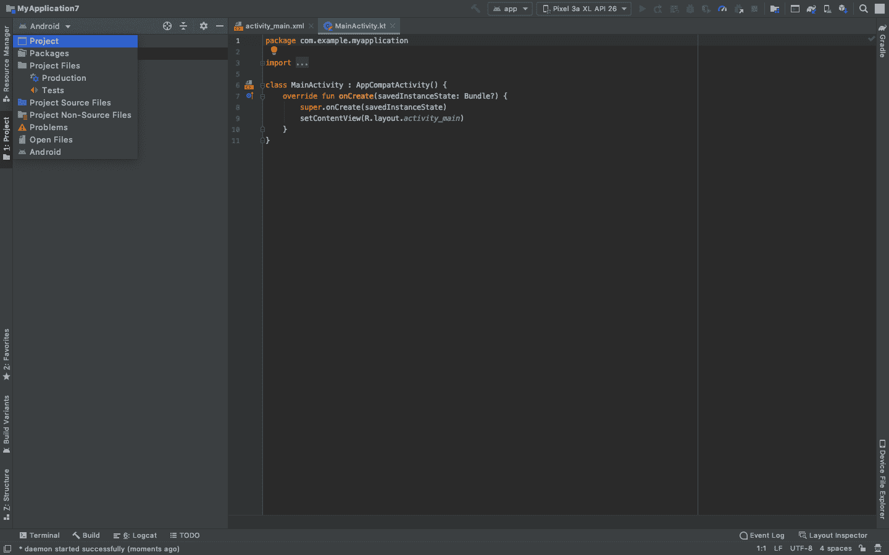
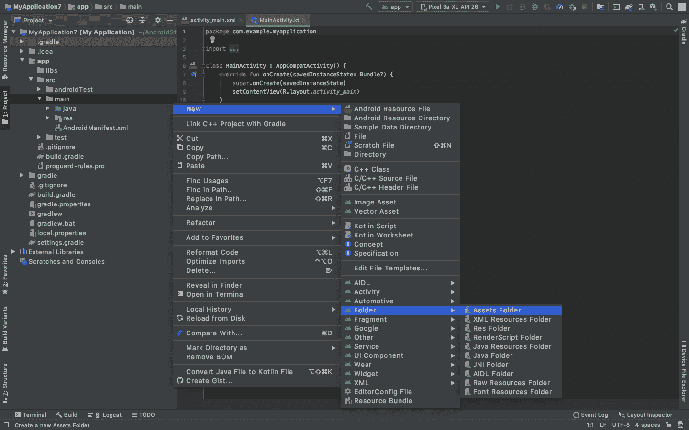
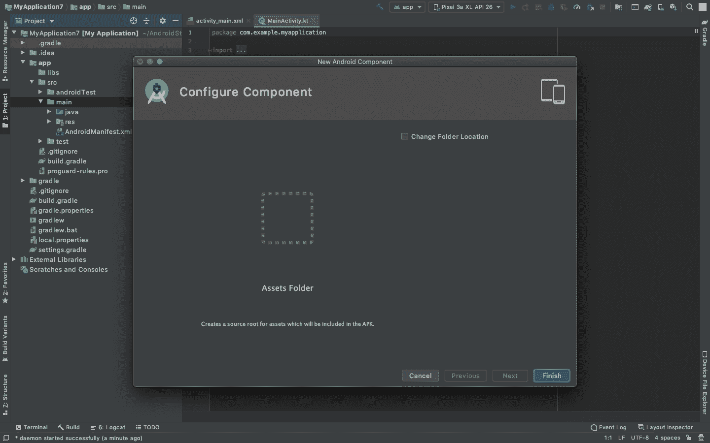
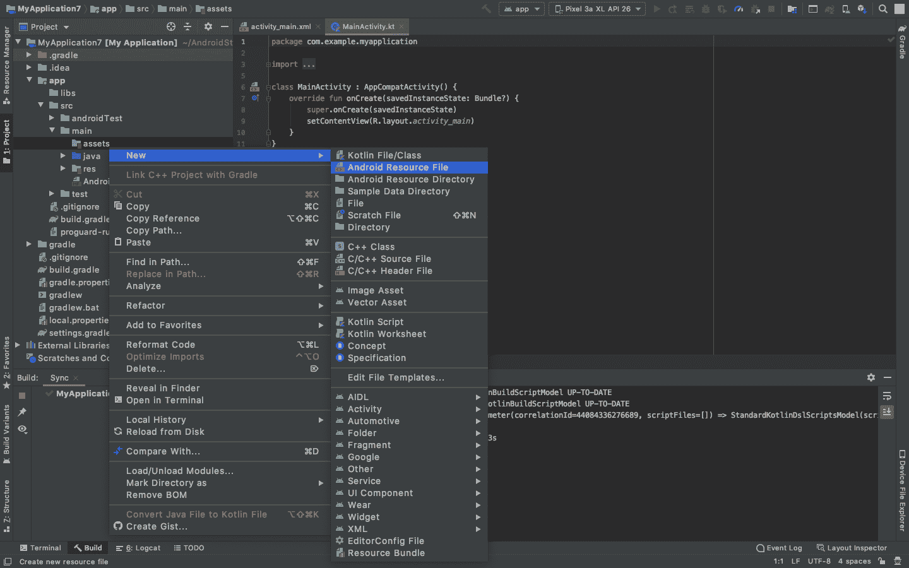
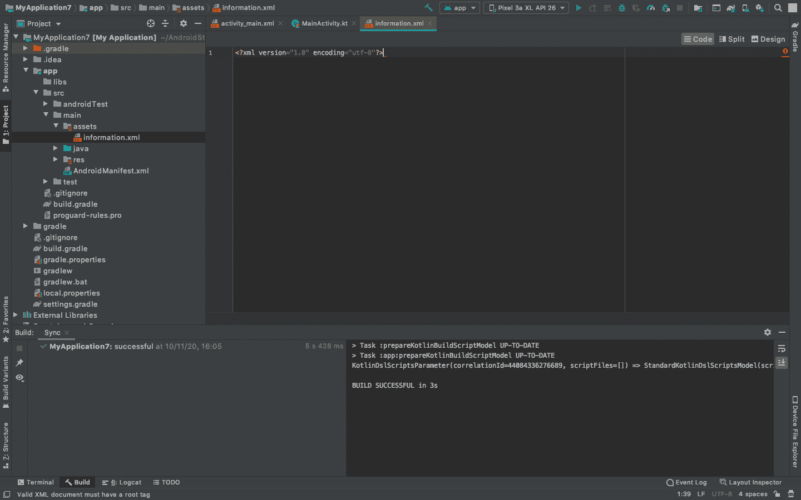
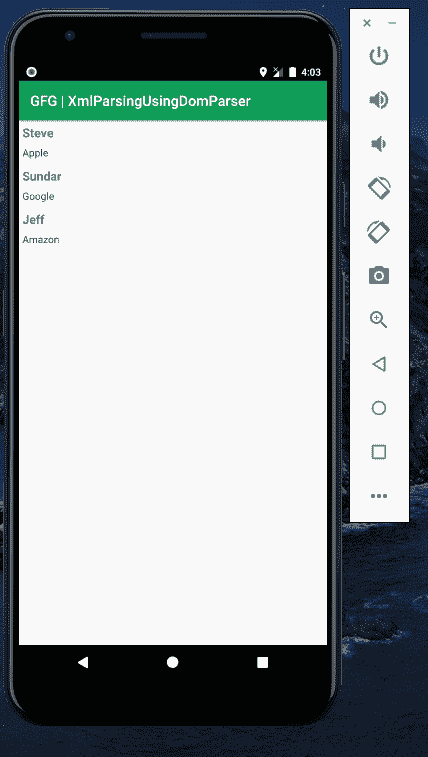

# 使用 DOM 解析器在安卓系统中解析 XML

> 原文:[https://www . geesforgeks . org/XML-Android 中解析-使用-dom-parser/](https://www.geeksforgeeks.org/xml-parsing-in-android-using-dom-parser/)

安卓 [**DOM(文档对象模型)**](https://www.geeksforgeeks.org/dom-document-object-model/) 解析器是一个解析 XML 文档并从中提取所需信息的程序。这个解析器使用基于对象的方法来创建和解析 XML 文件。一般来说，DOM 解析器会将 XML 文件加载到安卓内存中来解析 XML 文档。这会导致更多的内存消耗。文档通过 XML 文件中的每个可能节点进行解析。包含要提取的信息的 XML 文件包括以下四个主要组件:

1.  **序言:**XML 文件将以序言开始。Prolog 包含关于文件的信息，可以在第一行找到。
2.  **事件:**文档开始和结束、标签开始和结束等事件。包含在 XML 文件中
3.  **文本:**它是一个简单的文本，位于开始和结束的 XML 标签元素之间。
4.  **属性:**它们是标签中存在的标签的附加属性。

注意，我们将使用 **Kotlin** 语言来实现这个项目。还可以用另外两种方式执行 XML 解析。请参考以下文章:

*   [使用 SAX 解析器在安卓系统中解析 XML](https://www.geeksforgeeks.org/xml-parsing-in-android-using-sax-parser/)
*   [使用 XmlPullParser 在安卓系统中解析 XML](https://www.geeksforgeeks.org/xml-parsing-in-android-using-xmlpullparser/)

### 我们要做什么？

1.  我们需要一个带有一些信息的 **XML 文件**，这样我们就可以制作一个。将此文件放在**资产文件夹**下。这个文件被调用并被解析。
2.  我们希望以列表的形式显示这些数据，以实现列表视图。
3.  在 Main 程序中，我们从 assets 文件夹中调用了信息文件(在 assets 文件夹下)，这是作为输入流提供的。
4.  使用 **DocumentBuilderFactory** ，我们将创建一个新的实例。
5.  使用**文档生成器**，我们生成一个新的文档生成器。
6.  使用**文档方法**，我们解析**输入流**。
7.  由于信息是节点的形式，我们将创建一个**节点列表**，并使用 **FOR** 循环遍历每个节点。
8.  特定的信息将在这个循环中被提取出来，并添加到一个列表中(在代码的前面已经声明)。
9.  使用**列表适配器**，数据被广播到列表视图布局文件中。

### 方法

要在安卓系统中使用 DOM 解析器解析 XML 文件，我们需要遵循以下步骤:

**第一步:创建新项目**

要在安卓工作室创建新项目，请参考[如何在安卓工作室创建/启动新项目](https://www.geeksforgeeks.org/android-how-to-create-start-a-new-project-in-android-studio/)。注意选择**科特林**作为编程语言。

**步骤 2:创建资产文件夹**

在**项目布局**中的**主文件夹**下创建**资产**文件夹。在这个文件夹中创建一个**安卓资源文件**，我们将把**信息**以 **XML** 的形式放进去。将此文件命名为 **information.xml** 。为此，请参考以下步骤:

点击项目，如下图左侧所示。



展开直到找到主文件夹，右键点击，转到**新建>文件夹>资产文件夹**



然后点击完成按钮。



现在，资产文件夹已成功创建。右键点击**资产文件夹>新建>安卓资源文件**



将其命名为信息，将类型更改为 XML，然后完成。

> **注意:**有时，右键单击资产文件夹并创建安卓资源文件**会在 res 文件夹**中创建一个文件。如果发生这种情况，**剪切**我们的文件并**将其直接粘贴到**资产文件夹**中。这是由于一些内部设置造成的。**



粘贴该信息，该信息以 XML 的形式显示在 **information.xml** 文件中。下面是 **information.xml** 文件的代码。

## 可扩展标记语言

```
<?xml version="1.0" encoding="utf-8"?>
<users>
    <user>
        <name>Steve</name>
        <designation>Apple</designation>
    </user>
    <user>
        <name>Sundar</name>
        <designation>Google</designation>
    </user>
    <user>
        <name>Jeff</name>
        <designation>Amazon</designation>
    </user>
</users>
```

**步骤 3:使用 activity_main.xml 文件**

现在转到 **activity_main.xml** 文件，该文件表示应用程序的用户界面。创建一个 [**列表视图**](https://www.geeksforgeeks.org/android-listview-in-kotlin/) 如图所示。下面是**activity _ main . XML**文件的代码。

## 可扩展标记语言

```
<?xml version="1.0" encoding="utf-8"?>
<LinearLayout 
    xmlns:android="http://schemas.android.com/apk/res/android"
    android:layout_width="fill_parent"
    android:layout_height="fill_parent"
    android:orientation="vertical">

    <!--ListView to display the list-->
    <ListView
        android:id="@+id/user_list"
        android:layout_width="fill_parent"
        android:layout_height="wrap_content"
        android:dividerHeight="1dp" />
</LinearLayout>
```

**第四步:创建另一个布局文件**

转到 **app > res >布局>右键单击>新建>布局资源文件**并将文件命名为**列表。list.xml** 文件用于显示**列表视图**中的数据。下面是 **list.xml** 文件的代码。

## 可扩展标记语言

```
<?xml version="1.0" encoding="utf-8"?>
<RelativeLayout 
    xmlns:android="http://schemas.android.com/apk/res/android"
    android:layout_width="fill_parent"
    android:layout_height="wrap_content"
    android:orientation="horizontal"
    android:padding="5dip">

    <!--textView to show the name node-->
    <TextView
        android:id="@+id/name"
        android:layout_width="wrap_content"
        android:layout_height="wrap_content"
        android:textSize="17dp"
        android:textStyle="bold" />

    <!--textView to show the designation node-->
    <TextView
        android:id="@+id/designation"
        android:layout_width="wrap_content"
        android:layout_height="wrap_content"
        android:layout_below="@id/name"
        android:layout_marginTop="7dp"
        android:textColor="#343434"
        android:textSize="14dp" />

</RelativeLayout>
```

**步骤 5:使用 MainActivity.kt 文件**

最后转到 **MainActivity.kt** 文件，参考下面的代码。下面是 **MainActivity.kt** 文件的代码。代码中添加了注释，以更详细地理解代码。

## 我的锅

```
import android.os.Bundle
import android.widget.ListAdapter
import android.widget.ListView
import android.widget.SimpleAdapter
import androidx.appcompat.app.AppCompatActivity
import org.w3c.dom.Document
import org.w3c.dom.Element
import org.w3c.dom.Node
import org.w3c.dom.NodeList
import org.xml.sax.SAXException
import java.io.IOException
import java.io.InputStream
import javax.xml.parsers.DocumentBuilder
import javax.xml.parsers.DocumentBuilderFactory
import javax.xml.parsers.ParserConfigurationException

open class MainActivity : AppCompatActivity() {
    override fun onCreate(savedInstanceState: Bundle?) {
        super.onCreate(savedInstanceState)
        setContentView(R.layout.activity_main)

        // Try and Catch for avoiding the application to crash
        try {

            // This list will contain the data from the information.xml file
            val userList: ArrayList<HashMap<String, String?>> = ArrayList()

            // This listView will display the data from the information.xml file
            val lv = findViewById<ListView>(R.id.user_list)

            // The information.xml file will be taken in the form of input stream
            val istream: InputStream = assets.open("information.xml")

            // Steps to convert this input stream into a list
            val builderFactory: DocumentBuilderFactory = DocumentBuilderFactory.newInstance()
            val docBuilder: DocumentBuilder = builderFactory.newDocumentBuilder()
            val doc: Document = docBuilder.parse(istream)
            val nList: NodeList = doc.getElementsByTagName("user")

            // Iterating through this list
            for (i in 0 until nList.length) {
                if (nList.item(0).nodeType === Node.ELEMENT_NODE) {
                    val user: HashMap<String, String?> = HashMap()
                    val elm: Element = nList.item(i) as Element
                    user["name"] = getNodeValue("name", elm)
                    user["designation"] = getNodeValue("designation", elm)
                    userList.add(user)
                }
            }

            // Using Adapter to broadcast the information extracted
            val adapter: ListAdapter = SimpleAdapter(
                this,
                userList,
                R.layout.list,
                arrayOf("name", "designation"),
                intArrayOf(R.id.name, R.id.designation)
            )
            lv.adapter = adapter
        } catch (e: IOException) {
            e.printStackTrace()
        } catch (e: ParserConfigurationException) {
            e.printStackTrace()
        } catch (e: SAXException) {
            e.printStackTrace()
        }
    }

    // A function to get the node value while parsing
    private fun getNodeValue(tag: String?, element: Element): String? {
        val nodeList = element.getElementsByTagName(tag)
        val node = nodeList.item(0)
        if (node != null) {
            if (node.hasChildNodes()) {
                val child = node.firstChild
                while (child != null) {
                    if (child.nodeType == Node.TEXT_NODE) {
                        return child.nodeValue
                    }
                }
            }
        }
        // Returns nothing if nothing was found
        return ""
    }
}
```

### **输出:在仿真器上运行**

