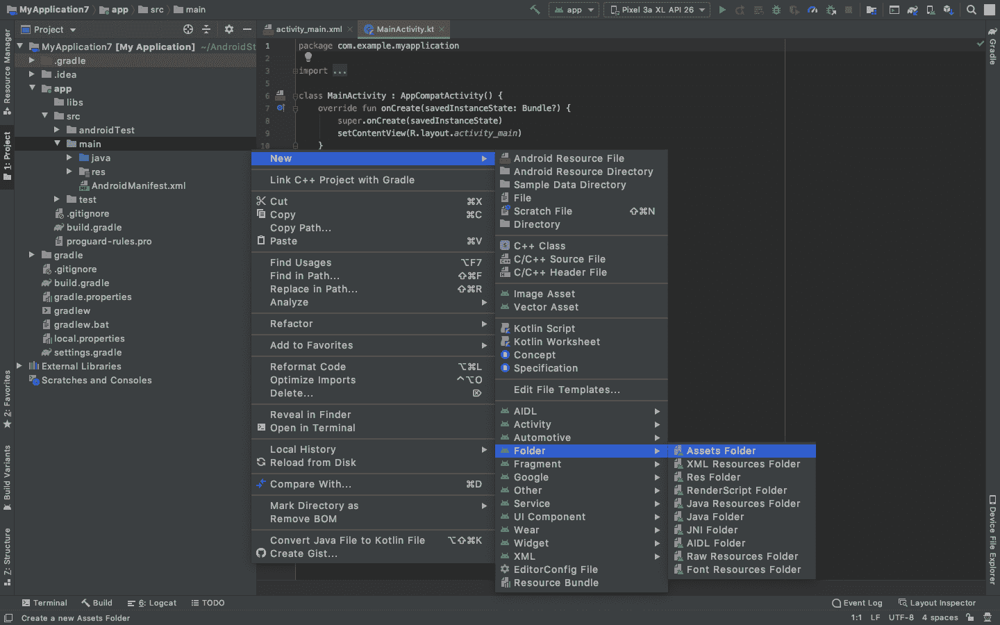
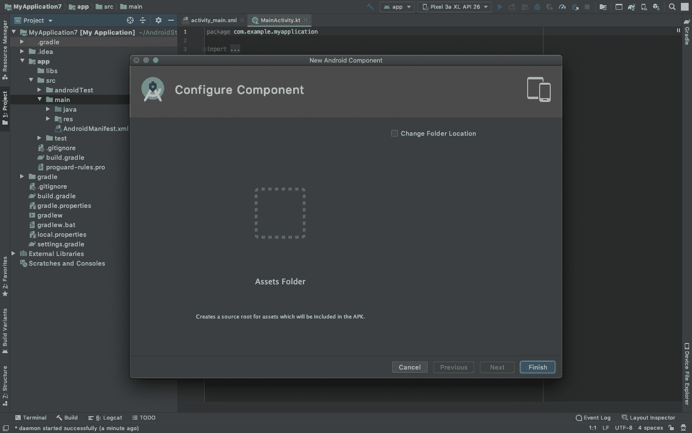

# 使用 SAX 解析器在安卓系统中解析 XML

> 原文:[https://www . geesforgeks . org/XML-Android 中解析-使用-sax-parser/](https://www.geeksforgeeks.org/xml-parsing-in-android-using-sax-parser/)

一般来说， **XML(可扩展标记语言)**是一种常用的交换服务器数据的数据交换格式。在安卓系统中， **SAX** 代表**XML**的简单 API，是一个广泛使用的 XML 解析 API。像 DOM 解析器一样，SAX 解析器也用于执行内存中的操作来解析 XML 文档，但是它比 DOM 解析器消耗的内存少。SAX 解析器相对于 DOM 解析器的主要优势是**可以指示 SAX 解析器在文档中途停止，而不会丢失任何收集的数据。**包含要提取的信息的 XML 文件包括以下四个主要组件:

1.  **序言:**XML 文件将以序言开始。Prolog 包含关于文件的信息，可以在第一行找到。
2.  **事件:**文档开始和结束、标签开始和结束等事件。包含在 XML 文件中
3.  **文本:**它是一个简单的文本，位于开始和结束的 XML 标签元素之间。
4.  **属性:**它们是标签中存在的标签的附加属性。

注意，我们将使用 **Kotlin** 语言来实现这个项目。还可以用另外两种方式执行 XML 解析。请参考以下文章:

*   [使用 DOM 解析器在安卓系统中解析 XML](https://www.geeksforgeeks.org/xml-parsing-in-android-using-dom-parser/)
*   [使用 XmlPullParser 在安卓系统中解析 XML](https://www.geeksforgeeks.org/xml-parsing-in-android-using-xmlpullparser/)

### **我们要做什么？**

1.  我们需要一个包含一些信息的 XML 文件，这样我们就可以制作一个。将该文件放在**资产文件夹**下。这个文件被调用并被解析。
2.  我们希望以列表的形式显示这些数据，以实现[列表视图](https://www.geeksforgeeks.org/android-listview-in-kotlin/)。
3.  SAX 解析器逐个字符地检查 XML 文件，并将 XML 文件翻译成一系列事件，例如 **startElement()** 、 **endElement()** 和 **characters()** 。
4.  一个 **ContentHandler** 对象将处理这些事件以执行适当的操作。 **parse()** 方法会将事件发送到内容对象来处理它们。
5.  在 android 应用程序中创建一个**saxperserfactory**、**saxpressor、**和 **DefaultHandler** 对象的实例，使用 Android 中的 SAX 解析器读取和解析 XML 数据。
6.  使用**列表适配器**，数据被发送到**列表视图**，并在屏幕上显示。

### **接近**

要在 Android 中使用 SAX 解析器解析 XML 文件，请执行以下步骤:

**第一步:创建新项目**

要在安卓工作室创建新项目，请参考[如何在安卓工作室创建/启动新项目](https://www.geeksforgeeks.org/android-how-to-create-start-a-new-project-in-android-studio/)。注意选择**科特林**作为编程语言。

**步骤 2:创建资产文件夹**

在**项目布局**中的**主文件夹**下创建**资产**文件夹。在这个文件夹中创建一个**安卓资源文件**，我们将把**信息**以 **XML** 的形式放进去。将此文件命名为 **userdetails.xml** 。为此，请参考以下步骤:

点击项目，如下图左侧所示。


展开直到找到主文件夹，右键点击，转到**新建>文件夹>资产文件夹**



然后点击完成按钮。



现在，资产文件夹已成功创建。右键点击**资产文件夹>新建>安卓资源文件**


将其命名为信息，将类型更改为 XML，然后完成。

> ***注意:**有时，右键单击资产文件夹并创建安卓资源文件**会在 res 文件夹**中创建一个文件。如果出现这种情况，**剪切**我们的文件，**直接粘贴**到**资产文件夹**中。这是由于一些内部设置造成的。*


以 XML 的形式粘贴这些信息，显示在 **userdetails.xml** 文件中。下面是 **userdetails.xml** 文件的代码。

## 可扩展标记语言

```kt
<?xml version="1.0" encoding="utf-8"?>
<users>
    <user>
        <name>Satya</name>
        <designation>CTO</designation>
    </user>
    <user>
        <name>Ajaypal</name>
        <designation>CEO</designation>
    </user>
    <user>
        <name>Mark</name>
        <designation>Consultant</designation>
    </user>
</users>
```

**步骤 3:使用 activity_main.xml 文件**

现在转到 **activity_main.xml** 文件，该文件表示应用程序的用户界面。创建一个 [**列表视图**](https://www.geeksforgeeks.org/android-listview-in-kotlin/) 如图所示。下面是**activity _ main . XML**文件的代码。

## 可扩展标记语言

```kt
<?xml version="1.0" encoding="utf-8"?>
<LinearLayout 
    xmlns:android="http://schemas.android.com/apk/res/android"
    android:layout_width="fill_parent"
    android:layout_height="fill_parent"
    android:orientation="vertical" >

    <!--A list View that will show the list elements-->
    <ListView
        android:id="@+id/user_list"
        android:layout_width="fill_parent"
        android:layout_height="wrap_content"
        android:dividerHeight="1dp" />
</LinearLayout>
```