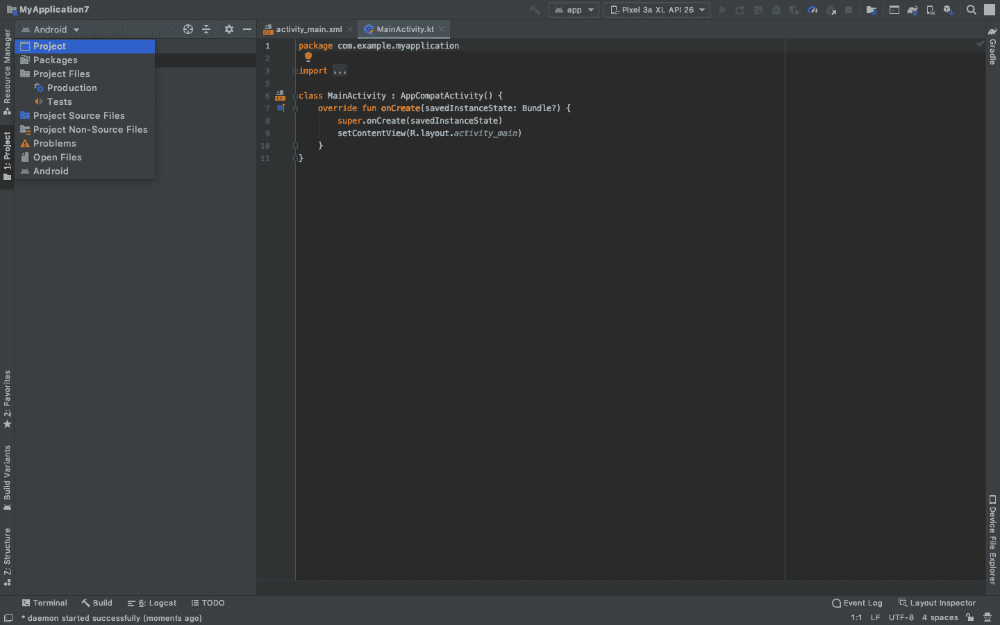

# 使用 XmlPullParser 在安卓系统中解析 XML

> 原文:[https://www . geesforgeks . org/XML-解析-in-Android-using-xmlpullparser/](https://www.geeksforgeeks.org/xml-parsing-in-android-using-xmlpullparser/)

在 android 中， **XMLPullParser** 接口提供了在 android 应用中解析 XML 文件的功能。与其他解析器方法(如 DOM Parser 和 SAX Parser)相比，XMLPullParser 是一种简单有效的解析 XML 数据的解析器方法。XMLPullParser 有一个方法 **next()** ，提供对高级解析事件的访问。 **next()** 方法将解析器推进到下一个事件。以下是 **XMLPullParser** 中可用的一系列事件，将通过 **next()** 方法查看。

1.  **START_DOCUMENT:** 解析器开始处理 XML 文档。
2.  **START_TAG:** 在这个事件中，我们可以得到 XML 格式的 START 标签。
3.  **TEXT:** 在这个事件中，我们可以使用 getText()方法读取文本内容。
4.  **END_TAG:** 读取了一个结束标记。
5.  **END_DOCUMENT:** 没有更多事件可用。

注意，我们将使用 **Kotlin** 语言来实现这个项目。还可以用另外两种方式执行 XML 解析。请参考以下文章:

*   [使用 DOM 解析器在安卓系统中解析 XML](https://www.geeksforgeeks.org/xml-parsing-in-android-using-dom-parser/)
*   [使用 SAX 解析器在安卓系统中解析 XML](https://www.geeksforgeeks.org/xml-parsing-in-android-using-sax-parser/)

### **我们要做什么？**

**XMLPullParser** 通过一系列事件，如 **START_DOCUMENT、START_TAG、TEXT、END_TAG、**和 **END_DOCUMENT** 对 XML 文档进行解析。要在 android 中使用 **XMLPullParser** 读取和解析 XML 文件，需要创建一个 **XMLPullParserFactory、**和 **XMLPullParser** 的实例。

### **接近**

要在安卓系统中使用 DOM 解析器解析 XML 文件，我们需要遵循以下步骤:

**第一步:创建新项目**

要在安卓工作室创建新项目，请参考[如何在安卓工作室创建/启动新项目](https://www.geeksforgeeks.org/android-how-to-create-start-a-new-project-in-android-studio/)。注意选择**科特林**作为编程语言。

**步骤 2:创建资产文件夹**

在**项目布局**中的**主文件夹**下创建**资产**文件夹。在这个文件夹中创建一个**安卓资源文件**，我们将把**信息**以 **XML** 的形式放进去。将此文件命名为 **userdetails.xml** 。为此，请参考以下步骤:

点击项目，如下图左侧所示。



展开直到找到主文件夹，右键点击，转到**新建>文件夹>资产文件夹**


然后点击完成按钮。


现在，资产文件夹已成功创建。右键点击**资产文件夹>新建>安卓资源文件**


将其命名为信息，将类型更改为 XML，然后完成。

> ***注意:**有时，右键单击资产文件夹并创建安卓资源文件**会在 res 文件夹**中创建一个文件。如果出现这种情况，**剪切**我们的文件，**直接粘贴**到**资产文件夹**中。这是由于一些内部设置造成的。*


以 XML 的形式粘贴这些信息，显示在 **userdetails.xml** 文件中。下面是 **userdetails.xml** 文件的代码。

## 可扩展标记语言

```
<?xml version="1.0" encoding="utf-8"?>
<users>
    <user>
        <name>Tom</name>
        <designation>Actor and Producer</designation>
    </user>
    <user>
        <name>Danny</name>
        <designation>Music Director</designation>
    </user>
    <user>
        <name>Christopher</name>
        <designation>Writer</designation>
    </user>
</users>
```

**步骤 3:使用 activity_main.xml 文件**

现在转到 **activity_main.xml** 文件，该文件表示应用程序的用户界面。创建一个 [**列表视图**](https://www.geeksforgeeks.org/android-listview-in-kotlin/) 如图所示。下面是**activity _ main . XML**文件的代码。

## 可扩展标记语言

```
<?xml version="1.0" encoding="utf-8"?>
<LinearLayout 
    xmlns:android="http://schemas.android.com/apk/res/android"
    android:layout_width="fill_parent"
    android:layout_height="fill_parent"
    android:orientation="vertical" >

    <!--Display the list from list_row file-->
    <ListView
        android:id="@+id/user_list"
        android:layout_width="fill_parent"
        android:layout_height="wrap_content"
        android:dividerHeight="1dp" />

</LinearLayout>
```

**第四步:创建另一个布局文件**

转到 **app > res >布局>右键单击>新建>布局资源文件**并将文件命名为**列表 _ 行。list_row.xml** 文件用于显示**列表视图**中的数据。下面是 **list_row.xml** 文件的代码。

## 可扩展标记语言

```
<?xml version="1.0" encoding="utf-8"?>
<RelativeLayout 
    xmlns:android="http://schemas.android.com/apk/res/android"
    android:layout_width="fill_parent"
    android:layout_height="wrap_content"
    android:orientation="horizontal"
    android:padding="5dip">

    <!--TextView to display the name 
        from the userdetails file-->
    <TextView
        android:id="@+id/name"
        android:layout_width="wrap_content"
        android:layout_height="wrap_content"
        android:textSize="17dp"
        android:textStyle="bold" />

    <!--TextView to display the designation 
        from the userdetails file-->
    <TextView
        android:id="@+id/designation"
        android:layout_width="wrap_content"
        android:layout_height="wrap_content"
        android:layout_below="@id/name"
        android:layout_marginTop="7dp"
        android:textColor="#343434"
        android:textSize="14dp" />

</RelativeLayout>
```

**步骤 5:使用 MainActivity.kt 文件**

最后转到 **MainActivity.kt** 文件，参考下面的代码。下面是 **MainActivity.kt** 文件的代码。代码中添加了注释，以更详细地理解代码。

## 我的锅

```
import android.os.Bundle
import android.widget.ListAdapter
import android.widget.ListView
import android.widget.SimpleAdapter
import androidx.appcompat.app.AppCompatActivity
import org.xmlpull.v1.XmlPullParser
import org.xmlpull.v1.XmlPullParserException
import org.xmlpull.v1.XmlPullParserFactory
import java.io.IOException
import java.util.*

class MainActivity : AppCompatActivity() {
    override fun onCreate(savedInstanceState: Bundle?) {
        super.onCreate(savedInstanceState)
        setContentView(R.layout.activity_main)
        try {

            // creating a user list string hash map arraylist
            val userList = ArrayList<HashMap<String, String?>>()

            // creating a user string hashmap
            var user = HashMap<String, String?>()

            // declaring the list view from the layout file
            val lv = findViewById<ListView>(R.id.user_list)

            // input stream the userdetails.xml file
            val istream = assets.open("userdetails.xml")

            //creating a XmlPull parse Factory instance
            val parserFactory = XmlPullParserFactory.newInstance()
            val parser = parserFactory.newPullParser()

            // setting the namespaces feature to false
            parser.setFeature(XmlPullParser.FEATURE_PROCESS_NAMESPACES, false)

            // setting the input to the parser
            parser.setInput(istream, null)

            // working with the input stream
            var tag: String? = ""
            var text: String? = ""
            var event = parser.eventType
            while (event != XmlPullParser.END_DOCUMENT) {
                tag = parser.name
                when (event) {
                    XmlPullParser.START_TAG -> if (tag == "user") user = HashMap()
                    XmlPullParser.TEXT -> text = parser.text
                    XmlPullParser.END_TAG -> when (tag) {
                        "name" -> user["name"] = text
                        "designation" -> user["designation"] = text
                        "user" -> userList.add(user)
                    }
                }
                event = parser.next()
            }

            // List Adapter to broadcast the information to the list_rows.xml file
            val adapter: ListAdapter = SimpleAdapter(this, userList, R.layout.list_row,
                arrayOf("name", "designation"), intArrayOf(R.id.name, R.id.designation)
            )
            lv.adapter = adapter
        } catch (e: IOException) {
            e.printStackTrace()
        } catch (e: XmlPullParserException) {
            e.printStackTrace()
        }
    }
}
```

### **输出:在仿真器上运行**

