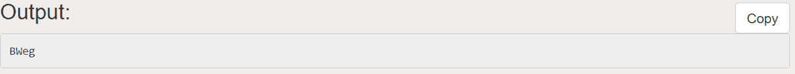
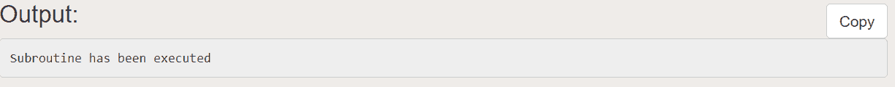
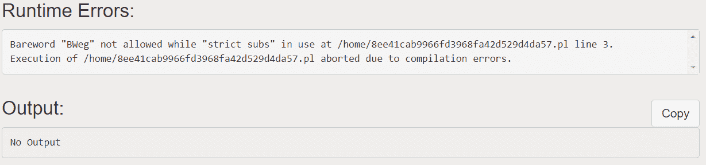
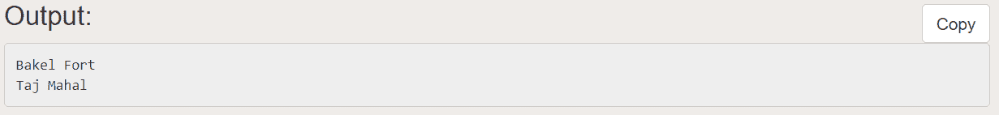

# Perl 中的基本词汇

> 原文:[https://www.geeksforgeeks.org/barewords-in-perl/](https://www.geeksforgeeks.org/barewords-in-perl/)

像任何其他语言一样，Perl 也容易出错。Perl 中的一些特性很难正确使用。Perl 的解析器在一些符号的帮助下理解 Perl 的运算符、函数和方法。但情况并非总是如此。当我们使用**准系统**时，解析器必须进行猜测。准系统是没有必要符号或标点的标识符或变量。简单来说，我们可以说**无引号的词**(即无引号的字符串)。即使 Perl 中的严格规则不鼓励使用不明确的裸词，其中一些仍然可以被解析器接受。

**例:**

```
#!usr/bin/perl
my $bw = BWeg;
print "$bw\n";
```



这将打印 BWeg。但是当我们使用同名的子程序时，情况会怎样呢？

**例:**

```
#!usr/bin/perl
sub BWeg
{
    return "Subroutine has been executed";
}

$bw = BWeg;
print "$bw\n";
```



这里我们可以看到子程序已经被执行了。所以我们也可以说，推辞造成歧义。为了避免这种歧义，Perl 有“使用严格”的说法。使用严格是为了使 Perl 程序不容易出错。

**例:**

```
#!usr/bin/perl
use strict;
my $bw = BWeg;
print "$bw\n";
```

它会发出这样的编译错误。


### 如何正确使用准考证？

准系统可以用于[哈希](https://www.geeksforgeeks.org/perl-hash/)键、包名、常量、命名代码块。

**例:**

```
#!usr/bin/perl
my %India = (UP =>'Taj Mahal',
Rajastan =>'Chittorgarh', 
Kerala =>'Bakel Fort');

# Prints Bakel Fort
my $var1 = $India{'Kerala'}; 
print($var1, "\n");

# Prints Taj Mahal
my $var2 = $India{UP}; 
print($var2, "\n");
```



通常，Perl 中的哈希键是明确的。在这里我们可以看到，我们用两种方式将关键函数声明为$India{'Kerala'}和$India{UP}。尽管它们的声明不同，但它们会给出输出。

### 裸露包装名称

包名也是裸字。Perl 必须确定如何解析**包- >方法**。为此，我们强制解析器通过附加包分隔符(::)将包视为包名。

### 裸字命名代码块

特殊命名的代码块 AUTOLOAD、BEGIN、CHECK、DESTROY、END、INIT 和 UNITCHECK 是空白。

```
package Monkey::Butler;
BEGIN { initialize_simians( __PACKAGE__ ) }
sub AUTOLOAD { ... }
```

我们可以从 AUTOLOAD 中分离 sub，但这不是一种常见的做法。

### 正向常数

用常量 pragma 声明的常量可以用作裸词。

```
# don't use this for real authentication
#!usr/bin/perl
    use constant NAME => 'GeeksForGeeks';
    use constant PASSWORD => 'GeeksPl@tform';
    $name=;
    $pass=; 
return unless $name eq NAME && $pass eq PASSWORD;
```

如果给出了错误的用户名和密码，则返回 false。此外，常量不会插入双引号字符串中。