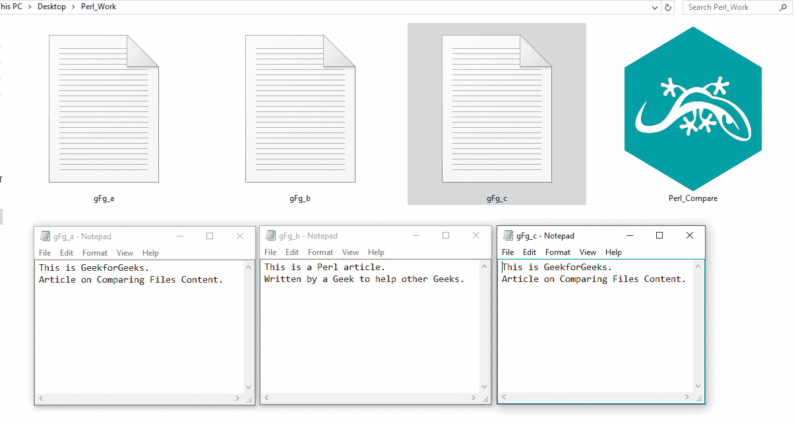
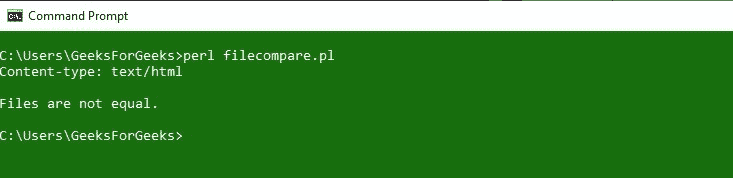

# 使用 Perl 比较文件内容

> 原文:[https://www . geesforgeks . org/comparison-content-of-file-use-perl/](https://www.geeksforgeeks.org/comparing-content-of-files-using-perl/)

在 [Perl](https://www.geeksforgeeks.org/introduction-to-perl/) 中，我们可以使用 **`File::Compare`** 模块轻松比较两个文件的内容。该模块提供了一个名为`**compare**`的函数，该函数有助于比较指定给它作为参数的两个文件的内容。如果两个文件中存在的数据出来是相同的，则函数返回 **0** 作为输出，如果传递的文件中的数据不同，则返回值为 **1** ，如果访问指定/传递的文件时出现错误，则返回值为 **-1** 。

**语法:**

```
use File::Compare;
$compare = compare('FILE_NAME_1', 'FILE_NAME_2');

```

**注:**

> *   **Same content: return value **[0]*****   **Different contents: return value **[1]*****   **Error accessing file: return value **[-1]****

**示例:**

**文件夹中存在的文件。**


**当文件的内容相同时:**

```
#!/usr/bin/perl
print "Content-type: text/html\n\n";

# Module to use compare function
use File::Compare;

# compare function to access the passed files.
$compare = compare("gfg_a.txt", "gfg_c.txt");

# checking if the files are same
if ($compare == 0)
{
    print "Files are equal. \n";
}

# checking if the files are different
elsif ($compare == 1)
{
    print "Files are not equal. \n";
}

# checking if the file is not accessible
elsif($compare == -1)
{
    print "Error Occured. \n";
}

exit;
```

**输出:**


**当文件的内容不同时:**

```
#!/usr/bin/perl
print "Content-type: text/html\n\n";

# Module to use compare function
use File::Compare;

# compare function to access the passed files.
$compare = compare("gfg_a.txt", "gfg_b.txt");

# checking if the files are same
if ($compare == 0)
{
    print "Files are equal. \n";
}

# checking if the files are different
elsif ($compare == 1)
{
    print "Files are not equal. \n";
}

# checking if the file is not accessible
elsif($compare == -1)
{
    print "Error Occured. \n";
}

exit;
```

**输出:**


**当文件不可访问时:**

```
#!/usr/bin/perl
print "Content-type: text/html\n\n";

# Module to use compare function
use File::Compare;

# compare function to access the passed files.
$compare = compare("gfg_a.txt", "gfg_d.txt");

# checking if the files are same
if ($compare == 0)
{
    print "Files are equal. \n";
}

# checking if the files are different
elsif ($compare == 1)
{
    print "Files are not equal. \n";
}

# checking if the file is not accessible
elsif($compare == -1)
{
    print "Error occurred. The file is not accessible. \n";
}

exit;
```

**输出:**
