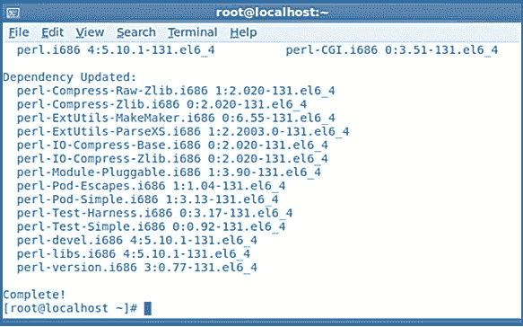
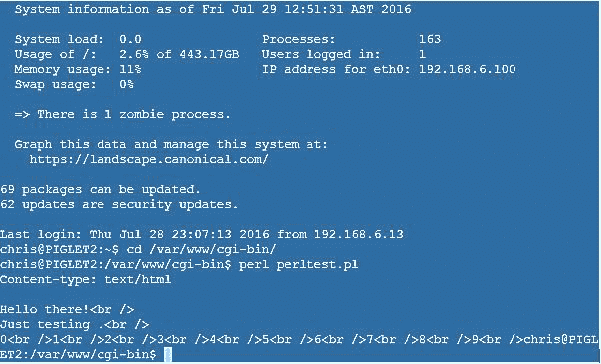
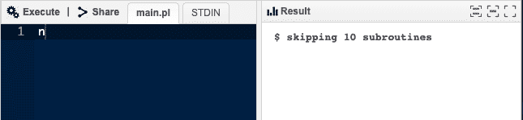
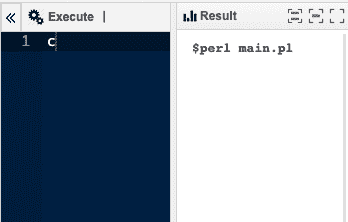
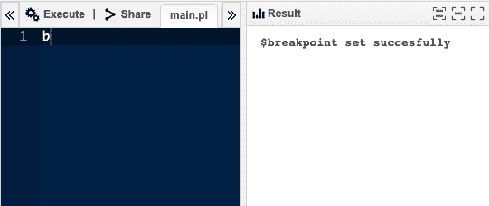
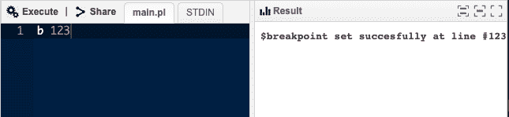
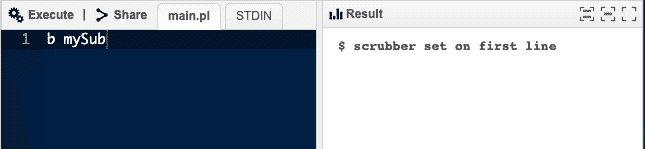
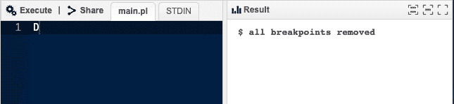

# 调试 Perl CGI 脚本

> 原文:[https://www.geeksforgeeks.org/debugging-perl-cgi-scripts/](https://www.geeksforgeeks.org/debugging-perl-cgi-scripts/)

Perl 是一种跨平台、开源的计算机编程语言，广泛用于商业和私营部门。Perl 因其适应性强、不断发展的文本处理和解决问题的能力而受到网络开发人员的欢迎。尽管 Perl 最初是为文本编辑而开发的，但它的灵活性使它成为一种用于各种任务的通用工具。

我们已经研究了一些可能导致频繁出错的事情，但并不是所有事情都是一个共同的问题。如果你遇到了麻烦，但没有一个选项对 CGI 有效，你需要进行一些研究。在这一部分中，我们将研究各种可以帮助您找到问题原因的工具。以下是您可以采取的行动的简要概述:

*   使用-c 开关，您可以检查脚本的语法。
*   检查网络服务器上的错误日志。
*   使用命令行运行脚本。将变量转储到浏览器允许您测试它们的值。
*   利用交互式调试器。

### 验证语法

如果您的代码没有解析或编译，它将永远无法正确执行。因此，在浏览器中测试脚本之前，先练习使用命令行中的-c 标志来测试脚本，并且在测试时，使用-w 标志检查脚本是否有警告。请记住，如果您使用污点模式(您可能对所有脚本都这样做)，您还必须传递-T 参数**以避免以下错误:Myscript . CGI-WC perl*****“T”选项不再可用。*** 因此，使用

> perl -wcT calendar.cgi 程式码

### 检查错误日志

错误经常被报告给**，在某些网络服务器上，当 CGI 脚本正在执行时，所有产生给***【STDERR】***的东西都会显示在错误日志中。当您遇到问题时，通常可以通过查看这些日志来找到许多重要信息。该文件可在以下位置找到:**

> **/usr/local/apache/logs/error log 或/usr/var/logs/httpd/error log 与 Apache 一起使用。**

**错误被附加到日志的底部；当你测试你的 CGI 脚本时，你应该关注它。如果您**使用-f 选项**执行尾部命令**

> **$ tail-f/usr/local/Apache/logs/error _ log**

****

### **从命令行执行的脚本**

**在您的脚本通过语法检查后，您可以尝试从命令行运行它们。**因为 CGI 程序非常依赖环境变量**，所以您可以在运行脚本之前手动配置这些变量**

> **$ export HTTP _ COOKIE = " user _ id = ABC 123 "**
> 
> **$ export QUERY_STRING= "月= 1 月&年=2001 "**
> 
> **$ export REQUEST_METHOD="GET "**
> 
>  **$ ./calendar.cgi**

### **Perl 调试器**

**如果您使用-d 开关运行 Perl，您将结束一个交互式会话。遗憾的是，这意味着调试器只能通过命令行使用。虽然这不是 CGI 脚本的典型环境，但正如我们之前所展示的，复制 CGI 环境并不简单。将 CGI 对象保存到查询文件中，初始化您可能需要的任何其他环境变量，例如 cookies，然后像这样运行您的 CGI 脚本是最好的方法。**

> **$perl -dT calendar.cgi**
> 
> **从 perl5db.pl 版本 1 加载数据库例程**
> 
> **Emacs 支持可用**
> 
> **输入 h 或“h h”寻求帮助。**
> 
> **main::(Dev:Pseudo:7): my $q =新 CGI 数据库<1>**

****一开始调试器可能看起来很吓人，但确实很强大。****

**该表提供了对脚本进行故障排除以帮助您入门所需的所有基本命令的快速概述。尽管有更多的工具可用，但是您可以只使用这些指令来调试所有的 CGI 脚本。要了解如何导航调试器，请练习单步执行您已经知道工作正常的程序。因为调试器不会修改您的文件，所以您不能通过输入不正确的命令来中断工作脚本。**

<figure class="table">

| 命令 | 描述 |
| --- | --- |
| **s** | **步；** Perl 单步执行任何子程序，并执行提示符上方列出的行。值得注意的是，用几个指令评估一行可能需要几个步骤。

 |
| **n** | 接下来，Perl 运行提示符上面列出的行，跳过任何子程序(它们仍然运行；Perl 等待它们完成后再继续) |
| **断点** | 继续，直到程序结束或到达下一个断点，以先到者为准。 |
| **c 123** | 继续直到你到达第 123 行，它必须包括一个命令(它不能是一个注释，空行，命令的后半部分，等等。) |
| **b** | 在当前行设置断点；断点停止已被 c 停止的代码的执行。 |
| **b 123** | 在第 123 行放置一个断点，断点必须包含一个命令(不能是注释、空行、命令的后半部分等。). |
| **b mySub** | 在我的 sub 的第一个可执行行设置一个断点。 |
| **d** | 从当前行移除断点，并接受与 b 相同的参数。 |
| **D** | 断点删除 |

</figure>

### **结论**

**使用 ptkdb 有两个要求。你首先需要一个 X 窗口服务器；X Window 系统与大多数 Unix 和类似系统捆绑在一起，商业版本也可用于其他操作系统。第二，网络服务器必须包含 Tk.pm 模块，该模块需要 Tk，并且可以在 CPAN 访问。Tk 是 Tcl 编程语言附带的图形库。**