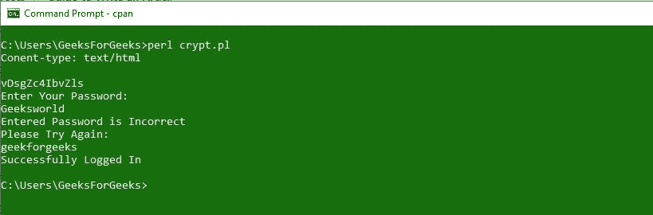
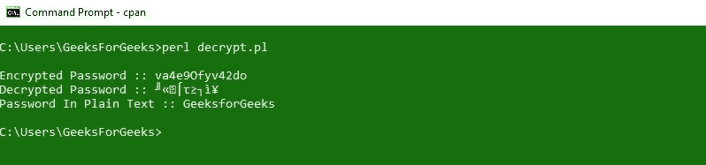

# Perl 中的加密和解密

> 原文:[https://www . geesforgeks . org/perl 中的加密和解密/](https://www.geeksforgeeks.org/encryption-and-decryption-in-perl/)

**Crypt** 函数在， [Perl](https://www.geeksforgeeks.org/introduction-to-perl/) 中，基本上是用 ASCII 字符作为加密字符串来存储敏感数据和密码(这个函数对字符串进行加密)。字符串只能加密，不能像加密一样解密。

> **语法:**$ encycled _ string = crypt $ string，$ salt
> **传递给函数的参数:**
> 
> *   **$string:** 是需要加密的字符串。
> *   **$salt:** 用于从不同变体中选择加密版本。
> 
> **返回值:**函数返回一个加密字符串

**注意:** **$salt** 变量可以是下面给定集合中任意两个字符的组合:

```perl
['.', '/', 0..9, 'A'..'Z', 'a'..'z']
```

除了这个给定的字符集，我们可以使用/包含更多的字符，这个字符集只是用于推荐的目的。加密字符串中的前两个字符存储为 salt 字符，可用于以后的比较。我们甚至可以使用**兰德功能**来选择盐的字符(随机选择)。如果在 **$string 或$salt 中进行小的更改，我们可以观察/看到结果/最终加密字符串中的大的更改。**
**示例:**下面是说明上述加密的加密函数的示例。

## Perl 语言

```perl
#!usr/bin/perl
print "Content-type: text/html\n\n";

# Setting the password
$password = 'geekforgeeks';

# Encrypting the password using crypt function
$hidden = crypt $password, join "",
          ('.', '/', 0..9, 'A'..'Z', 'a'..'z') [rand 64, rand 64];

print "$hidden \n";

$salt = substr ($hidden, 0, 2);

# Taking user input
print "Enter Your Password: \n";
while (<STDIN>)
{
    if ($hidden eq (crypt $_, $salt))
    {
        print "Successfully Logged In \n";
        exit;
    }
    else
    {
        print "Entered Password is Incorrect \n";
        print "Please Try Again: \n";
    }
}
```

**输出:**



### Perl 中的解密

对于解密，需要使用 **MIME::Base64** 模块对 Perl 中的加密密码进行解密。为了解密一个字符串，我们可以调用或使用 **decode_base64()** 函数。函数将字符串形式的单个参数作为输入，以返回解码或解密的数据/密码。
**语法:**

> **使用 MIME::Base64；**
> **$ decode = decode _ base64()；**

**示例:**下面给出的示例说明了 Perl 中的解密过程。

## Perl 语言

```perl
#!/usr/bin/perl
use strict;
use warnings;
use MIME::Base64;

# Setting the password
my $password = "GeeksforGeeks";

# For encrypting the plaintext password
# using crypt function
my $encoded = crypt $password, join "",
             ('.', '/', 0..9, 'A'..'Z', 'a'..'z') [rand 64, rand 64];

my $salt = substr ($encoded, 0, 2);

# For decrypting the encrypted password
# using base_64 module
my $decoded = decode_base64($encoded);
print "\n";

# For printing the Encrypted password
print "Encrypted Password :: $encoded\n";

# For printing the Decrypted password
print "Decrypted Password :: $decoded\n";

# For printing the password in PlainText
print "Password In Plain Text :: $password\n";
```

**输出:**



让鹂鸟带你找到你的宝藏。