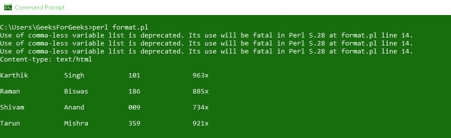
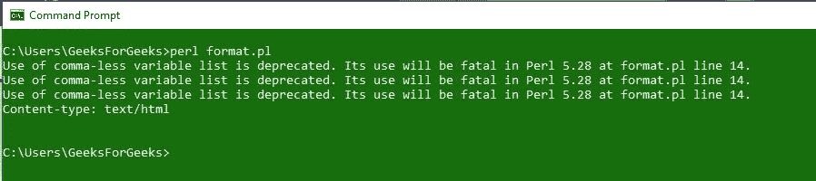
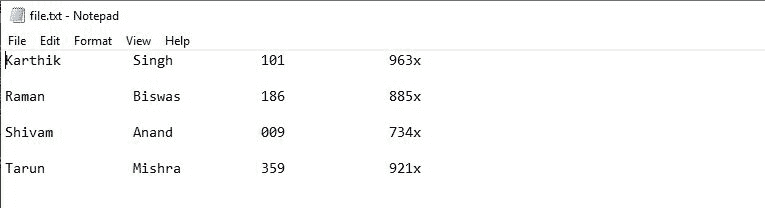
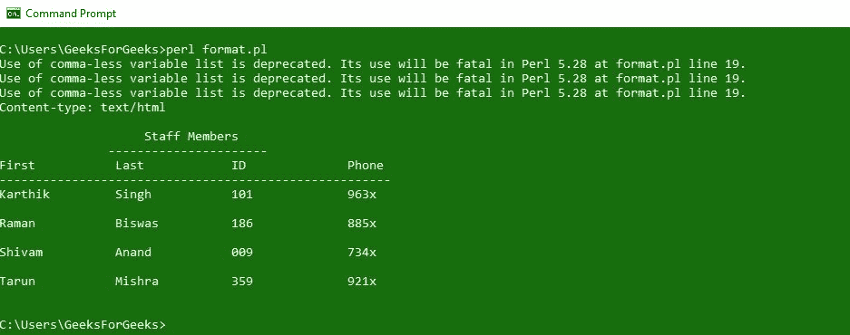
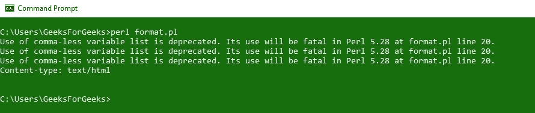
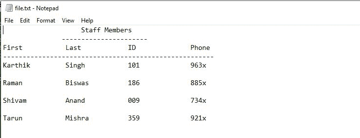
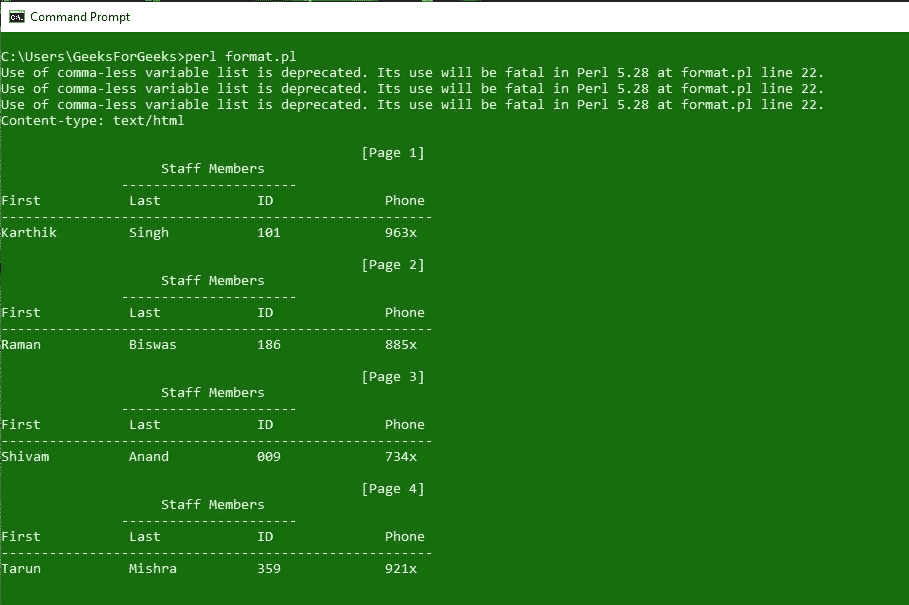

# Perl 格式

> 原文:[https://www.geeksforgeeks.org/formats-in-perl/](https://www.geeksforgeeks.org/formats-in-perl/)

格式是在 [Perl](https://www.geeksforgeeks.org/introduction-to-perl/) 中用来输出报告的书写模板。Perl 有一种机制可以帮助生成简单的报告和图表。不是执行，而是声明格式，因此它们可以出现在程序中的任何点。除了 Perl 中的其他类型，格式有自己的命名空间，即名为“tron”的函数与名为“tron”的格式不同。但是，程序中文件句柄的名称是与该文件句柄关联的格式的默认名称。

### 定义格式

定义 Perl 格式的语法:

```
format FormatName =
fieldline
value_1, value_2, value_3
fieldline
value_1, value_2, value_3
.

```

–格式名称由**格式名称表示。**
–**field line**是一种用于格式化数据的特殊方式。Fieldline 也可以保存文本或**字段固定器。**
–**值行**表示/描述将输入到**字段行的值。**
–格式以**单个句点(。)**
–**字段持有者**有空间存放后面要输入的数据。

**字段持有者语法:**

```
@<<<<<<<       left-justified (with 7 field spaces by counting '@' and '<')
@|||||||       center-justified
@###.####      numeric fieldholder
@*             multiline fieldholder

```

### 使用格式

**`Write`** 关键字用于调用格式声明。

```
Write FormatName;
```

格式名是打开的文件句柄的名称，write 语句将输出发送到同一个文件句柄。为了将数据发送到**标准输出**，格式名称需要与标准输出文件句柄相关联。
**注意:**使用`**select()**`功能确保 STDOUT 是选定的文件句柄。

```
select (STDOUT);
```

为了通过设置新的格式名和 STDOUT 来关联格式名和 STDOUT，使用像 **$~** 或 **$Format_Name** 这样的变量

```
$~ = "Format_Name";
```

**注意:**要在除 STDOUT 以外的任何其他文件句柄中编写报告，请使用`**select()**`功能选择该文件句柄。

**示例:**
**输入:使用 STDOUT。**

```
#!/usr/bin/perl
print "Content-type: text/html\n\n";

@First_Name = qw(Karthik Raman Shivam Tarun);
@Last_Name = qw(Singh Biswas Anand Mishra);
@ID = qw(101 186 009 359);
@Phone_Number = qw(963x 885x 734x 921x);

format DATA = 
@<<<<<<<<<<<<<<<@<<<<<<<<<<<<<<<@<<<<<<<<<<<<<<<@<<<<<<<<<<<<<<<
$First_Name[$k] $Last_Name[$k]  $ID[$k]         $Phone_Number[$k]

.

select(STDOUT);
$~ = DATA;
$k = 0;
while ($k <= $#First_Name)
{
    write;
    $k++;
}
```

**输出:**


**输入:使用其他文件句柄(将输出打印成文本文件。)**

```
#!/usr/bin/perl

print "Content-type: text/html\n\n";

@First_Name = qw(Karthik Raman Shivam Tarun);
@Last_Name = qw(Singh Biswas Anand Mishra);
@ID = qw(101 186 009 359);
@Phone_Number = qw(963x 885x 734x 921x);

format DATA = 
@<<<<<<<<<<<<<<<@<<<<<<<<<<<<<<<@<<<<<<<<<<<<<<<@<<<<<<<<<<<<<<
$First_Name[$k] $Last_Name[$k]  $ID[$k]         $Phone_Number[$k]

.

open(FILE, ">file.txt");
select FILE;
$~ = DATA;

$k = 0;
while ($k <= $#First_Name)
{
    write;
    $k++;
}

close FILE;
```

**输出:**


**打印数据的文件:**


### 报表页眉和页脚

页眉是出现在每页顶部的东西。不用定义模板，只需定义一个标题并将其分配给 **$^** 或 **$FORMAT_NAME_TOP** 。
**页脚**有固定尺寸。可以通过检查变量 **$-** 来实现。如果需要，您甚至可以使用下面给出的语法自己打印页脚，

```
format FORMAT_NAME_BOTTOM
End of Page $%

```

**示例:**
**输入:使用 STDOUT**

```
#!/usr/bin/perl
print "Content-type: text/html\n\n";

format DATA_TOP = 
@||||||||||||||||||||||||||||||||||||||||||||||||||||
                  "Staff Members"
               ----------------------
First           Last            ID              Phone
------------------------------------------------------
.

@First_Name = qw(Karthik Raman Shivam Tarun);
@Last_Name = qw(Singh Biswas Anand Mishra);
@ID = qw(101 186 009 359);
@Phone_Number = qw(963x 885x 734x 921x);

format DATA = 
@<<<<<<<<<<<<<<<@<<<<<<<<<<<<<<<@<<<<<<<<<<<<<<<@<<<<<<<<<<<<<<<
$First_Name[$k] $Last_Name[$k]  $ID[$k]         $Phone_Number[$k]

.

select (STDOUT);
$~ = DATA;
$^ = DATA_TOP;
$k = 0;
while ($k <= $#First_Name)
{
    write;
    $k++;
}
```

**输出:**


**输入:将输出输入到文本文件中。**

```
#!/usr/bin/perl
print "Content-type: text/html\n\n";

format DATA_TOP = 
@||||||||||||||||||||||||||||||||||||||||||||||||||||
                  "Staff Members"
               ----------------------
First           Last            ID              Phone
------------------------------------------------------
.

@First_Name = qw(Karthik Raman Shivam Tarun);
@Last_Name = qw(Singh Biswas Anand Mishra);
@ID = qw(101 186 009 359);
@Phone_Number = qw(963x 885x 734x 921x);

format DATA = 
@<<<<<<<<<<<<<<<@<<<<<<<<<<<<<<<@<<<<<<<<<<<<<<<@<<<<<<<<<<<<<<
$First_Name[$k] $Last_Name[$k]  $ID[$k]         $Phone_Number[$k]

.

open (FILE, ">file.txt");
select FILE;
$~ = DATA;
$^ = DATA_TOP;

$k = 0;
while ($k <= $#First_Name)
{
    write;
    $k++;
}
close FILE;
```

**输出:**


**打印数据的文件:**


### 页码

当你有一份很长的报告，一页都装不下时，分页就出现了。像 **$%** 或 **$FORMAT_PAGE_NUMBER** 这样的变量与格式中的标题一起使用有助于将页码定义为多页。默认页面行数为 60，但也可以使用变量 **$=** 或 **$FORMAT_LINES_PER_PAGE** 手动设置。

**示例:**

```
#!/usr/bin/perl
print "Content-type: text/html\n\n";

format DATA_TOP = 
@>>>>>>>>>>>>>>>>>>>>>>>>>>>>>>>>>>>>>>>>>>>>>>>>>>>>
"[Page $%]"
@||||||||||||||||||||||||||||||||||||||||||||||||||||
                  "Staff Members"
               ----------------------
First           Last            ID              Phone
------------------------------------------------------
.

@First_Name = qw(Karthik Raman Shivam Tarun);
@Last_Name = qw(Singh Biswas Anand Mishra);
@ID = qw(101 186 009 359);
@Phone_Number = qw(963x 885x 734x 921x);

format DATA = 
@<<<<<<<<<<<<<<<@<<<<<<<<<<<<<<<@<<<<<<<<<<<<<<<@<<<<<<<<<<<<<<<
$First_Name[$k] $Last_Name[$k]  $ID[$k]         $Phone_Number[$k]

.

select (STDOUT);
$~ = DATA;
$^ = DATA_TOP;
$= = 1;

$k = 0;
while ($k <= $#First_Name)
{
    write;
    $k++;
}
```

**输出:**
