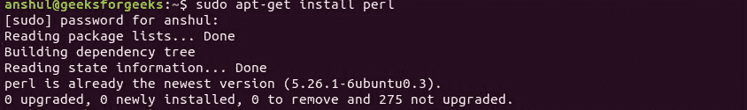

# Perl 中的 Hello World 程序

> 原文:[https://www.geeksforgeeks.org/hello-world-program-in-perl/](https://www.geeksforgeeks.org/hello-world-program-in-perl/)

[Perl](https://www.geeksforgeeks.org/introduction-to-perl/) 编程语言专为文本处理目的而设计。其缩写表示*实用提取和报告语言*。它兼容各种平台，如 Windows、Mac OS 和几乎所有版本的 UNIX。

你好世界！每种编程语言的编程都给初学者一个在新语言中更进一步的飞跃。基本的 Hello world 程序只是通过打印“Hello World！”在屏幕上。在 Perl 中，一个基本程序由以下执行步骤组成，

**第一步:将文件传输到 Perl 解释器:**
总是在 Perl 中，第一行以一对字符#开始！。它坚持 Perl 解释器应该如何执行文件。这里，文件应该被传输到驻留在/usr/bin/perl 文件夹中的 Perl 解释器。所以，程序的第一行将是这样的，

```perl
#!/usr/bin/perl
```

**第二步:Perl 中的 Pragma:**
Pragma 是 Perl 包中的一个特定模块，它对 Perl 的编译时或运行时行为的某些功能有控制，这是严格的或警告的。接下来的两行是这样的，

```perl
use strict;
use warnings;

```

**第三步:使用 print()函数:**
最后显示输出，我们使用 print()函数在 perl 中显示一个字符串。

```perl
print("Hello World\n");
```

**代码:**

```perl
#!/usr/bin/perl

# Modules used
use strict;
use warnings;

# Print function 
print("Hello World\n");
```

**输出:**

```perl
Hello World
```

**要点:**

*   文件必须以扩展名存储。pl
*   Perl 包的目录必须与保存程序文件的目录相同。

<center>**How to Run a Perl Program?**</center>

Generally, there are two ways to Run a Perl program-

*   **使用在线 ide:**可以使用各种在线 ide，不用安装就可以运行 Perl 程序。
*   **Using Command-Line:**You can also use command line options to run a Perl program. Below steps demonstrate how to run a Perl program on Command line in Windows/Unix Operating System:

    <center>**Windows**</center>

    *   首先，打开一个文本编辑器，如记事本或记事本++。
    *   在文本编辑器中编写代码，并用。pl 扩展
    *   确保您已经从 https://www.perl.org/get.html 下载并安装了最新版本的 Perl
    *   打开命令行，运行命令 *perl -v* 来检查你的 perl 最新版本是否安装正确。
        T3】
    *   编译代码类型 **perl HelloWorld.pl** 。如果您的代码没有错误，那么它将正确执行并显示输出。
        T3】

    <center>**Unix/Linux**</center>

    *   按照上面给出的步骤编写代码并保存文件。pl 扩展
    *   打开你的 Unix/Linux 操作系统的终端，按照以下步骤下载并安装 Perl:
        
    *   现在，运行命令 **perl 版本**来确定你的 perl 最新版本是否安装正确。
        T3】
    *   编译代码类型 **perl hello.pl** 。如果您的代码没有错误，那么它将正确执行并显示输出。
        T3】