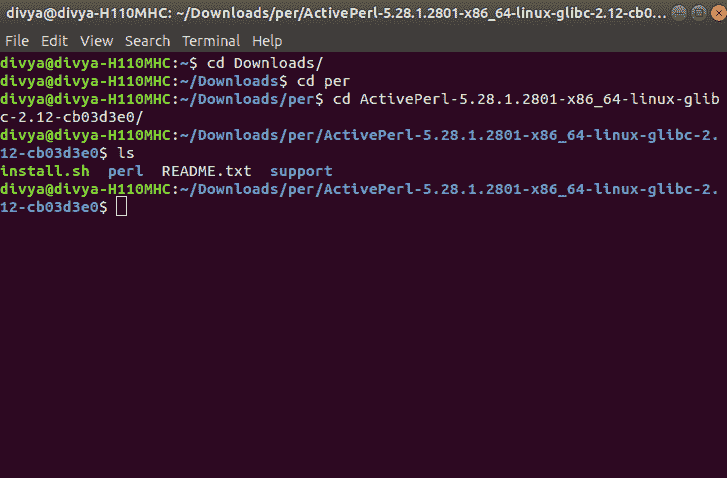
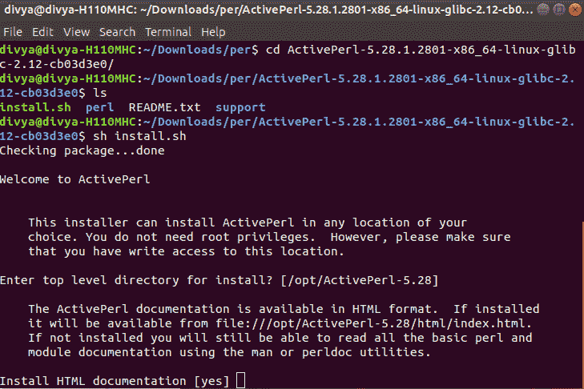
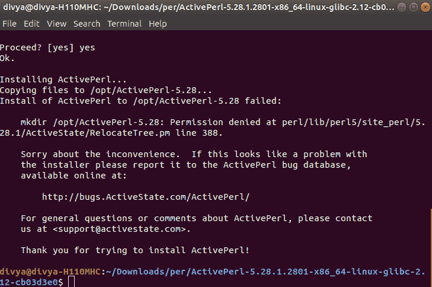

# 如何在 Linux 上安装 Perl？

> 原文:[https://www.geeksforgeeks.org/how-to-install-perl-on-linux/](https://www.geeksforgeeks.org/how-to-install-perl-on-linux/)

**先决条件:**[Perl 简介](https://www.geeksforgeeks.org/introduction-to-perl/)

之前，我们从在系统上安装 Perl 的过程开始。我们必须对什么是 Perl 语言以及它实际上做什么有第一手的知识？。Perl 是一种通用、高级解释和动态编程语言。Perl 最初是为文本处理而开发的，比如从指定的文本文件中提取所需的信息，以及将文本文件转换成不同的形式。Perl 支持过程式和面向对象编程。Perl 在语法上与 C 非常相似，对于有 C、C++知识的用户来说很容易。

Perl 程序可以写在任何纯文本编辑器上，比如****记事本++*** 或者任何类似的东西。人们也可以使用在线的 **IDE** 来编写 Perl 代码，或者甚至可以在他们的系统上安装一个，使编写这些代码更加可行。使用一个 **IDE** 使得编写 Perl 代码变得更加容易，因为 IDE 提供了很多功能，比如直观的代码编辑器、调试器、编译器等等。
首先，编写 Perl 代码并执行各种有趣而有用的操作，必须在他们的系统上安装 Perl。这可以通过遵循下面提供的逐步说明来完成:*

### *检查预安装的 Perl 版本:*

*在我们开始安装 Perl 之前，最好检查一下它是否已经安装在您的系统上，因为现在许多软件应用程序都需要 Perl 来执行它们的操作，因此软件的安装包中可能会包含一个版本的 Perl，因此当 Perl 已经存在时，没有必要重新加载和安装它。许多 Linux 系统的包中都预装了 Perl。
要检查您的设备是否预装了 Perl，请使用`**Ctrl+Alt+T**`打开终端。
现在运行以下命令:*

```
***perl -v***
```

*如果已经安装了 Perl，它将生成一条消息，提供 Perl 版本的所有细节，否则如果没有安装 Perl，将出现一个错误，说明 ***错误的命令或文件名***
*

### *下载和安装 Perl:*

***下载 Perl:**
在开始安装过程之前，您需要下载它。为此，Linux 的所有 Perl 版本都可以在

上获得。下载 Perl 并按照进一步的说明安装 Perl。*

***从安装开始:***

*   ***更改目录以安装 Perl:**
    *
*   ***开始安装过程:**
    *
*   ***选择安装 Perl 的目录:**
    *
*   ***完成安装:**
    *

*完成安装过程后，可以使用任何 IDE 或文本编辑器编写 Perl 代码，并使用命令在 IDE 或命令提示符下运行它们:*

```
*perl file_name.pl*
```

*这里有一个示例程序，首先使用 **Perl 编程** :
让我们考虑一个简单的 Hello World 程序。*

```
*#!/usr/bin/perl 

# Modules used 
use strict; 
use warnings; 

# Print function  
print("Hello World\n"); *
```

***Output:***