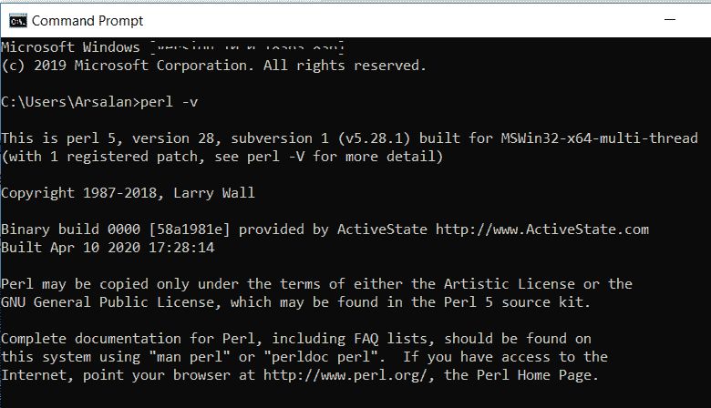
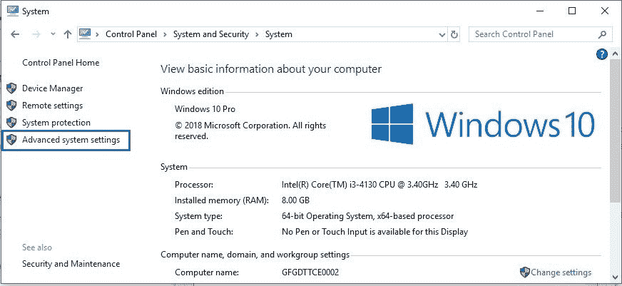
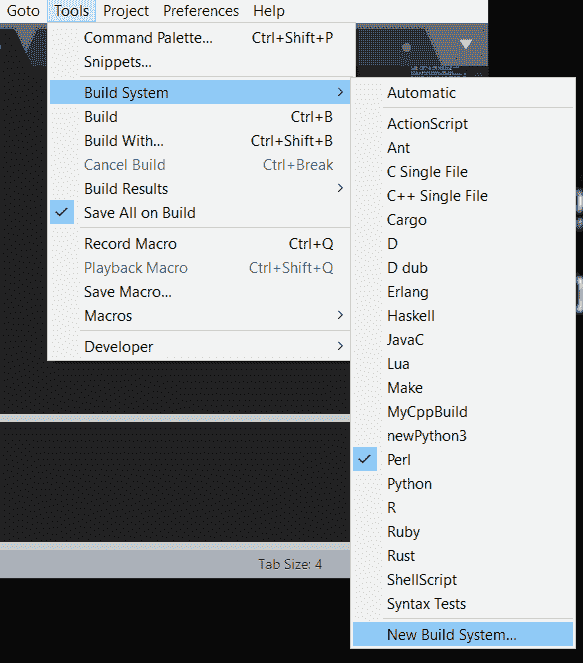
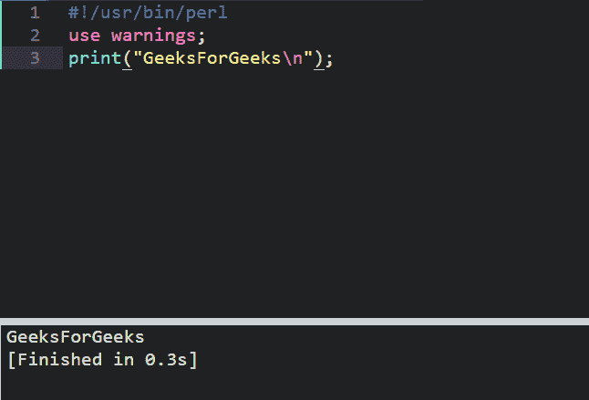

# 如何在 Windows 中为 Perl 设置崇高文本 3？

> 原文:[https://www . geeksforgeeks . org/how-setup-supreme-text-3 for-perl-in-window/](https://www.geeksforgeeks.org/how-to-setup-sublime-text-3-for-perl-in-windows/)

[Perl](https://www.geeksforgeeks.org/introduction-to-perl/) 是一种通用、高级解释和动态编程语言。Perl 最初是为文本处理而开发的，比如从指定的文本文件中提取所需的信息，以及将文本文件转换成不同的形式。
Perl 程序可以写在任何纯文本编辑器上，比如记事本、notepad++，或者任何类似的东西。人们也可以使用在线集成开发环境来编写 Perl 代码，或者甚至可以在他们的系统上安装一个集成开发环境来使编写这些代码更加可行。

由谷歌工程师编写的崇高文本是一个用 C++和 Python 开发的跨平台 IDE。它对 Python 有基本的内置支持。崇高的文本是快速的，你可以根据需要定制这个编辑器来创建一个完整的 Python 开发环境。您可以安装调试、自动完成、代码林挺等软件包。还有各种科学发展包，Django，Flask 等等。

#### 下载和安装

Perl 可以从[perl.org](https://www.perl.org/get.html)下载。要在 Windows 上安装 Perl，请通过[如何在 Windows 上安装 Perl？](https://www.geeksforgeeks.org/how-to-install-perl-on-windows/)

崇高文本 3 可以从其官方网站[sublimetext.com](https://www.sublimetext.com/3)下载。要在 Windows 上安装崇高文字 3，请通过[如何在 Windows 中安装崇高文字 3？](https://www.geeksforgeeks.org/how-to-install-sublime-text-3-in-windows/)

要检查 perl 是否完美地安装在您的设备上，只需键入:

```perl
perl -v
```



#### 设置环境变量

*   **第一步:**点击**高级系统设置**链接。



*   **第二步:**点击**环境变量**。在系统变量部分，找到路径环境变量并选择它。单击编辑。如果路径环境变量不存在，请单击新建。


*   **步骤 3:** 在编辑系统变量(或新系统变量)窗口中，指定**路径环境变量**的值。单击确定。单击确定关闭所有剩余窗口。

#### 致力于卓越的文本 3

**第一步:**转到**工具- >构建系统**并选择**新构建系统**。



**第二步:**复制下面的代码:

## Perl 语言

```perl
{
  "cmd": ["perl", "-w", "$file"],
  "file_regex": ".* at (.) line ([0-9])",
  "selector": "source.perl"
}
```

然后将其保存为 Perl

**第三步:**最后一步是创建任意文件，保存为“**any . pl**”，按 **ctrl + shift + B** 运行。

