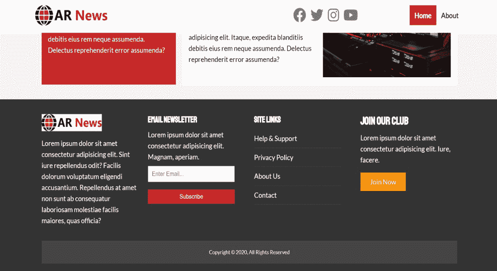

# 在 Perl 中篡改 HTML 表单

> 原文:[https://www.geeksforgeeks.org/html-form-tampering-in-perl/](https://www.geeksforgeeks.org/html-form-tampering-in-perl/)

Web 应用程序使用 HTML 表单来接收用户的输入。HTML 表单有一个主要缺点，即用户可以将表单保存在文件中，对其进行编辑，并将编辑后的表单文件提交回服务器。这个问题会导致更糟的结果，因为网络应用本质上是“无状态”的。HTTP 中的事务是无连接的，并且是一次性传输的。在通过表单收集用户数据的同时，他们必须通过一系列输入表单将他们的信息存储到服务器。“状态”信息存储在用户的浏览器中，并在交易时一起发送回服务器。该状态信息可以通过 3 种方式存储:

*   浏览器中的**cookie**
*   **网址中的特殊标签**
*   **HTML 表单中隐藏的**字段

HTML 表单中最常用的方法是隐藏的字段。这有助于隐藏表单中的输入，并且使用起来最简单，可以保存大量数据。然而，在填写表单时，数据存储在用户的网络浏览器上，它们很容易篡改隐藏的字段。

#### 示例:一个简单的 web 应用程序，允许用户使用 Perl 中的 CGI 库“登录”和更新他们的“邮件地址”。

## Perl 语言

```
#!/usr/bin/perl
use CGI qw/:standard/;

# Printing the MIME header:
print "Content−type: text/html\n\n";
print '<html><body>';
print '<h1>Tampering Input Form Example</h1>';

# Assign some unchanged example values:
$userid = 'GeeksforGeeks';
$credit_ok = 1;
$form_expires = '40002002:10:53:50';

# Displaying a blank HTML form:
if (! param('chaddr'))
{
 print_form();
}
else {
 print "You made this easy ", param('userid'), "<br>";
 print "Your address information has been successfully updated.";
}
print "</body></html>";

## SUBROUTINES:
sub print_form {

# Prints an example HTML form
# with signature in the hidden field:
print<<END_TEXT;

<p><form action="http://netlify.app/cgi/Tampered-Input-Form.pl"
method="post">
<table>
<tr>
<td><b>Address line A:</b></td><td><input type="text" name="addressA"></td>
<tr>
<td><b>Address line B:</b></td><td><input type="text" name="addressB"></td>
<tr>
<td><b>City:</b></td><td><input type="text" name="city"></td>
<tr>
<td><b>Prov:</b></td><td><input type="text" name="prov"></td>
<tr>
<td><b>Postal:</b></td><td><input type="text" name="postal"></td>
<tr><td colspan="2" align="center">
<input type="hidden" name="userid" value="$userid">
<input type="hidden" name="credit_ok" value="$credit_ok">
<input type="hidden" name="form_expires" value="$form_expires">
<input type="submit" name="chaddr" value="Change address">
</td></tr>
</table>
</form>
END_TEXT
}
```

在上面的登录页面中，我们跳过了 web 应用程序的登录页面，脚本也没有对表单的数据做任何处理。当我们在网络浏览器中运行表单并考虑 HTML 源代码时。此表单使用“隐藏”字段保存登录过程中的信息:

> <input type="”hidden”" name="”userid”" value="”GeeksforGeeks”">
> 
> <input type="”hidden”" name="”credit_ok”" value="”1″">
> 
> <input type="”hidden”" name="”form_expires”" value="”40002002:10:53:50″">

在表单中填写一些信息并按下提交按钮后，确认屏幕会使用隐藏字段 userID 值，直接来自 HTML 表单。

### 篡改表格:

要篡改 HTML 表单，请按“ **Ctrl+S** 将 HTML 表单的网页保存到您的计算机上。HTML 表单包含“**隐藏的**字段，可以使用文本编辑器进行编辑。更改“**用户标识**”字段，然后保存编辑后的文件。然后在网络浏览器中打开相同的文件并提交表单。它将接受编辑后的文件，因为网络应用程序信任隐藏的“T6”字段。

**示例:通过更改隐藏字段来篡改 HTML 表单。**

*   **HTML 表单:**



*   通过**‘Ctrl+S’**保存上述表格
*   表单中最初隐藏的字段:

## 超文本标记语言

```
<input type="hidden" name="userid" value="GeeksforGeeks" type="hidden"/>

<input type="hidden" name="credit_ok" value="1"/>

<input type="hidden" name="form_expires" value="40002002:10:53:50"/>
```

*   **“用户标识”**的值为“**极客头像**，类型为隐藏。
*   篡改表单中的隐藏字段:

## 超文本标记语言

```
<input type="hidden" name="userid" value="Geeks123" />

<input type="hidden" name="credit_ok" value="1" />

<input type="hidden" name="form_expires" value="40002002:10:53:50"/>
```