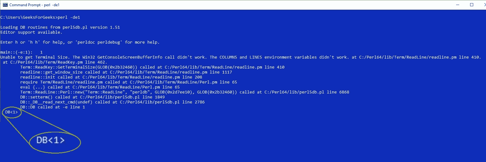
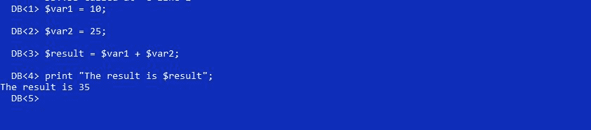
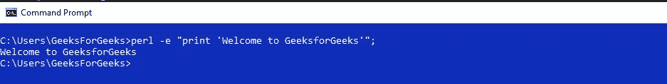
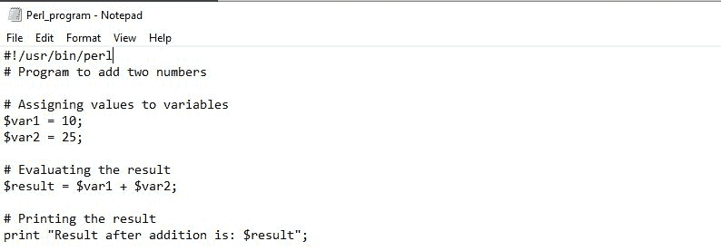
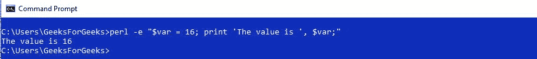
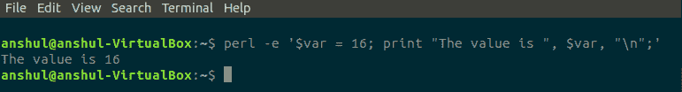

# 编写 Perl 代码的模式

> 原文:[https://www.geeksforgeeks.org/modes-of-writing-a-perl-code/](https://www.geeksforgeeks.org/modes-of-writing-a-perl-code/)

[Perl](https://www.geeksforgeeks.org/introduction-to-perl/) 是一种通用、高级解释的动态编程语言。Perl 支持过程编程和面向对象编程。在开始的时候，Perl 仅仅是为系统管理和文本处理而开发的，但是在后来的版本中，Perl 获得了处理正则表达式和网络套接字等的能力。由于 Perl 在语法上与其他广泛使用的语言非常相似，所以用 Perl 进行编码和学习更容易。

Perl 是一种自由形式的语言，这意味着它可以根据用户的要求进行编写、格式化和缩进。Perl 程序由一系列语句、循环、子程序等组成。允许在代码中轻松移动。Perl 代码中的每个语句都必须以分号(；).像其他语言一样，Perl 也支持编写和执行 Perl 代码的多种模式。这些模式可以根据它们的编写兼容性和执行模式以下列方式进行分类:

*   **交互模式**
*   **脚本模式**
*   **单线模式**

这些模式可以使用 perl 关键字在命令行上运行，也可以以代码块的形式在 Online IDEs 上运行。Perl 还提供了自己的内置 IDE 以及安装包。

**互动模式**

编写 Perl 代码的交互模式意味着与解释器的直接交互。交互模式是一个很好的开始方式，因为它有助于逐行检查代码流，并使调试过程更加容易。通过使用 Perl 调试器，可以在命令行上使用 Perl 中的交互模式。这个解释器通常被称为**REPL**–读取、评估、打印、循环。
交互模式提供了代码的即时开发和执行，而不需要创建临时文件来存储源代码。在 Perl 调试器的帮助下，Perl 内置的命令行或 Windows 命令提示符可以用作 REPL。借助以下命令，可以在 Perl 程序上使用该调试器:

```
perl -de1
```

该命令将在 Perl 命令行中打开调试器模式，如下所示:


在编写 Perl 代码的交互模式中，用户必须一行一行地编写代码，同时执行代码。
**示例:**如果我们需要添加两个数字并显示结果，那么可以在交互模式下以以下方式完成:


Perl 中的交互模式可以在命令行上运行，而无需使用 Perl 调试器。这可以通过使用以下命令来完成:

```
perl -e Code_statement;
```

此语句使用-e 标志来避免创建脚本，并允许代码在没有调试器的情况下在命令行上运行。
**示例:**

这种以交互模式编写的方法不允许用户像在调试器中那样编写 Multiline 代码。如果一个程序很长，那么这个模式将不是首选。


交互模式对初学者程序员学习编程基础很有帮助，但是如果你使用的是几行以上的代码，那么这种模式会变得笨拙和乏味。

**脚本模式**

Perl 中的脚本模式用于编写 Perl 程序，这些程序有多行代码，对于交互模式来说有点复杂。Perl 中的脚本模式可以通过文本编辑器的帮助来编写 Perl 程序，并将其保存在名为**脚本**的文件中，然后使用命令行执行保存的文件。该文件必须以. pl 扩展名保存，并且应该放在与命令行给出的目录路径相同的文件夹中。该脚本将使用以下命令在命令行中进一步运行:

```
perl File_Name.pl
```

**示例:**代码在文本编辑器(记事本等)中编写。)并保存为 Perl_program.pl 脚本。

现在，在命令行中运行以下命令来执行保存为 Perl_program.pl 的脚本

```
perl Perl_program.pl
```

**输出:**

Perl 中的脚本模式与交互模式不同，不能单独为表达式生成输出。在交互模式下，表达式将被求值，并且值会自己显示，但是在脚本模式下，表达式将被求值，但是它不会显示任何结果，直到被要求这样做。

脚本模式也在在线 IDEs 中实现，IdeS 用于编写和执行 perl 代码，而无需手动将它们存储在文件中。在这些集成开发环境中，编译后的代码以临时文件的形式存储在内存中，该文件仅在代码被执行和集成开发环境在浏览器中打开时使用。刷新后，该临时文件将被删除，占用的内存空间将被释放。
与将文件存储在系统内存中的脚本模式相比，在线 ide 使代码的执行变得更加容易，因为它们需要更少的工作量。这使得代码编译和执行更快。这些在线集成开发环境尽管对程序员来说很容易，但也有一定的局限性，例如，这些集成开发环境不能执行文件处理操作，除非文件上传到他们的服务器上，这可能会对一些重要数据造成风险。这种文件处理操作可以在命令行编译器上轻松完成。
以下是运行在在线集成开发环境上的两个数相加的 Perl 代码示例:

```
#!/usr/bin/perl
# Program to add two numbers

# Assigning values to variables
$var1 = 10;
$var2 = 25;

# Evaluating the result
$result = $var1 + $var2;

# Printing the result
print "Result after addition is: $result";
```

**Output:**

```
Result after addition is: 35

```

**单线模式**

Perl 还提供了一个单行模式，允许直接在命令行上键入和执行非常短的代码脚本。这样做是为了避免创建文件来存储不太长的代码脚本。借助以下命令，可以在命令行模式下在一行中键入这些代码:

```
perl -e
```

该命令用于通过在双引号中写入来编写和执行命令行中的单行代码。up 给定命令中的-e 标志告诉编译器，代码的脚本没有存储在任何类型的文件中，而是在这个标志之后立即写入双代码中。
**例:**


在 Linux/Unix 中，这些双引号被替换为单引号，反之亦然。


这些单行代码对于快速进行更改非常有用，例如查找信息、更改文件内容等。一些程序员避免使用单行代码，因为当脚本有点长时，它们可能会变得笨拙。虽然有些程序员喜欢这样做，因为一行比脚本快，因为不需要将它们存储到文件中。