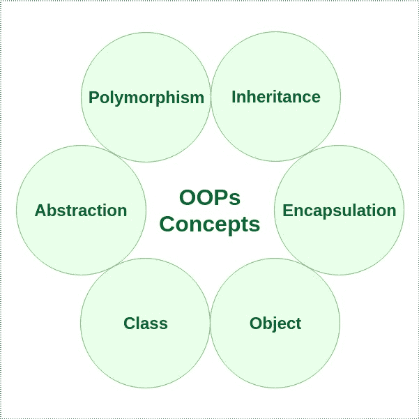
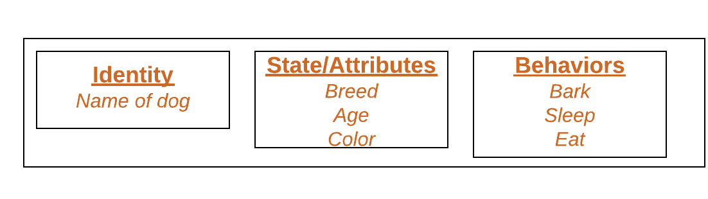
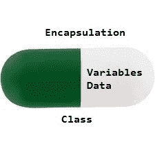

# Perl 中的面向对象编程(OOPs)

> 原文:[https://www . geesforgeks . org/面向对象编程-oops-in-perl/](https://www.geeksforgeeks.org/object-oriented-programming-oops-in-perl/)

**面向对象编程:**顾名思义，面向对象编程(Object-oriented programming，简称 OOPs)是指在编程中使用对象的语言。面向对象编程的目标是在编程中实现像继承、隐藏、多态等真实世界的实体。OOP 的主要目的是将数据和对数据进行操作的函数绑定在一起，这样除了函数之外，代码的任何其他部分都不能访问这些数据。

**OOPs 概念:**

*   [级](#Class)
*   [物体](#Object)
*   [方法](#Method)
*   [多态性](#Polymorphism)
*   [继承](#Inheritance)
*   [封装](#Encapsulation)
*   [抽象](#Abstraction)



让我们了解一下面向对象编程语言的不同特征:

1.  **[Class](https://www.geeksforgeeks.org/perl-classes-in-oop/):** A class is a user defined blueprint or prototype from which objects are created.  It represents the set of properties or methods that are common to all objects of one type. In general, class declarations can include these components, in order:
    1.  **类名:**名称应以首字母(按惯例大写)开头。
    2.  **超类(如果有的话):**类的父类(超类)的名称，如果有的话，前面加关键字‘use’。
    3.  **构造函数(如果有):**Perl 子程序中的构造函数返回一个对象，该对象是类的实例。在 Perl 中，惯例是将构造函数命名为“new”。
    4.  **Body:** 大括号包围的类体，{ }。

2.  **[Object](https://www.geeksforgeeks.org/perl-objects-in-oops/):** It is a basic unit of Object Oriented Programming and represents the real life entities.  A typical Perl program creates many objects, which as you know, interact by invoking methods. An object consists of :
    1.  **状态**:用一个对象的属性来表示。它还反映了对象的属性。
    2.  **行为**:用一个对象的方法来表示。它还反映了一个对象与其他对象的反应。
    3.  **身份**:为一个对象赋予唯一的名称，使一个对象能够与其他对象进行交互。

    一个物体的例子:狗

    [](https://media.geeksforgeeks.org/wp-content/uploads/Blank-Diagram-Page-1-5.png)

3.  **[Method](https://www.geeksforgeeks.org/perl-methods-in-oops/):** A method is a collection of statements that perform some specific task and return result to the caller. A method can perform some specific task without returning anything. Methods are **time savers** and help us to **reuse** the code without retyping the code.
4.  **[Polymorphism](https://www.geeksforgeeks.org/perl-polymorphism-in-oops/):** Polymorphism refers to the ability of OOPs programming languages to differentiate between entities with the same name efficiently. This is done by Perl with the help of the signature and declaration of these entities.

    Perl 中的多态性主要有两种类型:

    *   Perl 中的重载
    *   在 Perl 中重写
5.  **[Inheritance](https://www.geeksforgeeks.org/perl-inheritance-in-oops/):** Inheritance is an important pillar of OOP(Object Oriented Programming). It is the mechanism in perl by which one class is allowed to inherit the features(fields and methods) of another class.
    **Important terminology:** 
    *   **超类:**特征被继承的类称为超类(或基类或父类)。
    *   **子类:**继承另一个类的类称为子类(或派生类、扩展类或子类)。除了超类字段和方法之外，子类还可以添加自己的字段和方法。
    *   **可重用性:**继承支持“可重用性”的概念，即当我们想要创建一个新的类，并且已经有一个类包含了我们想要的一些代码时，我们可以从现有的类中派生出我们的新类。通过这样做，我们重用了现有类的字段和方法。

    一个类可以通过使用[包](https://www.geeksforgeeks.org/packages-in-perl/)在 perl 中创建，并且可以通过使用‘use’关键字继承。
    **语法:**

    ```
    use package_name

    ```

6.  **[Encapsulation](https://www.geeksforgeeks.org/perl-encapsulation-in-oops/):** Encapsulation is defined as the wrapping up of data under a single unit. It is the mechanism that binds together code and the data it manipulates. Another way to think about encapsulation is, it is a protective shield that prevents the data from being accessed by the code outside this shield.
    *   从技术上讲，在封装中，一个类的变量或数据对任何其他类都是隐藏的，只能通过声明它们的自己类的任何成员函数来访问。
    *   与封装一样，一个类中的数据对其他类是隐藏的，因此也被称为**数据隐藏**。
    *   封装可以通过以下方式实现:将类中的所有变量声明为私有，并在类中编写公共方法来设置和获取变量的值。

    [](https://media.geeksforgeeks.org/wp-content/uploads/Encapsulation.jpg)

7.  **Abstraction:** Data Abstraction is the property by virtue of which only the essential details are displayed to the user. The trivial or the non-essentials units are not displayed to the user. Ex: A car is viewed as a car rather than its individual components.

    数据抽象也可以定义为只识别对象所需特征而忽略无关细节的过程。对象的属性和行为使其区别于其他类似类型的对象，也有助于对对象进行分类/分组。

    考虑一个男人开车的真实例子。这个人只知道踩油门会提高汽车的速度，或者踩刹车会让汽车停下来，但他不知道踩油门后速度实际上是如何提高的，他不知道汽车的内部机制或者油门、刹车等在汽车中的实施。这就是抽象。