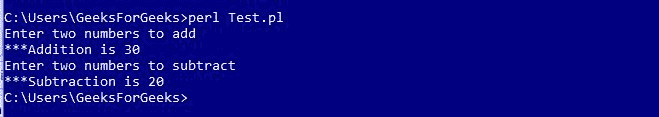
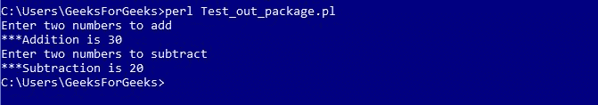
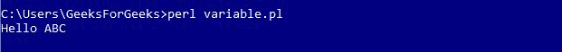

# Perl 中的包

> 原文:[https://www.geeksforgeeks.org/packages-in-perl/](https://www.geeksforgeeks.org/packages-in-perl/)

一个 Perl 包是驻留在它自己的名称空间中的代码的集合。Perl 模块是一个定义在文件中的包，该文件与包同名，扩展名为**。pm** 。两个不同的模块可能包含一个同名的变量或函数。任何不包含在任何包中的变量都属于主包。因此，所有正在使用的变量都属于“主”包。通过声明额外的包，可以保证不同包中的变量不会相互干扰。
T3】

<center>**Declaration of a Perl Module**</center>

Name of the module must be the same as that of the package name and has a .pm extension.

**示例:Calculator.pm**

```
package Calculator;

# Defining sub-routine for Addition
sub addition
{
    # Initializing Variables a & b
    $a = $_[0];
    $b = $_[1];

    # Performing the operation
    $a = $a + $b;

    # Function to print the Sum
    print "\n***Addition is $a";
}

# Defining sub-routine for Subtraction
sub subtraction
{
    # Initializing Variables a & b
    $a = $_[0];
    $b = $_[1];

    # Performing the operation
    $a = $a - $b;

    # Function to print the difference
    print "\n***Subtraction is $a";
}
1;
```

这里，文件的名称是“Calculator.pm”，存储在 Calculator 目录中。注意 1；写在代码的末尾，向解释器返回一个真值。Perl 接受任何真实的东西，而不是 1。

<center>**Using a Perl Module**</center>

To use this calculator module, we use require or use functions. To access a function or a variable from a module, :: is used. Here is an example demonstrating the same:

**示例:Test.pl**

```
#!/usr/bin/perl

# Using the Package 'Calculator'
use Calculator;

print "Enter two numbers to add";

# Defining values to the variables
$a = 10;
$b = 20;

# Subroutine call
Calculator::addition($a, $b);

print "\nEnter two numbers to subtract";

# Defining values to the variables
$a = 30;
$b = 10;

# Subroutine call
Calculator::subtraction($a, $b);
```

**输出:**


<center>**Accessing a Package from a different directory**</center>

If a file accessing the package lies outside the directory then we use ‘::’ to tell the path of the module. For example, file using calculator module is outside the calculator package so we write Calculator :: Calculator to load the module, where the value on left of ‘::’ represents package name and value on the right of ‘::’ represents Perl module name. Let’s see an example to understand this:

**示例:计算器目录外的 Test _ out _ package.pl】**

```
#!/usr/bin/perl

use GFG::Calculator; # Directory_name::module_name

print "Enter two numbers to add";

# Defining values to the variables
$a = 10;
$b = 20;

# Subroutine call
Calculator::addition($a, $b);

print "\nEnter two numbers to subtract";

# Defining values to the variables
$a = 30;
$b = 10;

# Subroutine call
Calculator::subtraction($a, $b);
```

**输出:**


<center>**Using Variables from modules**</center>

Variables from different packages can be used by declaring them before using. Following example demonstrates this
**Examples: Message.pm**

```
#!/usr/bin/perl

package Message;

# Variable Creation
$username;

# Defining subroutine
sub Hello
{
  print "Hello $username\n";
}
1;
```

Perl 文件访问模块如下
**示例**

```
#!/usr/bin/perl

# Using Message.pm package
use Message;

# Defining value to variable
$Message::username = "ABC";

# Subroutine call
Message::Hello();
```

**输出:**


<center>**Begin and End Block**</center>

BEGIN and END block is used when we want to run some part of the code at the beginning and some part of the code at an end. The codes written within BEGIN{…} are executed at the beginning of the script while the codes written within END{…} are executed at the end of the script. The program below demonstrates this:
**Examples: begineg.pl**

```
#!/usr/bin/perl

# Predefined BEGIN block
BEGIN
{
    print "In the begin block\n";
}

# Predefined END block
END
{
    print "In the end block\n";
}

print "Hello Perl;\n";
```

**输出:**

```
In the begin block
Hello Perl;
In the end block
```