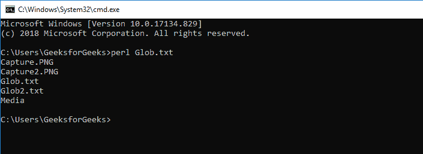
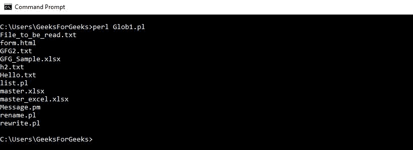

# Perl |使用文件全局化访问目录

> 原文:[https://www . geesforgeks . org/perl-access-a-directory-use-file-globbing/](https://www.geeksforgeeks.org/perl-accessing-a-directory-using-file-globbing/)

在 Perl 中，目录用于以列表的形式存储值。目录与文件非常相似。就像文件一样，目录也允许对它执行几个操作。这些操作用于修改现有目录或创建新目录。使用内置功能 **[`glob`](https://www.geeksforgeeks.org/perl-glob-function/)** 可以非常容易地打开和处理一个目录。

**Glob:**
它返回与参数中传递的表达式匹配的文件列表。这个函数可以打印扩展名已经被传递给它的所有或特定文件。

**语法:**

> @ list =；//打印当前目录
> @ list = glob(“*”)中的所有文件。pl ")；//以扩展名打印当前目录中的所有文件。pl
> @ list = glob('//geeks forgeks///Files/*)；//打印给定路径中的所有文件

下面是一些使用 **`File Globbing`** 访问目录的例子。
**示例:**

*   **Accessing the current directory of the script:**

    ```perl
    #!/usr/bin/perl -w

    # Accessing files using glob function
    @files = glob('*');      # Returns list of all files
    foreach $file (@files)   # Loop to run through all files
    {
        print $file . "\n";     # Print all files
    } 
    ```

    **输出:**
    

    *   **Opening a specified directory:**

    ```perl
    #!/usr/bin/perl -w

    # Prints only the filename excluding the path
    use File::Basename; 

    # Returns list of all files
    @files = glob('C:/Users/GeeksForGeeks/Folder/*'); 
    foreach $file (@files) # Loop to run through all files
    {
        print basename($file), "\n"; # Print all files
    } 
    ```

    **输出:**
    