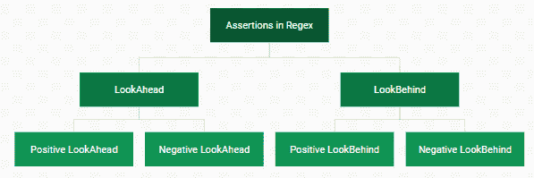

# Perl | Regex 中的断言

> 原文:[https://www.geeksforgeeks.org/perl-assertions-in-regex/](https://www.geeksforgeeks.org/perl-assertions-in-regex/)

[正则表达式(Regex 或 RE)](https://www.geeksforgeeks.org/perl-regular-expressions/) 在 [Perl](https://www.geeksforgeeks.org/introduction-to-perl/) 中是指描述给定字符串中的序列或搜索模式的特殊字符串。
正则表达式中的断言是指匹配在某种程度上是可能的。Perl 的 regex 引擎从左到右评估给定的字符串，搜索序列的匹配，当我们在字符串中的给定点找到匹配序列时，该位置被称为*匹配位置*或*当前匹配位置*。环视断言便于我们在不改变*当前匹配位置*的情况下，在*匹配位置*或*当前匹配位置*之前或之后匹配模式或字符串。

**断言类型:**
Regex 中主要有两种断言类型，进一步划分:


1.  **Lookahead Assertions:** In this type of assertion we **look ahead** the current match position, means will search the string **after** the current match position or the pattern/string **succeeding** string, without moving the current match position.

    **前瞻断言的语法:**

    ```perl
    /(?=pattern)/
    ```

    前瞻断言可以进一步分为:

    *   **正向前瞻(？=pattern):** **正向前瞻**就像正常的前瞻断言一样，它确保模式**确实存在于我们正在匹配的给定字符串中**。
        **例:**

    ```perl
    # Perl code for demonstrating 
    # Positive Lookahead Modules used 
    use strict; 
    use warnings; 

    $_ = "chicken cake";

    # It will check that if the cake is
    # in the string, then 
    # replace the chicken with chocolate
    s/chicken (?=cake)/chocolate /;

    # printing the result
    print $_;
    ```

    **输出:**

    ```perl
    chocolate cake
    ```

2.  **Negative Lookahead(?!pattern):** In **Negative Lookahead**, it Lookaheads the pattern and makes sure that the pattern **doesnot exist** in the given string which we are matching. To make Lookahead assertion as Negative Lookahead we just replace the ‘='(Equal) with ‘!'(Exclamation).
    **Example:**

    ```perl
    # Perl code for demonstrating 
    # Negative Lookahead Modules used 
    use strict; 
    use warnings; 

    $_ = "chicken cake";

    # it will check that if the curry is not
    # in the given string, then
    # replace the chicken with chocolate
    s/chicken (?!curry)/chocolate /;

    # printing the result
    print $_;
    ```

    **输出:**

    ```perl
    chocolate cake
    ```

3.  **Lookbehind Assertions:** In this type of assertion we **look behind** the current match position, means will search the string **before** the current match position or the **preceding** string, without moving the current match position.
    **Syntax for Lookbehind Assertions:**

    ```perl
    /(?<=pattern)/
    ```

    后视断言可以进一步分为:

    *   **Positive Lookbehind(?<=pattern):****Positive Lookbehind**, it makes sure that the pattern **does exist** in the given string we are matching.
        **Example:**

        ```perl
        # Perl code for demonstrating 
        # Positive Lookbehind Modules used 
        use strict; 
        use warnings; 

        $_= "chocolate curry";

        # it will check that if the chocolate 
        # is preceding curry, then 
        # it will replace the curry with cake
        s/(?<=chocolate )curry/cake /;

        # printing the result 
        print $_;
        ```

        **输出:**

        ```perl
        chocolate cake
        ```

    *   **Negative Lookbehind(?<!pattern):****Negative Lookbehind**, it Lookbehind the pattern and make sure that the pattern **does not exist** in the given string we are matching. To make Lookbehind assertion as negative we just replace the ‘='(Equal) with ‘!'(Exclamation).

        **示例:**

        ```perl
        # Perl code for demonstrating 
        # Negative Lookbehind Modules used 
        use strict; 
        use warnings; 

        $_= "chocolate curry";

        # it will check that if the chicken
        # is not preceding curry, then 
        # it will replace the curry with cake
        s/(?<!chicken )curry/cake /;

        # printing the result 
        print $_;
        ```

        **输出:**

        ```perl
        chocolate cake
        ```