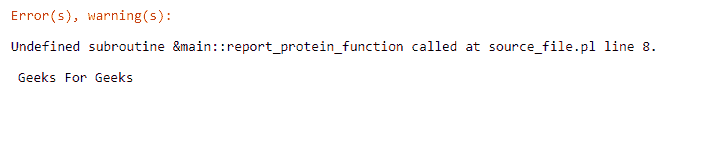
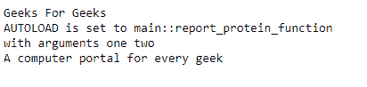

# Perl |自动加载功能

> 原文:[https://www.geeksforgeeks.org/perl-autoload-function/](https://www.geeksforgeeks.org/perl-autoload-function/)

在 [Perl](https://www.geeksforgeeks.org/introduction-to-perl/) 中，自动加载是一个定义在包中的例程或机制。使用起来很简单。每当包中有一个未定义的例程被调用时，就应用它。
如果没有自动加载，未定义的例程将在程序运行时产生错误。为了定位一个或多个包，使用未定义子程序的参数调用自动加载子程序。

**语法:**要使用自动加载，只需将该语法放入您的 Perl 程序中:-

```perl
use vars '$AUTOLOAD';
```

**参数:**
在$Autoload 中，原始子程序的名称出现在调用未定义函数的包的全局变量中。
在较新版本的 Perl 中，语法是

```perl
our $AUTOLOAD;
```

**示例:**
下面看一个 Perl 调用未定义函数的示例

```perl
#!/usr/bin/perl
use strict;
use warnings;

print "Geeks For Geeks\n";

report_protein_function("one", "two");

print "A computer portal for every geek\n";
```

**输出:**



如您所见，程序中出现了一个错误。现在我们将在程序中使用自动加载方法

```perl
#!/usr/bin/perl
use strict;
use warnings;
use vars '$AUTOLOAD';

print "Geeks For Geeks\n";

report_protein_function("one", "two");

print "A computer portal for every geek\n";

# AUTOLOAD() Function
sub AUTOLOAD 
{
    print "AUTOLOAD is set to $AUTOLOAD\n";
    print "with arguments ", "@_\n";
}
```

**输出:**


### 自动加载中的重新匹配方法()

**`AUTOLOAD()`** 功能帮助我们提取未定义包的名称。这使得从被引用的标量中获取被代理对象的数据地址成为可能。
代理类写入日志，然后重新调度到目标对象。
通过 **`NEXT`** 可以实现一个 **`AUTOLOAD`** 方法，该方法只处理`**get_**`和`**set_**`形式的方法调用，对任何其他方法请求都是不可见的。

实现如下所示:

```perl
sub AUTOLOAD
{
    $AUTOLOAD =~ s/.*:://;
    if ($AUTOLOAD =~ /^get_\w+$/) 
    {
        # Handle getting...
    }
    elsif ($AUTOLOAD =~ /^set_\w+$/) 
    {
        # Handle setting...
    }
    else 
    {
        # Decline to handle,
        # passing the request on to someone else...
        shift->${\"NEXT::$AUTOLOAD"}(@_);
    }
}
```

### 在自动加载中生成代码()

重新分配方法很容易，但是效率很低。在 **`AUTOLOAD()`** 中，代理上的每个方法调用都以正常调度失败告终。
这使得之前的自动加载方法对闭包绑定了未定义子程序的名称。这使得代码可以调用并直接到达结果。
这个方法比较容易清理，处理 **`AUTOLOAD()`** 中的行为。

### 自动加载的缺点()

这里列出了自动加载的一些缺点()

1.  虽然这个方法很有用，但是很难正确使用它，因为它没有给出关于对象和类的能力的正确信息。
2.  它会延迟子程序的加载。
3.  自动加载执行速度非常快