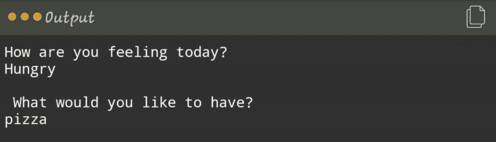
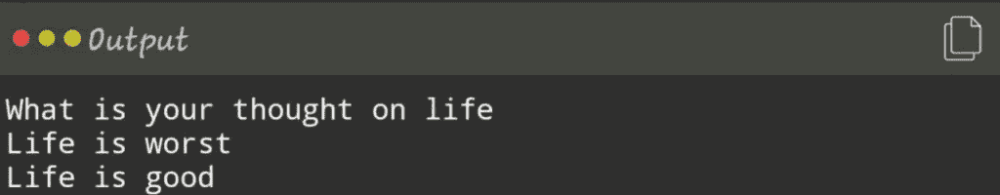
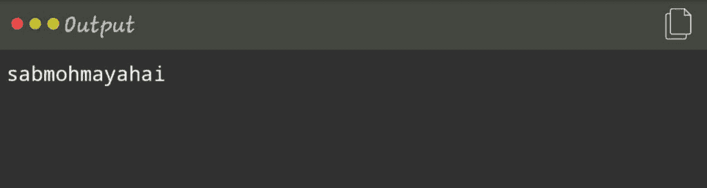
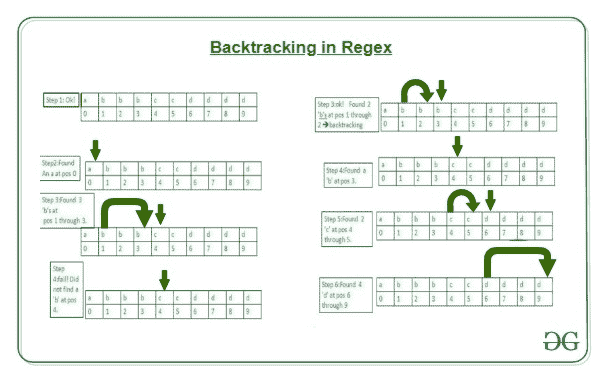

# Perl |正则表达式中的回溯

> 原文:[https://www . geesforgeks . org/perl-正则表达式回溯/](https://www.geeksforgeeks.org/perl-backtracking-in-regular-expression/)

在 Perl 中，[正则表达式](https://www.geeksforgeeks.org/perl-regular-expressions/)(又名 regexes 或 regexps 或 REs)是一种描述一组字符串的方式，而不必列出程序中的所有字符串，或者简单地说，我们可以说它是一个用于模式匹配的字符序列。在 Perl 中，正则表达式有不同的用途:

*   Firstly, they are used in conditionals to determine whether a string matches a particular pattern.
    **Example:**Usage of Regular expressions in conditionals.

    ```
    #!usr/bin/perl

    # Regular expressions in Conditionals
    # Program to determine whether a string 
    # matches a particular pattern
    print "How are you feeling today?\n";
    my $stmt = <>;
    print($stmt);
    if ($stmt == /hungry/)
    {
        print "\nWhat would you like to have?\n";
        my $ip = <>;
        print($ip);
    }
    ```

    **输出:**
    

    在这里，用户提供的输入是匹配的，如果我们有一个词“饥饿”，即如果条件为真，它将打印“你会有什么？”否则，它将跳转到下一个条件或语句

*   Secondly, they can locate patterns within a string and can replace them with something else.
    **Example:** Substitution Operator

    ```
    #!usr/bin/perl
    # Regular expressions in Substitutions

    # Program to determine whether a string 
    # matches a particular pattern and replaces it
    print "What is your thought on life\n";
    my $stmt = <>;
    print ($stmt);

    # Substitution using regex
    $stmt =~ s/worst/good/;
    print ("\n$stmt");
    ```

    **输出:**
    
    在上面的代码中“好”的替换是代替“最差”完成的。

*   最后，模式不仅可以指定某物在哪里，还可以指定它不在哪里。所以 **`[split](https://www.geeksforgeeks.org/perl-split-function/)`** 运算符使用正则表达式来指定数据不在哪里。也就是说，正则表达式定义了分隔数据字段的分隔符。
    **示例:**拆分运算符

```
#!usr/bin/perl

# Program to illustrate 
# the use of split function
$var1 = "Birth";
$var2 = "Life";
$var3 = "Death";

# Using the split function
my ($var1, $var2, $var3) = split(/, /, "sab, mohmaya, hai");
print($var1);
print($var2);
print($var3);  
```

**输出:**

这里，在上例中，split 函数匹配单个逗号字符。

### 追踪

正则表达式匹配的另一个重要特性是回溯，目前(需要时)所有正则非所有格表达式[量词](https://www.geeksforgeeks.org/perl-quantifiers-in-regular-expression/)都使用回溯(用于统计所有匹配的总数，而不是默认的只匹配一次)，即“*”、*？, "+", +?、{n，m}和{n，m}？。回溯通常在内部进行优化，但这里概述的一般原则是有效的(它是从可能性树上不成功的递归返回的)。当 Perl 试图将模式与正则表达式匹配时，它会回溯，而它之前的尝试并不成功，或者简单地说，回溯意味着存储匹配的模式以备将来使用。
**例如:** /。*?/可能用于匹配类似于 HTML 标记的内容，如“ **Bold** ”。这将推动模式的两个部分匹配完全相同的字符串，在这种情况下是“B”。

让我们再举一个例子，

```
/^ab*bc*d/
```

上面的正则表达式可以理解为:
1。从字符串的开头开始
2。匹配 a。
3。尽可能多地匹配 b，但不匹配任何 b 都可以。
4。匹配尽可能多的 c，但不匹配任何一个都可以。
5。尽可能多地匹配 d，但不匹配任何 d 都可以。
对阵‘abbbcdddd’。

这里我们可以看到我们之所以回溯到第三步是因为第四步不可行，所以我们回溯并找到最佳的解决方案来进行到第四步。