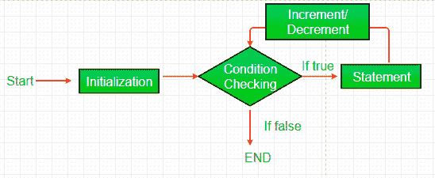

# Perl | Perl 程序的基本语法

> 原文:[https://www . geesforgeks . org/perl-basic-语法-of-a-perl-program/](https://www.geeksforgeeks.org/perl-basic-syntax-of-a-perl-program/)

[Perl](https://www.geeksforgeeks.org/introduction-to-perl/) 是一种通用、高级解释的动态编程语言。Perl 最初是为文本处理而开发的，比如从指定的文本文件中提取所需的信息，以及将文本文件转换成不同的形式。
Perl 支持过程和面向对象编程。Perl 在语法上与 C 非常相似，对于了解 **C** 、 **C++** 的用户来说很容易。

像其他编程语言一样，Perl 也遵循为应用程序和软件编写程序或编写简单 Perl 程序的基本语法。该语法包含一些预定义的词，如关键字、用于存储值的变量、表达式、用于执行逻辑的语句、用于迭代变量值的循环、用于分组语句的块、用于降低代码复杂性的子程序等。所有这些放在一起，将构成一个 Perl 程序。一个 Perl 程序，无论是一个用于两个数相加的小代码，还是一个用于执行网络脚本的复杂代码，都使用这些变量、语句和组成程序语法的其他参数。

## 变量

[变量](https://www.geeksforgeeks.org/perl-variables/)是用户定义的单词，用于保存传递给程序的值，该值将用于评估代码。每个 Perl 程序都包含代码对其执行操作的值。如果不使用变量，就不能操作或存储这些值。只有当值存储在变量中时，才能通过使用变量的名称来处理该值。
一个值是传递给程序执行操纵操作的数据。这些数据可以是数字、字符串、字符、列表等。
**例:**

```perl
Values: 
5
geeks
15

Variables:
$a = 5;
$b = "geeks";
$c = 15;
```

上面的例子包含一个字符串变量和两个整数变量。

## 公式

Perl 中的表达式由变量和一个运算符组成。这些表达式规定了要对相应代码中提供的数据执行的操作。Perl 中的表达式是在求值时返回值的东西。表达式也可以只是一个没有变量和运算符符号的值。它可以是整数，也可以是没有变量的字符串。
**例:**

```perl
Value 10 is an expression, $x + $y is an expression that returns their sum, etc.
```

表达式可以更复杂，如[正则表达式](https://www.geeksforgeeks.org/perl-regular-expressions/)，用于对字符串和子字符串执行操作。

## 评论

Perl 开发人员经常使用注释系统，因为如果不使用它，事情会变得非常混乱，非常快。注释是开发人员提供的有用信息，可以让读者理解源代码。它解释了代码中使用的逻辑或部分逻辑。当你不再回答关于代码的问题时，注释通常对维护或增强代码的人很有帮助。这些经常被引用为一种有用的编程惯例，它不参与程序的输出，但是提高了整个程序的可读性。

Perl 中有两种类型的注释:

**单行注释:** Perl 单行注释以没有空格(#)的 hashtag 符号开始，一直持续到行尾。如果注释超过一行，那么在下一行放一个标签并继续注释。Perl 的单行注释对于提供变量、函数声明和表达式的简短解释非常有用。请参见下面演示单行注释的代码片段:

```perl
#!/usr/bin/perl
$b = 10;    # Assigning value to $b
$c = 30;    # Assigning value to $c

$a = $b + $c;   # Performing the operation
print "$a";     # Printing the result
```

**多行字符串作为注释:** Perl 多行注释是一段包含在“=”和“=cut”中的文本。当注释文本不适合一行时，它们很有用；因此需要跨线。多行注释或段落作为其他人阅读您的代码的文档。Perl 将任何写在“=”符号之后的内容都视为注释，直到它的末尾带有“=cut”。请注意，' = '符号后不应有空格。请参见下面演示多行注释的代码片段:

```perl
#!/usr/bin/perl

=Assigning values to 
variable $b and $c
=cut
$b = 10;    
$c = 30;

=Performing the operation
and printing the result
=cut
$a = $b + $c;   
print "$a";    
```

## 声明

Perl 中的一条语句保存编译器执行操作的指令。这些语句在运行时对变量和值执行操作。Perl 中的每条语句都必须以分号(；).基本上，在源代码中编写的用于执行的指令称为语句。在 Perl 编程语言中有不同类型的语句，如赋值语句、条件语句、循环语句等。这些都有助于用户获得所需的输出。例如，n = 50 是赋值语句。
**多行语句:**Perl 中的语句可以简单地分成几部分扩展到一行或多行。与 Python 等其他语言不同，Perl 寻找分号来结束语句。两个分号之间的每一行都被视为一条语句。
当程序员需要做长时间的计算，无法将自己的语句装进一行时，可以很容易地将其分成多行。
**例:**

```perl
$x = $a + $b + $c + 
     $d + $e + $f;

```

## 街区

块是用于执行相对操作的一组语句。在 Perl 中，通过使用大括号({})，可以同时执行多个语句(在单个条件或循环下)。这形成了同时执行的语句块。通过分组组织语句，该块可用于使程序更加优化。在块内声明的变量的[作用域](https://www.geeksforgeeks.org/perl-scope-of-variables/)仅限于该特定块，在块外没有任何用处。只有在该特定块被执行之前，它们才会被执行。
**例:**

```perl
{
     $x = 15;
     $x = $x + 25;
     print($x);
}

```

在上面的代码中，变量$x 的范围将仅限于这个特定的块，并且在块之外没有任何用处。上块保存操作相互关联的语句。

## 函数或子程序

一个[函数/子程序](https://www.geeksforgeeks.org/perl-subroutines-or-functions/)是写在程序中的一段代码，用来执行一些特定的任务。我们可以将程序中的功能与现实生活中办公室的员工联系起来，以便更好地理解功能是如何工作的。假设老板想让他的员工计算年度预算。那么这个过程将如何完成呢？员工将从老板那里获得关于静态的信息，执行计算和计算预算，并将结果显示给他的老板。函数以类似的方式工作。它们将信息作为参数，执行一组语句或对这些参数执行操作，并返回结果。

Perl 为我们提供了两种主要类型的函数:

**内置函数:** Perl 为我们提供了大量的内置库函数。这些函数已经以函数的形式编码和存储。要使用它们，我们只需按照我们的要求将其称为 [sin()](https://www.geeksforgeeks.org/perl-sin-function/) 、 [cos()](https://www.geeksforgeeks.org/perl-cos-function/) 、 [chr()](https://www.geeksforgeeks.org/perl-chr-function/) 、 [return()](https://www.geeksforgeeks.org/perl-return-function/) 、 [shift()](https://www.geeksforgeeks.org/perl-shift-function/) 、[等](https://www.geeksforgeeks.org/tag/perl-function/)。

**用户定义函数:**除了内置函数，Perl 还允许我们创建自己的定制函数，称为用户定义函数或子程序。
使用这个我们可以创建我们自己的代码包，并通过简单地调用它在任何需要的地方使用它。

## 环

像任何其他语言一样，Perl 中的[循环](https://www.geeksforgeeks.org/perl-loops-for-foreach-while-do-while-until-nested-loops/)用于多次执行一条语句或一个语句块，直到满足特定条件。这有助于用户节省多次编写相同代码的时间和精力。

Perl 支持各种类型的循环技术:

1.  **[为回路](https://www.geeksforgeeks.org/perl-loops-for-foreach-while-do-while-until-nested-loops/)**
2.  **[foreach loop](https://www.geeksforgeeks.org/perl-loops-for-foreach-while-do-while-until-nested-loops/#foreach%20loop)**
3.  **[同时循环](https://www.geeksforgeeks.org/perl-loops-for-foreach-while-do-while-until-nested-loops/#while%20loop)**
4.  **[做……](https://www.geeksforgeeks.org/perl-loops-for-foreach-while-do-while-until-nested-loops/#do....%20while%20loop)边路循环**
5.  **[直到循环](https://www.geeksforgeeks.org/perl-loops-for-foreach-while-do-while-until-nested-loops/#do....%20while%20loop)**
6.  **[嵌套循环](https://www.geeksforgeeks.org/perl-loops-for-foreach-while-do-while-until-nested-loops/#Nested%20loops)**



## 空格和缩进

**Perl 中的 Whitespaces** 是变量和运算符之间或者关键字之间使用的空格等。除非在引号中使用空格，否则 Perl 不会影响空格。空格，如空格、制表符、换行符等。如果在引号之外使用，在 Perl 中具有相同的含义。
T3】例 1:

```perl
$a = $b + $c;
Here, spaces are of no use, 
it will cause no effect even if it is written as 
$a = $b       +         $c;

```

**例 2:**

```perl
print "Geeks for Geeks"; 
will print 
Geeks for geeks
whereas, 
print "Geeks       for
                Geeks";   
will print 
Geeks       for
                Geeks
```

这里，在上面的例子中，显示了空白只有在引号内使用时才有效。
同样的，**缩进**的过程是用来有条理的排列代码，让读者更容易理解。无论何时使用语句块，缩进都有助于降低代码的读取复杂性。
**例:**

```perl
Using Indentation:
{
    $a = $b + $c;
    print "$a";
}

Without using Indentation:
{
$a = $b + $c;
print "$a";
}

```

在上面的例子中，这两个块将以完全相同的方式工作，但是，对于有大量语句的代码，缩进的使用使它与读者更加兼容。
虽然没有必要在 Perl 代码中使用空格和缩进，但是这样做是一个很好的做法。

## 关键词

**关键词**或**保留词**是语言中用于某些内部过程或代表某些**预定义的**动作的词。它们对编译器有特殊的意义。因此，这些词不允许用作变量名或对象。这样做会导致**编译时错误**。在 Perl 中，关键字包括内置函数以及控制字。
这些关键字有时可以用作变量名，但这将导致混乱，因此，调试这样的程序将是困难的。
**示例:**

```perl
One can use $print as a variable along with the keyword print().
```