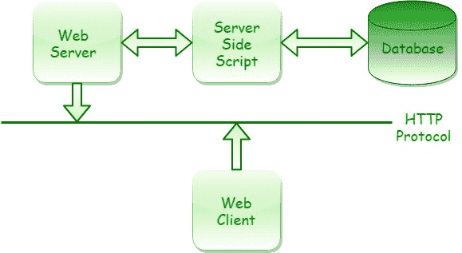

# Perl | CGI 编程

> 原文:[https://www.geeksforgeeks.org/perl-cgi-programming/](https://www.geeksforgeeks.org/perl-cgi-programming/)

在 Perl 中，CGI(公共网关接口)是一种通过 web 请求执行脚本的协议。它是一组定义信息如何在 web 服务器和自定义脚本之间交换的规则和标准。早先，像 Perl 这样的脚本语言被用于编写 CGI 应用程序。并且，HTTP 服务器调用的 CGI 代码被称为 CGI 脚本。后来，网络的发展导致了对动态内容需求的增加，通过动态内容，用其他语言而不是 Perl 编写的 CGI 应用程序变得更加流行和受欢迎，并且只被称为脚本。服务器如何执行脚本的细节由服务器决定。CGI 应用程序几乎可以执行任何任务。例如，您可以访问数据库、举行远程登录会话、动态创建网页和生成图形等。CGI 有一个非常简单的概念，但是创建一个 CGI 应用程序需要真正的编程技能。

**What is CGI?**

公共网关接口(CGI)只不过是一种协议，它定义了网络服务器与一些可执行程序的交互，以便生成动态网页。基本上，它显示了网络服务器如何向程序发送信息，程序如何将信息发送回网络服务器，而网络服务器又可以将信息发送回浏览器。在 web 服务器和外部程序之间，它被认为是标准的编程接口。
CGI 代表:

> **常见:**与很多不同的 OS 交互。
> **网关:**它为用户提供了访问图片生成器或数据库等不同程序的途径。
> **界面:**使用一种方法与 Web 服务器进行交互。

CGI 程序可以发送多种类型的数据或媒体，如文档、图像、音频剪辑等。大多数网站使用带有输入字段的计算机生成接口，网上动态内容的交易主要使用计算机生成接口完成。它是一种方法，通过这种方法，网络服务器可以分别从/向数据库、文档和其他程序获取/发送数据，然后通过网络将数据呈现给观众。

**CGI Architecture**



上图中，在客户端机器上运行的 HTTP(超文本传输协议)网络浏览器的帮助下，与网络服务器交换信息。由于 CGI 程序和 web 服务器通常运行在 web 服务器所在的同一系统上，因此根据浏览器的请求，web 服务器要么从自己的文档目录中提供文档，要么执行 CGI 程序。

**简单的 CGI 程序:**
这里有一个简单的程序来了解用 Perl 进行 CGI 编程的工作原理。在这里，我们将在 HTML 程序中获得输入，然后为结果网页运行 CGI 脚本。
因为，HTML 确定了许多输入字段，我们可以使用这些字段将用户数据传递给 CGI 程序。这是一个 HTML 表单，它利用这些输入字段，如文本字段、向下滚动列表、复选框和提交按钮，将用户数据提交给 web 服务器。

```
<html>
<head>
    <title>GfG Test Example Form</title>
</head>
<body>
    <h1>CGI-Example Form</h1>
    <h3><p>Information Required.</p></h3>
    <form action="/cgi-bin/script.pl" method="Post">
    <table>
        <tr>
        <td>Name:</td>
        <td><input type="text" name="name"><td>
        </tr>
        <tr>
        <td>Gender:</td>
        <td><select name="gender" size="1">
            <option>Female</option>
            <option>Male</option>
            <option>Transgender</option>
        </select></td>
        </tr>
        <tr>
            <td>Profession:</td>
            <td><input type="text" name="profession"><td>
        </tr>
        <tr>
        <td>Sports:</td>
            <td><input type="checkbox" name="sport"
                    value="Cricket">Cricket
                <input type="checkbox" name="sport"
                    value="Hockey">Hockey
                <input type="checkbox" name="sport"
                    value="TableTennis">TableTennis
                <input type="checkbox" name="sport"
                    value="Football">Football</td>
        </tr>
        <tr>
        <td colspan="2"><input type="submit"></td>
        </tr>
    </table>
    </form>
</body>
</html>                    
```


**注意:**HTML 表单中的每个输入元素都有一个名称属性，这在我们需要访问数据时非常重要。并且，所有的输入元素都在<表单>标签中。除此之外，<表单>标签中还有一个“动作”属性，它决定了提交表单时将调用的 CGI 脚本。

**上述表单的 Perl-CGI 脚本:**

```
#!"c:\xampp\perl\bin\perl.exe"

use strict;
use CGI ':standard';

my $name = param('name');
my $gender = param('gender');
my $profession = param('profession');
my @sports = param('sport');

my $list;

if (@sports) 
{
    $list = join ', ', @sports;
} 
else 
{
    $list = 'Null';
}

print header,
start_html(-title=>$name),
h1("Hello, $name"),
h3 p('You have Submitted the following Data:'),
h4 table(Tr(td('Name:'),
h4 td($name)),
h4 Tr(td('Gender:'),
h4 td($gender)),
h4 Tr(td('Profession:'),
h4 td($profession)),
h4 Tr(td('Sports:'),
h4 td($list))),
end_html;
```

> **CGI.pm:** CGI.pm(使用 CGI)是一个用于编程 CGI web 应用程序的大型且广泛使用的 Perl 模块，它为接收和处理用户输入提供了一致的 API。我们需要编写一个 Perl 脚本来返回一个 HTTP 响应头(内容类型:html/text)和正文中的 html，但是 CGI.pm 为我们轻松地处理了它(不需要为 HTTP 响应头硬编码)。
> 它有一个名为“param”的函数，该函数将我们传递给脚本的数据的细节/信息发送回来。当给它一个参数名时，它返回与该名称相关联的值。HTML 表单页面中输入元素的名称是 CGI 参数名称。

**注意:**提交表单后，我们将获得的网页如下所示。如果你注意到在网页浏览器的网址框中，你会看到网址已经被改变了。
T3】