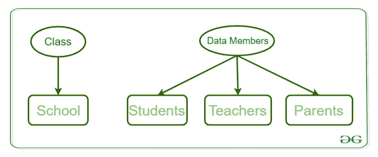

# 面向对象程序设计中的 Perl |类

> 原文:[https://www.geeksforgeeks.org/perl-classes-in-oop/](https://www.geeksforgeeks.org/perl-classes-in-oop/)

在这个现代世界中，编程的使用已经达到了最大限度，并在我们生活中的每一项工作中得到应用，我们需要使自己适应这种与现实世界的例子直接相关的编程范例。现实世界问题的竞争性和复杂性发生了巨大变化，因此该行业现在需要一些应对这些复杂性的通用方法。面向对象编程语言的概念很好地处理了这些复杂性，并且是一种完美的方式来塑造任何编程语言，使得现实世界的例子变得非常容易解决。面向对象编程(OOP)使用更加强调对象而不是过程的方法。OOPs 概念是关于根据对象和对象之间的交互来工作。

**注:**面向对象编程旨在编程中实现 ***继承******封装******多态*** 等现实世界实体。OOP 的主要目的是将数据和对数据进行操作的函数绑定在一起，这样除了函数之外，代码的任何其他部分都不能访问这些数据。

## 对象 c

对象是具有某些特征和行为的数据结构类的实例。例如，我们说“苹果”是一个物体。它的特点是:*它是一种水果*，*它的颜色是红色*，*等*。它的行为是:“*味道好*”。在 OOPs 的概念中，对象的特征由其数据表示，行为由其关联的函数表示。因此，一个对象是一个存储数据的实体，并且通过函数拥有它的接口。

## 类别–

类是数据结构的扩展概念。它定义了由数据组成的对象的原型蓝图。对象是类的实例。一个类由数据成员和数据函数组成，它是根据用户需求预先定义的数据类型，可以通过创建该类的实例来访问和使用。

**例:**
考虑*学校的一个班*。可能有不同名称和结构的学校，但它们都有一些共同的特征，如学生、教师、员工等。所以这里的学校是以老师、学生、家长为数据成员的班级，成员函数可以是 calculate_students_marks()，calculate_teachers_salary()，和 Parents_Database()。

**数据成员:**数据成员是数据变量，成员函数是用于操作这些变量的函数，这些数据成员和成员函数一起定义了类中对象的属性和行为。



### 定义类别–

在 Perl 中定义一个类非常容易。在 Perl 中，类对应于一个包。为了定义一个类，我们首先加载并构建一个[包](https://www.geeksforgeeks.org/packages-in-perl/)。软件包是用户定义的变量和子程序的预包含单元，可以在整个程序中使用。

**语法:**

```perl
package Class_name
```

### 创建类和使用对象

Perl 中的一个类可以通过使用关键字 package 来创建，但是要创建一个对象，需要调用[构造函数](https://www.geeksforgeeks.org/perl-constructors-and-destructors/)。构造函数在类中被定义为方法。

**创建一个类的实例**
类名和构造函数名可以根据用户的要求。大多数程序员更喜欢用“new”作为他们程序的构造函数名，因为它容易记住，而且比任何其他复杂的构造函数名都更容易使用。

## Perl 语言

```perl
package student     // This is the class student
sub Student_data    // Constructor to class
{
    my $class = shift;
    my $self = {
                _StudentFirstName => shift;
                _StudentLastName => shift;
               };

    print "Student's First Name is $self ->{_StudentFirstName}\n";
    print "Student's Last Name is $self ->{_StudentLastName}\n";
    bless $self, $class;
    return $self;
}
```

在上面的示例代码中，使用了名为**祝福**的函数。此函数用于将对象附加到作为参数传递给它的类。

**语法:**

```perl
bless Object_name, Class Name
```

**创建一个对象**
Perl 中的一个对象通过使用类中定义的构造函数来实例化。根据用户的要求，对象名可以是任何变量，但是通常根据与类的相关性来命名它。

## Perl 语言

```perl
$Data = Student_data student( "Shikhar", "Mathur");
```

**示例:**

## Perl 语言

```perl
use strict;
use warnings;

package student;

# constructor
sub student_data
{

    # shift will take package name 'student'
    # and assign it to variable 'class'
    my $class_name = shift;
    my $self = {
                'StudentFirstName' => shift,
                'StudentLastName' => shift
               };
    # Using bless function
    bless $self, $class_name;

    # returning object from constructor
    return $self;
}

# Object creating and constructor calling
my $Data = student_data student("Geeks","forGeeks");

# Printing the data
print "$Data->{'StudentFirstName'}\n";
print "$Data->{'StudentLastName'}\n";
```

**Output:** 

```perl
Geeks
forGeeks
```

在面向对象编程中使用类的概念非常重要，因为它完全描述了现实世界的应用程序，并且可以在现实世界的问题中采用。