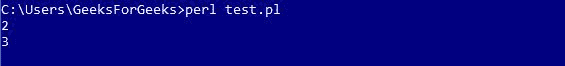
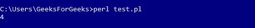
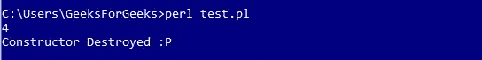

# Perl |构造函数和析构函数

> 原文:[https://www . geesforgeks . org/perl-构造函数和析构函数/](https://www.geeksforgeeks.org/perl-constructors-and-destructors/)

<center>**施工方**</center>

Perl 子例程中的构造函数返回一个对象，该对象是类的实例。在 Perl 中，惯例是将构造函数**命名为“new”**。与许多其他的 **OOPs** 不同，Perl 不提供任何构造对象的特殊语法。它使用与特定类显式关联的数据结构(散列、数组、标量)。
构造函数对散列引用和类名(包的名称)使用**“保佑”**函数。

让我们设计一些代码，以便更好地解释:
**注意:**由于使用了软件包，以下代码将无法在联机 IDE 上运行。下面的代码是一个 Perl 类或模块文件。将以下文件另存为(*。pm)扩展。

```
# Declaring the Package
package Area; 

# Declaring the Constructor method
sub new 
{
    return bless {}, shift; # blessing on the hashed 
                            # reference (which is empty).
}

1;
```

调用构造函数方法时，包名‘Area’存储在默认数组**“@ _”**中。**“shift”**关键字用于从**“@ _”**中获取包裹名称，并将其传递给**“祝福”**功能。

```
package Area;

sub new
{
    my $class = shift; # defining shift in $myclass
    my $self = {}; # the hashed reference
    return bless $self, $class;
}
1;
```

```
Note: "my" restricts the scope of a variable.
```

Perl 中的属性作为键和值对存储在哈希引用中。此外，向代码中添加一些属性。

```
package Area;

sub new 
{
    my $class = shift;
    my $self = 
    {
        length => 2, # storing length
        width  => 3, # storing width 
    };
    return bless $self, $class;
}
1;
```

上面的代码(**区域**类)有两个属性:**长度**和**宽度**。为了访问这些属性，设计了另一个 Perl 程序来使用它们。

```
use strict;
use warnings;
use Area;
use feature qw/say/;

# creating a new Area object
my $area = Area->new;

say $area->{length}; #print the length
say $area->{width}; # print the width
```

**运行代码的步骤:**

1.  将带有包区域的程序保存在名为 **Area.pm**
    **的文本文件中注意:**文件的名称应始终与包的名称相同。
2.  现在，通过名称* .pl 保存用于访问包中定义的属性的程序。这里，*可以是任何名称(在本例中是 test.pl)。
3.  使用命令
    ***在 Perl 命令行中运行保存为 test.pl 的代码***

**输出:**


***传递动态属性:***
用动态属性更新现有文件:

**Areas.pm:**

```
package Area;

sub new 
{
    my ($class, $args) = @_; # since the values will be 
                             # passed dynamically
    my $self = 
    {
        length => $args->{length} || 1, # by default the value is 1 (stored)
        width  => $args->{width} || 1,  # by default the value is 1 (stored)
    };
    return bless $self, $class;
}

# we have added the get_area function to
# calculate the area as well
sub get_area 
{
    my $self = shift;

    # getting the area by multiplication
    my $area = $self->{length} * $self->{width}; 
    return $area;
}
1;
```

**test.pl:**

```
use strict;
use warnings;
use feature qw/say/;
use Area;

# pass length and width arguments 
# to the constructor
my $area = Area->new(
            {
                length => 2, # passing '2' as param of length
                width => 2, # passing '2' as param of width
            });

say $area->get_area;
```

现在，参数

```
length = 2, width = 2
```

传递到包面积上，以计算正方形的面积。

> 调用任何子程序时，参数都包含在默认数组变量 **@_** 中

**注意:**现在按照上面解释的相同过程运行代码。
**输出:**


<center>**Destructors**</center>

当对象的所有引用都超出范围时，Perl 会自动调用析构函数方法。如果类创建线程或临时文件，而这些线程或临时文件在对象被销毁时需要清理，析构函数方法就很有用。Perl 包含析构函数的一个特殊方法名， **DESTROY** ，必须在析构函数声明时使用。

***语法:***

```
sub DESTROY 
{ 
    # DEFINE Destructors
    my $self = shift;
    print "Constructor Destroyed :P"; 
}
```

```
Once this snippet is added to existing file Area.pm.
```

输出会有点像这样:
