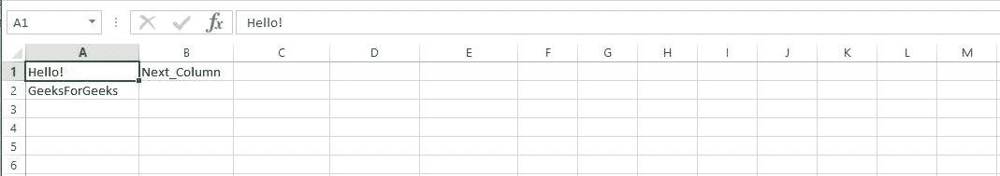
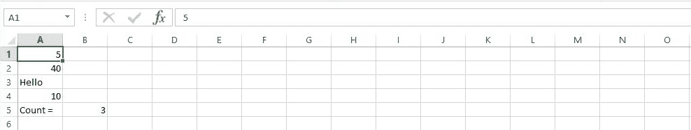
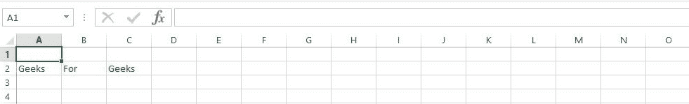

# Perl |创建 Excel 文件

> 原文:[https://www.geeksforgeeks.org/perl-creating-excel-files/](https://www.geeksforgeeks.org/perl-creating-excel-files/)

Excel 文件是计算机之间最常用的办公应用程序。它用于创建文本、数字和计算公式的行和列。这是发送报告的好方法。这个演示也适用于 Linux、Windows 和其他平台。在 excel 中，行是从 1 到 n 编号的……列是用字母 A、B、C 等标记的..因此，A1 指的是左上角。为了用 Perl 创建 excel 文件，您可以使用 padre IDE，我们还将使用 Excel::Writer::XLSX 模块。
Perl 使用 write()函数向 excel 文件中添加内容。

> **语法:**写(cell_address，content)
> 
> **参数:**
> **单元格 _ 地址:**要添加内容的单元格的地址。
> **内容:**要添加到工作表中。

**Creating an Excel File**

Excel 文件可以使用 Perl 命令行创建，但是首先我们需要加载 Excel::Writer::XLSX 模块。

```
#!/usr/bin/perl 
use Excel::Writer::XLSX;

my $Excelbook = Excel::Writer::XLSX->new( 'GFG_Sample.xlsx' );
my $Excelsheet = $Excelbook->add_worksheet();

$Excelsheet->write( "A1", "Hello!" );
$Excelsheet->write( "A2", "GeeksForGeeks" );
$Excelsheet->write( "B1", "Next_Column" );

$Excelbook->close;
```

**输出:**


程序工作原理如下:
**步骤 1:** 加载模块 Excel::Writer::XLSX。
**步骤 2:** 创建一个代表整个 Excel 文件的对象$Excelbook。
**第三步:**调用 write()方法将数据添加到工作表中。
**第四步:**现在，用**保存文件。pl** 延伸。
**第五步:**运行你的。将在命令行和 Excelsheet 上创建 pl 文件。

**Use of Basic Formulas**

Excel 提供了各种数学公式的使用，便于在资产负债表、业务记录等数据表上进行计算。
下面是 Excel 两个基本公式的描述:

*   **Addition:**
    Excel provides a method ‘SUM’ for the addition of values on specific cells.

    > **语法:** =SUM(开始，结束)
    > 
    > **参数:**
    > **起始:**起始单元格地址
    > **结束:**终止单元格地址
    > 
    > **返回:**起始单元格和结束单元格之间的值的总和。

    ```
    #!/usr/bin/perl 
    use Excel::Writer::XLSX;

    my $Excelbook = Excel::Writer::XLSX->new( 'GFG_Sample.xlsx' );
    my $Excelsheet = $Excelbook->add_worksheet();

    # Writing values at A1 and A2
    $Excelsheet->write( "A1", 55 );
    $Excelsheet->write( "A2", 47 );

    # Adding without use of SUM method
    $Excelsheet->write( "A3", "= A1 + A2" );

    # Addition of a Range of cells
    $Excelsheet->write( "A4", " =SUM(A1:A3)" );
    ```

    **输出:**
    

*   **Count:**
    This function in Excel is used to count all the cells in the given range which contain only numeric value.

    > **语法:** =COUNT(开始，结束)
    > **返回:**包含数值的所有单元格的计数

    ```
    #!/usr/bin/perl 
    use Excel::Writer::XLSX;

    my $Excelbook = Excel::Writer::XLSX->new( 'GFG_Sample.xlsx' );
    my $Excelsheet = $Excelbook->add_worksheet();

    # Writing values
    $Excelsheet->write( "A1", 5 );
    $Excelsheet->write( "A2", 40 );
    $Excelsheet->write( "A3", "Hello" );
    $Excelsheet->write( "A4", 10 );

    # Addition of a Range of cells
    $Excelsheet->write( "A5", "Count =");
    $Excelsheet->write( "B5", "=COUNT(A1:A4)" );
    ```

    **输出:**
    

**Adding Colors to ExcelSheet**

颜色可以在 ExcelSheets 中单独标记特定值。这些颜色是使用 add_format()方法指定的。

> **语法:**add _ format(color =>' color _ name ')

```
#!/usr/bin/perl
use Excel::Writer::XLSX;

my $Excelbook = Excel::Writer::XLSX->new( 'GFG_Sample.xlsx' );
my $Excelsheet = $Excelbook->add_worksheet();

# Setting value of color
my $color1 = $Excelbook->add_format(color=> 'blue',);
my $color2 = $Excelbook->add_format(color=> 'red',);
my $color3 = $Excelbook->add_format(color=> 'green',);

$Excelsheet->write( "A2", "Geeks", $color1 );
$Excelsheet->write( "B2", "For", $color2 );
$Excelsheet->write( "C2", "Geeks", $color3 );
$Excelbook->close;
```

**输出:**


**Adding values at specific coordinates**

通过提供要添加值的单元格的地址，可以在特定坐标添加值。

> **语法:**写(R，C，“值”)
> **参数:**
> R 和 C 分别是行和列的坐标。

```
#!/usr/bin/perl 
use Excel::Writer::XLSX;

my $Excelbook = Excel::Writer::XLSX->new( 'GFG_Sample.xlsx' );
my $Excelsheet = $Excelbook->add_worksheet();

$Excelsheet->write( 0, 0, "Hello!" );
$Excelsheet->write( 1, 0, "GeeksForGeeks" );
$Excelsheet->write( 3, 2, "Welcome!!!" );

$Excelbook->close;
```

**输出:**
