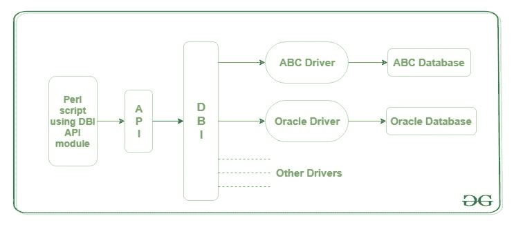
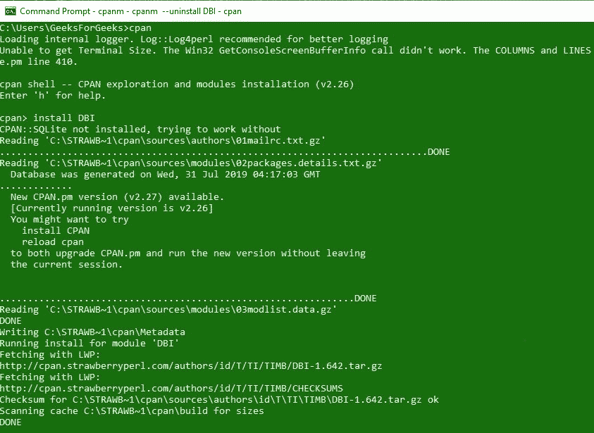

# Perl | DBI(数据库独立接口)模块集–1

> 原文:[https://www . geesforgeks . org/perl-dbidatabase-independent-interface-module-set-1/](https://www.geeksforgeeks.org/perl-dbidatabase-independent-interface-module-set-1/)

数据库是相互关联的数据的集合，有助于从数据库中高效地检索、插入和删除数据，并以表、视图、模式、报告等形式组织数据。例如，大学数据库组织了关于学生、教师和管理人员等的数据。这有助于更有效地对这些数据执行操作。

这个数据库可以在各种工具和软件的帮助下访问和操作。在 [Perl](https://www.geeksforgeeks.org/introduction-to-perl/) 中，可以借助 Perl 脚本访问和操作数据库。这些脚本在名为 **DBI(数据库独立接口)**模块的帮助下运行。DBI 模块提供了一个 API，可以与 *MySQL* 、 *Oracle* 等多个数据库进行交互。这个模块提供了一组变量和方法，它们提供了与数据库接口的交互，并且不需要访问原始数据库。

> **注意:** DBI 不对数据库进行任何操作。它只是在应用程序和驱动程序之间提供了一层。通过使用这一层，驱动程序在应用程序上进行交互和操作。

### 一个 Perl DBI 的架构



Perl 中的 DBI 不依赖于它使用的数据库。它从应用编程接口获取命令和指令，并将它们转发给与之关联的驱动程序。

### 将 DBI 连接到 Perl 中的数据库

要连接到 Perl 中的数据库，必须在系统上安装一个数据库服务器。这里，我们使用的是 **MySQL** ，因此进一步的说明将与 **MySQL** 数据库相关。

**首先:**需要在系统中安装 Perl 的 DBI 模块。这可以通过在 Shell 中运行以下命令来安装 DBI 模块来实现:

```perl
perl -MCPAN -e shell
install DBI
```


**第二步:**启动你的 MySQL 服务器，按照以下步骤与你的 DBI 建立连接:

**步骤 1:** 创建一个数据库，并相应命名。在这里，我们将把它命名为“GFG”。
**步骤 2:** 在这个数据库中创建一个表。我们创建了一个“员工”表，其字段为“姓名”、“职务”和“工资”。
**步骤 3:** 使用以下给定的脚本将数据库与 Perl 文件连接起来:

```perl
#!/usr/bin/perl  
use strict;  
use warnings;  
use DBI;  

my $driver = "mysql";  
my $database = "GFG";  
my $dsn      = "dbi:$driver:database=$database";  
my $user     = "root";  
my $password = "";  
my $dbh = DBI->connect($dsn, $user, $password, 
{  
   PrintError       => 0,  
   RaiseError       => 1,  
   AutoCommit       => 1,  
   FetchHashKeyName => 'NAME_lc',  
});  
$dbh->disconnect;  
```

在上面的脚本中，变量 **$dsn** 保存正在加载的数据库，变量 **$dbh** 保存数据库句柄对象。