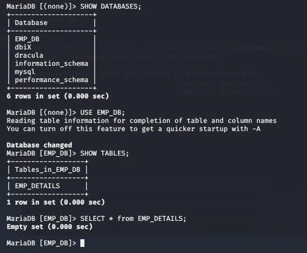
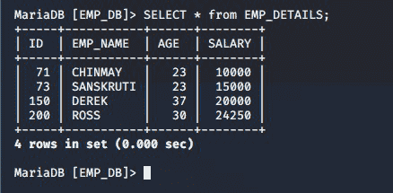
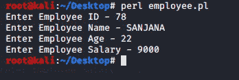
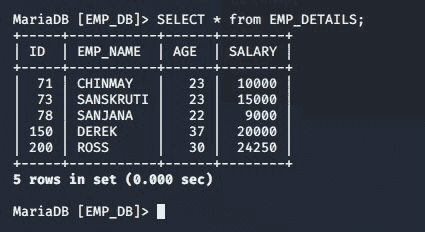
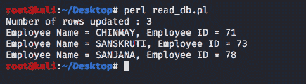
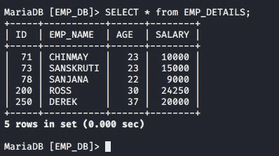
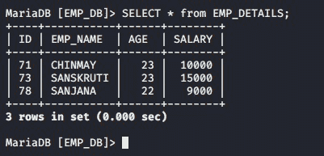

# Perl–DBI(独立于数据库)模块|集合–2

> 原文:[https://www . geesforgeks . org/perl-dbidatabase-independent-module-set-2/](https://www.geeksforgeeks.org/perl-dbidatabase-independent-module-set-2/)

[Perl](https://www.geeksforgeeks.org/introduction-to-perl/) 允许在 Perl 脚本的帮助下处理数据库。这些脚本在名为 [DBI(数据库独立接口)](https://www.geeksforgeeks.org/perl-dbidatabase-independent-interface-module-set-1/)模块的帮助下运行。DBI 模块提供了一个与许多数据库交互的应用编程接口，如 MySQL、Oracle 等。这个模块提供了一组变量和方法，它们提供了与数据库接口的交互，并且不需要访问原始数据库。

#### 创建表格

要在 Perl 中创建一个表，首先我们必须在 SQL 中创建一个数据库。为此，我们将在 SQL 提示符下执行以下语句:

```perl
CREATE DATABASE EMP_DB;
```

现在，一个名为 **EMP_DB** 的数据库将被创建。我们将使用该数据库在我们的数据库中存储员工记录。

现在，我们将使用以下命令连接到该数据库–

```perl
my $dbh = DBI->connect("dbi:$driver:$dsn", $username, $passwd, { AutoCommit => 1 })
```

现在，我们将建立与数据库的连接，我们将使用下面的语句创建一个表 EMP_DEATAILS 来保存员工详细信息的记录。

> my **$sth** = $dbh- >准备(“CREATE TABLE EMP _ DETAILS(ID INT PRIMARY KEY，EMP_NAME VARCHAR(50)，AGE INT，SALARY INT)”)；
> $ sth->execute()；

参考的完整程序如下:

```perl
#!/usr/bin/perl -w
use strict;
use DBI;
my $driver = "mysql";
my $dsn = "database=EMP_DB";
my $username = "root";
my $passwd = "";
my $dbh = DBI->connect("dbi:$driver:$dsn", 
               $username, $passwd,
               { AutoCommit => 1 }) or 
               die "Failed to connect to database : $DBI::errstr";
my $sth = $dbh->prepare("CREATE TABLE EMP_DETAILS ( 
                           ID INT PRIMARY KEY, 
                           EMP_NAME VARCHAR(50),
                           AGE INT, SALARY INT)");

$sth->execute();
```

**输出:**



#### 在数据库中插入

现在我们已经在 EMP_DB 数据库中创建了 EMP_DETAILS 表，让我们使用以下语句将一些值插入到表中:

```perl
#$dbh->do("INSERT INTO EMP_DETAILS (ID, EMP_NAME, AGE, SALARY)  
VALUES (71, 'CHINMAY', 23, 10000)")  
or die "Failed to insert :  $DBI::errstr";

#$dbh->do("INSERT INTO EMP_DETAILS (ID, EMP_NAME, AGE, SALARY)  
VALUES (73, 'SANSKRUTI', 23, 15000)")  
or die "Failed to insert :  $DBI::errstr";

$dbh->do("INSERT INTO EMP_DETAILS (ID, EMP_NAME, AGE, SALARY)  
VALUES (150, 'DEREK', 37, 20000)")  
or die "Failed to insert :  $DBI::errstr";

$dbh->do("INSERT INTO EMP_DETAILS (ID, EMP_NAME, AGE, SALARY)  
VALUES (200, 'ROSS', 30, 24250)")  
or die "Failed to insert :  $DBI::errstr";
```

**输出:**



#### 插入绑定值

考虑下面给出的程序。在程序中，我们使用了问号(？)在某些地方。这些问号被称为*占位符*。通过使用占位符，数据库驱动程序可以在对 SQL 提示符执行查询之前对其进行预处理。这个过程被称为数据的**绑定**。绑定帮助我们提高代码安全性，这有助于防止 SQL 注入攻击。

```perl
#!/usr/bin/perl -w
use strict;
use DBI;
my $driver = "mysql";
my $dsn = "database=EMP_DB";
my $username = "root";
my $passwd = "";
my $dbh = DBI->connect("dbi:$driver:$dsn", 
               $username, $passwd, 
               { AutoCommit => 1 }) or 
               die "Failed to connect to database : $DBI::errstr";

# Inserting Bind Values
print "Enter Employee ID - ";
my $id = <>;
chomp($id);

print "Enter Employee Name - ";
my $name = <>;
chomp($name);

print "Enter Employee Age - ";
my $age = <>;
chomp($age);

print "Enter Employee Salary - ";
my $salary = <>;
chomp($salary);

my $sth = $dbh->prepare("INSERT INTO EMP_DETAILS (
                            ID, EMP_NAME, AGE, SALARY)
                            VALUES (?, ?, ?, ?)");

$sth->execute($id, $name, $age, $salary) or 
      die "Failed to insert : $DBI::errstr";
```

**输出:**




#### 读取数据库值

我们的数据库现在填充了一些值。现在我们需要将它们读回给用户。为此，我们将使用 while 循环向用户读回数据。

```perl
#!/usr/bin/perl -w
use strict;
use DBI;
my $driver = "mysql";
my $dsn = "database=EMP_DB";
my $username = "root";
my $passwd = "";
my $dbh = DBI->connect("dbi:$driver:$dsn", 
               $username, $passwd, 
               { AutoCommit => 1 }) or 
               die "Failed to connect to database : $DBI::errstr";

my $sth = $dbh->prepare("SELECT EMP_NAME, ID FROM EMP_DETAILS WHERE ID<100");

$sth->execute() or die "Failed to select rows : $DBI::errstr";

my $rows = $sth->rows;
print "Number of rows updated : $rows \n";

while (my @emp_data = $sth->fetchrow_array()) 
{
    my ($name, $id ) = @emp_data;
    print "Employee Name = $name, Employee ID = $id \n";
}
$sth->finish();
```

**输出:**



#### 更新数据库值

要更新表中的任何值，我们可以通过以下方式使用 SQL UPDATE 命令:

```perl
#!/usr/bin/perl -w
use strict;
use DBI;
my $driver = "mysql";
my $dsn = "database=EMP_DB";
my $username = "root";
my $passwd = "";
my $dbh = DBI->connect("dbi:$driver:$dsn", 
               $username, $passwd, 
               { AutoCommit => 1 }) or 
               die "Failed to connect to database : $DBI::errstr";

$dbh->do("UPDATE EMP_DETAILS SET ID=250 WHERE ID=150")
      or die "Failed to update : $DBI::errstr";
```

**输出:**

**原表:**


**数据更新后的表格:**


#### 删除数据库值

要从表中删除特定的行，我们可以通过以下方式使用 SQL DELETE 语句:

```perl
#!/usr/bin/perl -w
use strict;
use DBI;
my $driver = "mysql";
my $dsn = "database=EMP_DB";
my $username = "root";
my $passwd = "";
my $dbh = DBI->connect("dbi:$driver:$dsn", 
            $username, $passwd, { AutoCommit => 1 }) or 
            die "Failed to connect to database : $DBI::errstr";

$dbh->do("DELETE FROM EMP_DETAILS WHERE ID=250") or 
     die "Failed to delete : $DBI::errstr";

$dbh->do("DELETE FROM EMP_DETAILS WHERE EMP_NAME='ROSS'") or 
     die "Failed to delete : $DBI::errstr";
```

**输出:**

