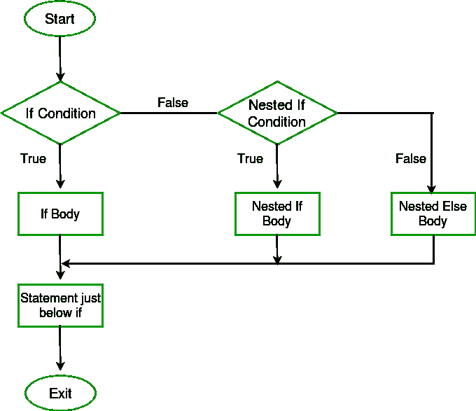
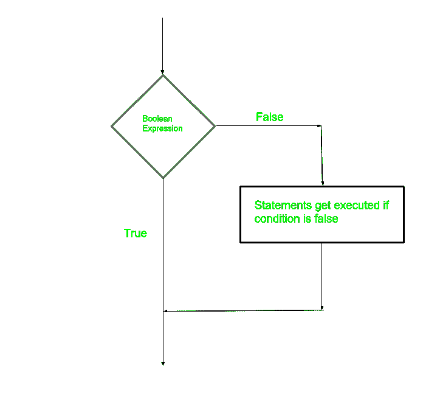
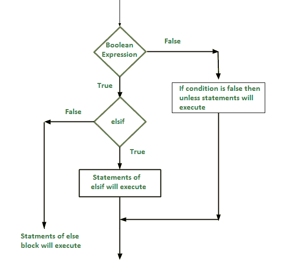

# Perl |决策制定(如果，如果-否则，嵌套-如果，如果-否则阶梯，除非，除非-否则，除非-否则)

> 原文:[https://www . geesforgeks . org/perl-决策-if-if-elsif-嵌套-if-elsif-梯形-除非-除非-elsif/](https://www.geeksforgeeks.org/perl-decision-making-if-if-else-nested-if-if-elsif-ladder-unless-unless-else-unless-elsif/)

编程中的决策类似于现实生活中的决策。在编程中，当满足某个条件时，需要执行某个代码块。编程语言使用控制语句根据某些条件来控制程序的执行流程。这些用于使执行流程前进，并根据程序状态的变化进行转移。

#### Perl 中的决策语句:

*   [如果](#if)
*   [If–else](#ifelse)
*   [嵌套–如果](#NestedIf)
*   [if–elsif 阶梯](#ifelsifladder)
*   [除非](#Unless)
*   [除非–否则](#Unlesselse)
*   [除非–elsif](#Unlesselsif)

**if 语句**

if 语句与其他编程语言相同。它用于执行基于基本条件的任务。它用于决定是否执行某个语句或语句块，即如果某个条件为真，则执行某个语句块，否则不执行。
**语法:**

```
if(condition)
{    
     # code to be executed    
}  
```

**注意:**如果花括号{ }没有和 If 语句一起使用，那么会出现编译时错误。所以必须在 if 语句中使用括号{ }。
T3】流程图:T5】


**示例:**

## Perl 语言

```
# Perl program to illustrate if statement

$a = 10;

# if condition to check
# for even number
if($a % 2 == 0 )
{
    printf "Even Number";
}
```

**输出:**

```
Even Number
```

**if–else 语句**

if 语句在条件为真的情况下计算代码，但是如果条件不为真怎么办，这就出现了 else 语句。它告诉代码当 if 条件为假时该做什么。
**语法:**

```
if(condition)
{  
      # code if condition is true  
}
else
{  
      # code if condition is false  
}  
```

**流程图:**


**示例:**

## Perl 语言

```
# Perl program to illustrate
# if - else statement

$a = 21;

# if condition to check
# for even number
if($a % 2 == 0 )
{
    printf "Even Number";
}
else
{  
    printf "Odd Number\n";
}
```

**输出:**

```
Odd Number
```

**嵌套–if 语句**

**if 语句在 if** 语句中被称为嵌套 if。在这种情况下，if 语句是另一个 if 或 else 语句的目标。当不止一个条件需要为真并且其中一个条件是父条件的子条件时，可以使用嵌套 if。
**语法:**

```
if (condition1) 
{
   # Executes when condition1 is true

   if (condition2) 
   {
      # Executes when condition2 is true
   }
}
```

**流程图:**



**示例:**

## Perl 语言

```
# Perl program to illustrate
# Nested if statement

$a = 10;

if($a % 2 ==0)
{
     # Nested - if statement
     # Will only be executed
     # if above if statement
     # is true
    if($a % 5 == 0)
    { 
         printf "Number is divisible by 2 and 5\n"; 
     }
}
```

**输出:**

```
Number is divisible by 2 and 5
```

**If–elsif–else 阶梯声明**

在这里，用户可以在多个选项中进行选择。if 语句从上到下执行。一旦控制 if 的条件之一为真，与该条件相关联的语句就会被执行，而阶梯的其余部分就会被绕过。如果这些条件都不成立，那么将执行最后的 else 语句。
**语法:**

```
if(condition1)
{  
           # code to be executed if condition1 is true  
}
elsif(condition2)
{  
           # code to be executed if condition2 is true  
}  
elsif(condition3)
{  
           # code to be executed if condition3 is true  
}  
 ... 
else
{
           # code to be executed if all the conditions are false  
}  
```

**流程图:**

[](https:#write.geeksforgeeks.org/wp-content/uploads/if-else-if-1.png)

如果-否则-如果

**示例:**

## Perl 语言

```
# Perl program to illustrate
# if - elseif ladder statement

$i = 20; 

if($i == 10)
{
    printf "i is 10\n"; 
}

elsif($i == 15)
{
    printf "i is 15\n";
}

elsif($i == 20)
{
    printf "i is 20\n";
}

else
{
    printf "i is not present\n";
}
```

**输出:**

```
i is 20
```

**除非声明**

在这种情况下，如果条件为假，那么语句将执行。**数字 0、空字符串“”、字符“0”、空列表()和 undf**在布尔上下文中都是**假**，所有其他值都是真。
**语法:**

```
unless(boolean_expression) 
{
   # will execute if the given condition is false
}
```

**流程图:**



**示例:**

## Perl 语言

```
# Perl program to illustrate
# unless statement

$a = 10;

unless($a != 10)
{

    # if condition is false then
    # print the following
    printf "a is not equal to 10\n";
}
```

**输出:**

```
a is not equal to 10
```

**除非另有说明**

除非语句后面可以跟一个可选的 else 语句，该语句在布尔表达式为真时执行。
**语法:**

```
unless(boolean_expression)
{
      # execute if the given condition is false
}

else 
{
      # execute if the given condition is true
}
```

**流程图:**


**示例:**

## Perl 语言

```
# Perl program to illustrate
# unless - else statement

$a = 10;

unless($a == 10)
{

    # if condition is false then
    # print the following
    printf "a is not equal to 10\n";
}

else
{

    # if condition is true then
    # print the following
    printf "a is equal to 10\n";
}
```

**输出:**

```
a is equal to 10
```

**除非–elsif 声明**

除非语句后面可以跟一个可选的 elsif…else 语句，这对于使用单个除非…elsif 语句测试各种条件非常有用。
**要记住的要点:**

*   除非语句可以有零到多个 elsif，并且所有这些都必须在其他语句之前。
*   除非语句可以有零个或一个其他的，并且必须在任何其他的之后。
*   一旦 elsif 成功，剩下的 elsif 或其他的都不会被测试。

**语法:**

```
unless(boolean_expression 1) 
{
     # Executes when the boolean expression 1 is false
} 
elsif( boolean_expression 2)
{
     # Executes when the boolean expression 2 is true
}
else 
{
     # Executes when the none of the above condition is met
}
```

**流程图:**



**示例:**

## Perl 语言

```
# Perl program to illustrate
# unless - elsif statement
$a = 50;

unless($a  ==  60)
{

   # if condition is false
   printf "a is not equal to 60\n";
}
elsif($a ==  60)
{  

   # if condition is true
   printf "a is equal to 60\n";
}
else
{ 

   # if none of the condition matches
   printf "The value of a is $a\n";
}
```

**Output**

```
a is not equal to 60
```

**输出:**

```
a is not equal to 60
```