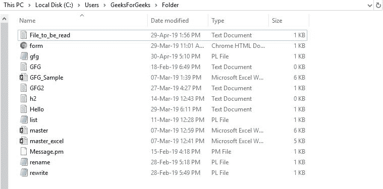
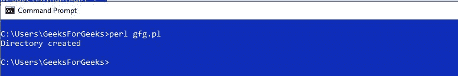
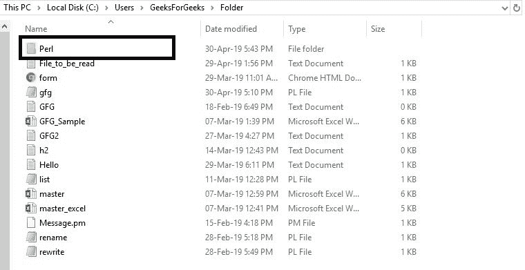
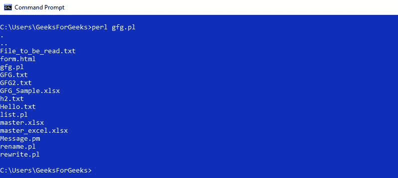
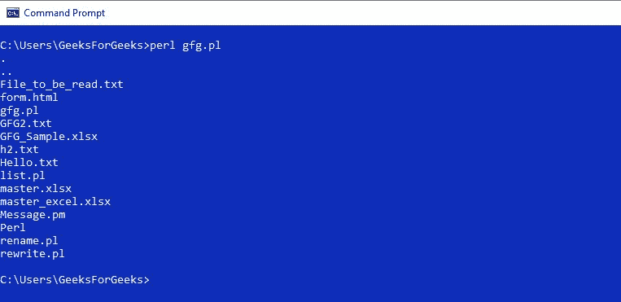
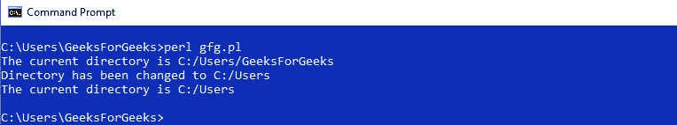
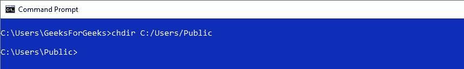
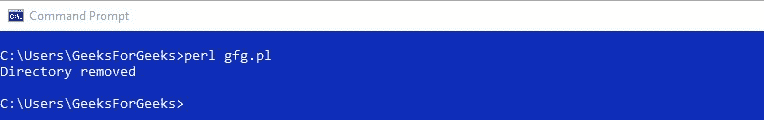

# Perl |带有 CRUD 操作的目录

> 原文:[https://www . geeksforgeeks . org/perl-directory-with-crud-operations/](https://www.geeksforgeeks.org/perl-directories-with-crud-operations/)

[Perl](https://www.geeksforgeeks.org/introduction-to-perl/) 是一种通用的跨平台编程语言，主要用于文本操作，用于开发 web 开发、图形用户界面应用等多种软件应用。它比其他编程语言更受欢迎，因为它更快、更强大，并且 Perl 有很多快捷方式，有助于编写快速脚本，从而减少编写时间。
在编程语言中，目录用于以列表的形式存储值。目录与文件非常相似。就像文件一样，目录也允许对它执行几个操作。这些操作用于修改现有目录或创建新目录。

**可以对目录执行的不同操作有:**

1.  创建新目录
2.  打开现有目录
3.  读取目录的内容
4.  更改目录路径
5.  关闭目录
6.  删除目录

**Creating a Directory**

创建目录使用 mkdir(路径，模式)。该功能有助于创建新目录，如果用户想检查文件是否已经存在，可以通过 **-e** 功能完成。路径由路径使用模式功能指定的模式设置。
**例:**

```perl
#!/usr/bin/perl  

# Path of the directory
my $directory = 'C:\Users\GeeksForGeeks\Folder\Perl';  

# Creating a directory in perl  
mkdir($directory) or die "No $directory directory, $!";  
print "Directory created \n"; 
```

**输出:**




**Opening a directory**

用一个简短的函数 opendir DIRHANDLE 在 Perl 中打开一个目录，使用的是 PATH。这里的 PATH 是要打开的目录的路径。
**例:**

```perl
#!/usr/bin/perl  

my $directory = 'C:\Users\GeeksForGeeks\Folder';  
opendir (DIR, $directory) or die "No directory, $!";  
while ($file = readdir DIR) 
{  
    print "$file\n";  
}  
closedir DIR;
```

**OutPut:**


**Read Directory in Scalar and List Context**

读取目录是一项常见的任务，因为每次都必须读取文件中存储的内容来运行代码或理解代码。要读取目录，需要使用 readdir DIRHANDLE。用户可以通过两种方式读取目录，即列表上下文和标量上下文。
在列表上下文中，代码返回目录中所有剩余的条目，如果目录中的条目是空的，那么未定义的值将在标量上下文和列表上下文中的空列表中返回。
**标量上下文:**
**示例:**

```perl
#!/usr/bin/perl  
use strict; 
use warnings; 
use 5.010; 

# Path of the directory
my $directory = shift // 'C:\Users\GeeksForGeeks\Folder'; 

# Opening the directory
opendir my $dh, $directory or 
die "Could not open '$directory' for reading '$!'\n"; 

# Printing content of the directory
while (my $content = readdir $dh) 
{ 
    say $content; 
} 

# Closing the directory
closedir $dh; 
```

**输出:**


**列表上下文:**

```perl
#!/usr/bin/perl  
use strict;  
use warnings;  
use 5.010;  

# Path of the directory
my $directory  = shift // 'C:\Users\GeeksForGeeks\Folder';  

# Opening the directory
opendir my $dh, $directory or 
die "Could not open '$directory' for reading '$!'\n";  

# Reading content of the file
my @content = readdir $dh;  

# Printing content of the directory
foreach my $content (@content) 
{  
    say $content;  
}  

# Closing the directory
closedir $dh;
```

**输出:**


**Changing a directory**

要更改目录，使用 chdir()函数。此功能有助于更改目录并将其发送到新位置。chdir()函数在用脚本调用时，会更改脚本其余部分的目录。如果在脚本中调用此函数，终端上的目录将不会改变。另一方面，当使用新的目录路径直接调用时，更改会同时反映在终端中。
**示例 1:** 在脚本中调用 chdir()时

```perl
#!/usr/bin/perl

# Module to return 
# current directory path
use Cwd;

# Path of new directory
$directory = "C:/Users";

# Printing the path of current directory
# using cwd function
print "The current directory is ";
print(cwd);
print "\n"; 

# Changing the directory using chdir function
chdir($directory) or 
      die "Couldn't go inside $directory directory, $!";

# Printing the path of changed directory
print "Directory has been changed to $directory\n";
print "The current directory is ";
print(cwd);
print "\n"; 
```

**输出**


**例 2:** 在终端上直接调用 chdir()时


**Closing a directory**

要关闭目录，使用 closedir DIRHANDLE。这里，DIRHANDLE 是使用 opendir 函数打开的目录的句柄。
**例:**

```perl
#!/usr/bin/perl

# Directory which is to be opened
$dirname = "C:/Users/GeeksForGeeks";

# Opening the directory 
# using opendir function
opendir (dir, $dirname) || die "Error $dirname\n";

# Printing content of the directory
# using readdir function
while(($filename = readdir(dir))) 
{
    print("$filename\n");
}

# Closing the directory using closedir 
closedir(dir);
```

**输出:**


**Removing a Directory**

删除一个目录可以使用 rmdir 函数完成。此函数仅在指定目录为空时，才通过 FILENAME 移除该目录，如果成功，则返回 true，否则返回 false。
**例:**

```perl
#!/usr/bin/perl  
$directory = "C:/Users/GeeksForGeeks/Folder/Perl";  

# This removes perl directory  
rmdir($directory ) or
      die "Couldn't remove $directory directory, $!";  

print "Directory removed \n";  
```

**输出:**


