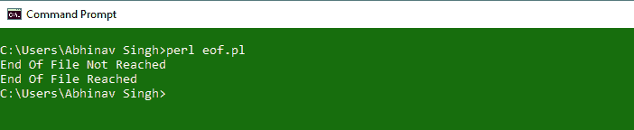

# Perl | eof–文件结束函数

> 原文:[https://www . geesforgeks . org/perl-eof-文件结束-函数/](https://www.geeksforgeeks.org/perl-eof-end-of-file-function/)

函数的作用是检查是否达到了文件的结尾。如果达到了 EOF，或者文件句柄没有打开，并且在所有其他情况下都没有定义，则返回 1。

> **语法:** eof(文件句柄)
> 
> **参数:**
> **文件句柄:**用于打开文件
> 
> **如果达到电渗流，则返回:** 1

**病例:**

1.  **eof(FileHandle) :** Passing FileHandle to eof() function. If File is empty then it returns 1 otherwise undef.
    **Example:**

    ```perl
    #!/usr/bin/perl

    # Opening Hello.txt file
    open(fh,"<Hello.txt"); 

    # Checking if File is Empty or not
    if(eof(fh)) # Returns 1 if file is empty 
                # i.e. EOF encountered at the beginning
    {
        print("End Of File\n");
    }

    # Closing the File
    close(fh);

    # Checking if File is closed or not
    # using eof() function
    if(eof(fh)) # fh is a closed file 
                # and hence, eof returns 1
    {
        print("File is closed");
    }
    ```

    **输出:**

    *   **如果 Hello.txt 为空:**
        
    *   **如果 ex1.txt 不为空:**
        
2.  **eof() :** The eof with empty parentheses refers to pseudo file formed from the files passed as command line arguments and is accessed via the ‘<>’ operator. eof() checks for the end of the last file of all the files passed as arguments in the command line.

    **Example:**

    ```perl
    #!/usr/bin/perl

    # opens filehandle for files passed as arguments
    while(<>)
    {
        # checks for eof of the last file passed as argument
        if(eof()) # It returns 1 if End Of the File is reached.
        {
            print "$_";
            print("\nEnd Of File Reached");
        }

        else # prints each fileread of the File
        {
            print "$_";
        }
    }
    ```

    **输出:**
    

3.  **eof :** eof with no parentheses checks for the End Of File of the last file read.

    **Example:**

    ```perl
    #!/usr/bin/perl

    # opening Hello.plx
    if(!open(fh, "<Hello.txt"))
    {
        print("File Not Found");
        exit;
    }

    if(eof fh)
    {
        print("Empty File");
        exit;
    }

    # check for End Of File of last file read i.e. fh
    if(not eof) # Returns 1 since eof is not reached
    {
        print("End Of File Not Reached");
    }

    # Empty while loop to reach to the End Of File
    while(<fh>) 
    { };

    # check for End Of File of last file read i.e. fh
    if(eof) # Returns 1 since eof is reached
    {
        print("\nEnd Of File Reached");
    }
    ```

    **输出:**
    