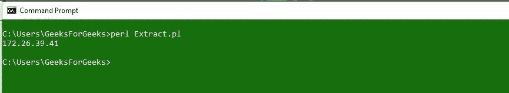
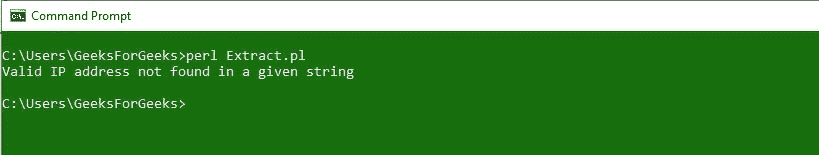
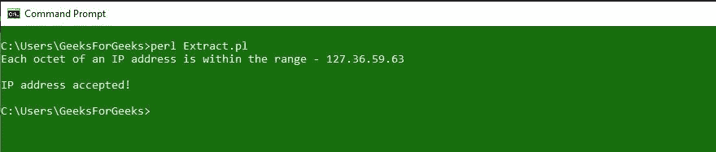
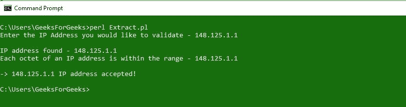

# Perl |使用正则表达式从字符串中提取 IP 地址

> 原文:[https://www . geesforgeks . org/perl-extracting-IP-address-from-a-string-use-regex/](https://www.geeksforgeeks.org/perl-extracting-ip-address-from-a-string-using-regex/)

Perl 代表**实用提取和报告语言**和这个未经授权的缩写。Perl 编程语言最强大的功能之一是**正则表达式**，在本文中，您将学习如何从字符串中提取 IP 地址。正则表达式可以是简单的，也可以是复杂的，这取决于您想要匹配的模式，比如我们的标题——使用正则表达式从字符串中提取 IP 地址。从字符串中提取 IP 地址可能是一项简单或具有挑战性的任务。因此，人们喜欢和讨厌正则表达式。它们是表达简单模式的好方法，也是表达复杂模式的可怕方法。下面给出了一些量词和字符及其含义的例子:

| 数量词 | 意义 |
| a* | 零个或多个 a |
| a+ | 一个或多个 a |
| a？ | 零分还是一分 |
| {m} | 完全是硕士 |
| a{m，} | 至少是硕士 |
| a{m，n} | 至少 m，但最多不超过 a |

| 性格；角色；字母 | 意义 |
| ^ | 字符串开头 |
| $ | 字符串结尾 |
| 。 | 除换行符以外的任何字符 |
| * | 匹配 0 次或更多次 |
| + | 匹配 1 次或更多次 |
| ？ | 匹配 0 或 1 次 |
| &#124; | 供选择的 |
| ( ) | 分组 |
| [ ] | 字符集 |
| { } | 编辑重复 |
| \ | 报价还是特价 |

### 从字符串中提取 IP 地址

最简单的方法就是用句点分隔的四个十进制数字的任意字符串

```
\d{1,3}\.\d{1,3}\.\d{1,3}\.\d{1,3})/ OR /^\d+\.\d+\.\d+\.\d+$/

```

在下面的例子中，我们只是从给定的字符串中提取一个 IP 地址。

```
#!/usr/bin/perl

my $ip = "MY IP ADDRESS IS172.26.39.41THIS IS A VALID IP ADDRESS";

if($ip =~ /(\d{1,3}\.\d{1,3}\.\d{1,3}\.\d{1,3})/)
{
    $ip = $1;
    print "$ip\n";
}
```

**输出:**


但是，上面的例子也接受了错误的 IP 地址，比如 596.368.258.269。我们知道，一个适当的十进制点分 IP 地址没有大于 255 的值，编写一个匹配 0 到 255 整数的正则表达式很难，因为正则表达式不懂算术；他们纯粹通过文本操作。因此，您必须用纯文本的方式描述整数 0 到 255。

现在，我们将看到一个提取 IP 地址的实现，它也将检查八位字节范围。

```
#!/usr/bin/perl

my $ip = "MY IP ADDRESS IS 36.59.63 THIS IS A VALID IP ADDRESS";

if($ip =~ /(\d{1,3}\.\d{1,3}\.\d{1,3}\.\d{1,3})/)
{
    if($1 <= 255 && $2 <= 255 && $3 <= 255 && $4 <= 255)
    {
        print("Each octet of an IP address ",
              "is within the range - $1\n");
        print("\nIP address accepted!\n");
    }
    else
    {
        print("Octet not in range - $1\n",
              "IP address not accepted\n");
    }
}
else
{
    print("Valid IP address not found in a given string\n");
}
```

**输出:**


如果将字符串更改为

```
[my $ip = "MY IP ADDRESS IS 127.36.59.63 THIS IS A VALID IP ADDRESS";] 
```

那么输出就是


在下面的例子中，我们接受来自用户的包含一个 IP 地址的字符串，然后从中提取 IP 地址。我们使用 **chomp()** 函数从字符串末尾删除任何换行符。

```
#!/usr/bin/perl

print("Enter the IP Address you would like to validate - ");
my $ip = <STDIN>;

if($ip =~ /(\d{1,3}\.\d{1,3}\.\d{1,3}\.\d{1,3})/)
{
    $ip = $1;
}

chomp($ip);

if($ip =~ m/^(\d\d?\d?)\.(\d\d?\d?)\.(\d\d?\d?)\.(\d\d?\d?)$/)
{
    print("\nIP address found - $ip\n");
    if($1 <= 255 && $2 <= 255 && $3 <= 255 && $4 <= 255)
    {
        print("Each octet of an IP address is ",
              "within the range - $1.$2.$3.$4\n");
        print("\n-> $ip IP address accepted!\n");
    }
    else
    {
        print("Octet(s) out of range. ",
              "Valid number range between 0-255\n");
    }
}
else
{
    print("IP Address $ip is not in a valid format\n");
}
```

**输出:**
