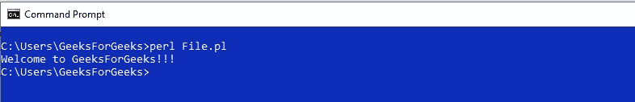
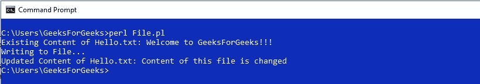
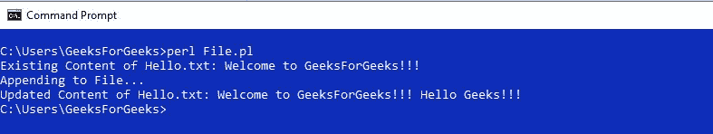
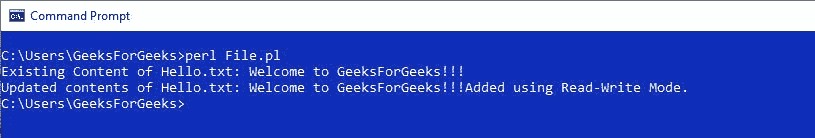
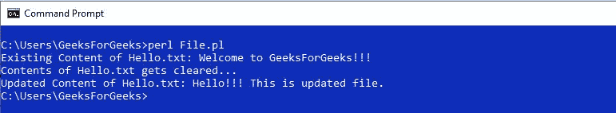
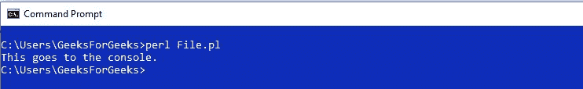
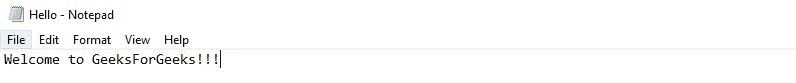
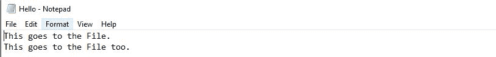

# Perl |文件处理简介

> 原文:[https://www . geesforgeks . org/perl-文件处理-简介/](https://www.geeksforgeeks.org/perl-file-handling-introduction/)

在 [Perl](https://www.geeksforgeeks.org/introduction-to-perl/) 中，文件句柄将一个名称与一个外部文件相关联，该文件可以一直使用到程序结束或文件句柄关闭。简而言之，文件句柄就像一个连接，可以用来修改外部文件的内容，并为这个连接命名(文件句柄)，以便更快地访问和使用。

Perl 中的三个基本文件句柄是 STDIN、STDOUT 和 STDERR，它们分别代表标准输入、标准输出和标准错误设备。

文件处理通常通过打开功能完成。

> **语法:**打开(文件句柄、模式、文件名)；
> 
> **参数:**
> 
> *   文件句柄——对文件的引用，可以在程序中使用，或者直到它关闭。
> *   模式-打开文件的模式。
> *   文件名-要打开的文件的名称。

此外，模式和文件名可以组合在一起形成一个单独的表达式。

> **语法:**打开(FileHandle，Expression)；
> T3】参数:
> 
> *   文件句柄——对文件的引用，可以在程序中使用，或者直到它关闭。
> *   表达式模式和文件名组合在一起。

使用关闭功能关闭文件句柄。

> **语法:**关闭(file handle)；
> T3】参数:
> 
> *   文件句柄-要关闭的文件句柄。

**Reading from and Writing to a File using FileHandle**

通过打印功能可以读取文件句柄。

> **语法:**打印(<文件句柄>)；
> T3】参数:
> 
> *   文件句柄-文件句柄以读取模式或类似模式打开。

写入文件也可以通过打印功能完成。

> **语法:**打印文件句柄字符串
> **参数:**
> 
> *   文件句柄-文件句柄以写模式或类似模式打开。
> *   字符串-要插入文件的字符串。

**Different Modes in File Handling**

| 方式 | 说明 |
| " | 只读模式 |
| ">" | 创建文件(如有必要)，清除文件内容并写入其中 |
| ">>" | 创建文件(如有必要)，追加到文件 |
| "+ | 读取和写入，但不创建 |
| "+>" | 创建文件(如有必要)、清除、读取和写入 |
| "+>>" | 创建文件(如有必要)，读取和追加 |

**示例:**
考虑一个包含字符串“欢迎来到 GeeksForGeeks！！!"最初。

1.  **Mode = “<"**
    This is read-only Mode. This mode is used to Read the content line by line from the file.

    ```
    #!/usr/bin/perl

    # Opening a File in Read-only mode
    open(r, "<", "Hello.txt");

    # Printing content of the File
    print(<r>);

    # Closing the File
    close(r);
    ```

    **输出:**
    

2.  **Mode = “>”**
    This is write-only Mode. Original contents of the File are cleared once it is opened in this Mode. It creates a new File with the same name, if one is not found.

    ```
    #!/usr/bin/perl

    # Opening File Hello.txt in Read mode
    open(r, "<", "Hello.txt"); 

    # Printing the existing content of the file
    print("Existing Content of Hello.txt: " . <r>); 

    # Opening File in Write mode
    open(w, ">", "Hello.txt"); 

    # Set r to the beginning of Hello.txt
    seek r, 0, 0; 

    print "\nWriting to File...";

    # Writing to Hello.txt using print
    print w "Content of this file is changed";

    # Closing the FileHandle
    close(w); 

    # Set r to the beginning of Hello.txt
    seek r, 0, 0; 

    # Print the current contents of Hello.txt
    print("\nUpdated Content of Hello.txt: ".<r>); 

    # Close the FileHandle
    close(r); 
    ```

    **输出:**
    

3.  **Mode=”>>”**
    This is Append Mode. Original content of the File is not cleared when it is opened in this Mode. This Mode cannot be used to overwrite as the String always attaches at the End. It creates a new File with the same name, if one is not found.

    ```
    #!/usr/bin/perl

    # Opening File Hello.txt in Read mode
    open(r, "<", "Hello.txt"); 

    # Printing the existing content of the file
    print("Existing Content of Hello.txt: " . <r>); 

    # Opening the File in Append mode
    open(A, ">>", "Hello.txt"); 

    # Set r to the beginning of Hello.txt
    seek r, 0, 0; 

    print "\nAppending to File...";

    # Appending to Hello.txt using print
    print A " Hello Geeks!!!"; 

    # close the FileHandle
    close(A); 

    # Set r to the beginning of Hello.txt
    seek r, 0, 0; 

    # Print the current contents of Hello.txt
    print("\nUpdated Content of Hello.txt: ".<r>);

    # Close the FileHandle
    close(r); 
    ```

    **输出:**
    

4.  **Mode = “+<“**
    This is Read-Write Mode. This can be used to overwrite an existing String in File. It cannot create a new File.

    ```
    #!/usr/bin/perl

    # Open Hello.txt in Read-Write Mode
    open(rw, "+<", "Hello.txt"); 

    # Print original contents of the File. 
    # rw is set to the end.
    print("Existing Content of Hello.txt: ".<rw>); 

    # The string is attached at the end 
    # of the original contents of the file.
    print rw "Added using Read-Write Mode."; 

    # Set rw to the beginning of the File for reading.
    seek rw, 0, 0; 

    # Printing the Updated content of the File
    print("\nUpdated contents of Hello.txt: ".<rw>);

    # Close the FileHandle
    close(rw); 
    ```

    **输出:**
    

5.  **Mode = “+>”**
    This is Read-Write Mode. The difference between “+<” and “+>” is that “+>” can create a new File, if one with the name is not found, but a “+<” cannot.

    ```
    #!/usr/bin/perl

    # Opening File Hello.txt in Read mode
    open(r, "<", "Hello.txt"); 

    # Printing the existing content of the file
    print("Existing Content of Hello.txt: " . <r>); 

    # Closing the File
    close(r);

    # Open Hello.txt in Read-Write Mode
    open(rw, "+>", "Hello.txt"); 

    # Original contents of the File
    # are cleared when the File is opened
    print("\nContents of Hello.txt gets cleared..."); 

    # The string is written to the File
    print rw "Hello!!! This is updated file."; 

    # Set rw to the beginning of the File for reading.
    seek rw, 0, 0; 

    print("\nUpdated Content of Hello.txt: " .<rw>);

    # Closing the File
    close(rw);
    ```

    **输出:**
    

6.  **Mode = “+>>”**
    This is Read-Append Mode. This can be used to Read from a File as well as Append to it. A new File with same name is created, if one is not Found.

    ```
    # Open Hello.txt in Read-Append Mode
    open(ra, "+>>", "Hello.txt"); 

    # Set ra to the beginning of the File for reading.
    seek ra, 0, 0; 

    # Original content of the File 
    # is NOT cleared when the File is opened
    print("Existing Content of the File: " . <ra>);

    print "\nAppending to the File....";

    # The string is appended to the File
    print ra "Added using Read-Append Mode"; 

    # Set ra to the beginning of the File for reading.
    seek ra, 0, 0; 

    # Printing the updated content
    print("\nUpdated content of the File: " . <ra>);

    # Closing the File
    close(rw);
    ```

    **输出:**
    

    **Redirecting Output**

    可以使用选择功能将输出从控制台重定向到文件中。

    > **语法:**选择文件句柄；
    > T3】参数:
    > 
    > *   文件句柄–要选择的文件的文件句柄。

    **步骤:**

    *   打开文件句柄进行写入，即“>”、“> >”、“+ ”或“+> >”。
    *   使用选择功能选择文件句柄。

    现在，使用打印功能打印的任何内容都被重定向到文件。

    **例:**

    ```
    # Open a FileHandle in Write Mode.
    open(File, ">", "Hello.txt"); 

    # This sets File as the default FileHandle
    select File; 

    # Writes to File
    print("This goes to the File."); 

    # Writes to File
    print File "\nThis goes to the File too."; 

    # This sets STDOUT as default FileHandle
    select STDOUT; 
    print("This goes to the console.");

    # Close the FileHandle.
    close(File); 
    ```

    **控制台输出:**
    

    **hello . txt 的内容:**
    **原始文件:**
    

    **更新文件:**
    