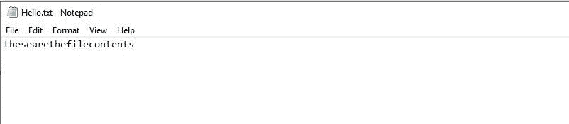

# Perl |文件输入/输出功能

> 原文:[https://www.geeksforgeeks.org/perl-file-i-o-functions/](https://www.geeksforgeeks.org/perl-file-i-o-functions/)

[Perl](https://www.geeksforgeeks.org/introduction-to-perl/) 中的[文件处理](https://www.geeksforgeeks.org/perl-file-handling-introduction/)用于从外部文件读取数据或将数据写入外部文件。这非常有用，因为它提供了一个从文件中永久存储和检索数据的平台。

**文件句柄**
文件句柄将一个名称与一个外部文件相关联，该文件可以一直使用到程序结束或文件句柄关闭。简而言之，文件句柄就像一个连接，可以用来修改外部文件的内容，并为这个连接命名(文件句柄)，以便更快地访问和使用。

输入和输出功能(输入/输出功能)是文件处理不可分割的一部分，下面是用例子解释的主要输入/输出功能。

#### 读行（）

该函数从 FILEHANDLE 中读取一行，该行必须由给定的表达式引用。对于每次函数调用，都会读取文件的下一行。这可以重复进行，直到文件结束。为了直接使用 filehandle，它必须作为 typeglob 传递。

**语法:**

```perl
readline (EXPR)
```

**示例:**

```perl
#!/ usr / bin / perl - w

my($data) = "";
open(F, "Hello.txt") or 
 die("Error encountered while reading file");

$data = <F>;
print("$data");

$data = readline(*F);
print("$data");

close(F);
```

**输出:**


#### binmode()

该函数用于将 FILEHANDLE 的读写格式设置为二进制。当一个文件被写成二进制文件时，它没有文件结尾字符。因为数据是以二进制读写的，所以执行速度更快、效率更高，因为数据不必由机器转换，而且可以直接理解。

**语法:**

```perl
binmode(FILEHANDLE)
```

**示例:**

```perl
#!/ usr / bin / perl

my($read_data);
open(DATA, "<Hello.txt") or die "Error in reading the file";

# To convert the file 
# in binary mode
binmode(DATA);

close(DATA);
```

#### 已读()

该函数用于在执行过程中从文件中读取所需数量的字符，也就是说，它可以用于读取缓冲的信息块。它也用于从文件中读取二进制数据。
**语法:**

```perl
read(FILEHANDLE, SCALAR, LENGTH)
```

**示例:**

```perl
#!/ usr / bin / perl

my($read_data);
open(DATA, "<Hello.txt") or die "Error in reading the file";
read(DATA, $read_data, 4);

print($read_data);
close(DATA);
```

**输出:**


#### 打印()

print()是 perl 中最重要的 I/O 函数之一。它用于从控制台将数据输出到文件中。

**语法:**

```perl
print FILEHANDLE LIST
```

**示例:**

```perl
#!/ usr / bin / perl

my($read_data);
open(DATA, "<Hello.txt") or
 die "Error in reading the file";

@dat = ("these", "are", "the", "file", "contents");
print DATA @dat;
close(DATA);
```

**文件在`print()`之前:**
T4】

**输出:**
这将把“这些是文件内容”写入文件`data.txt`



#### seek()

此功能用于将文件指针的位置更改为所需的位置。这里的位置也可以分别改变到另一个指定的位置(从那里)。

**语法:**

```perl
seek(FILEHANDLE, POSITION, WHENCE)
```

这里，WHORD 用于指定指针移动到的相应位置。
a)WHORD = 0，表示指针必须从文件的开头开始。
b)WHOW = 1，表示指针必须从文件的当前位置开始。
c)whorf = 2，表示指针必须从文件末尾开始。

**示例:**

```perl
#!/ usr / bin / perl

my($read_data);
open(DATA, "<Hello.txt") or
die "Error in reading the file";

# Here, WHENCE is set to 1
seek(DATA, 10, 1);
close(DATA);
```

**输出:**

```perl
The position of the pointer will be set to the specified position.
```

#### tell()

这个函数用于从程序中获取指针在文件中的位置。

**语法:**

```perl
tell(FILEHANDLE)
```

**示例:**

```perl
#!/ usr / bin / perl

my($read_data);
open(DATA, "<Hello.txt") or 
 die "Error in reading the file";
print(tell(DATA));

$char = getc(DATA);

print(tell(DATA));
close(DATA);
```

**输出:**

之所以如此，是因为最初指针位于 0 位置，但在读取一个字符后，它会移动到位置 1。

#### 关闭()

当我们打开一个文件时，我们将一个 FILEHANDLE 与一个外部文件相关联。因此，当我们使用完文件时，我们必须将 FILEHANDLE 从文件中分离出来，为此，使用了 close()函数。这将刷新 FILEHANDLE 的缓冲区。

**语法:**

```perl
close(FILEHANDLE)
```

**示例:**

```perl
#!/ usr / bin / perl

my($read_data);
open(DATA, "<data.txt") or 
 die "Error in reading the file";

close(DATA);
```