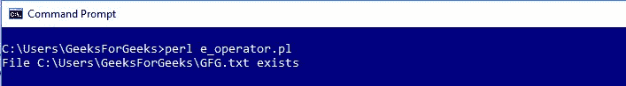
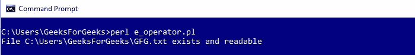

# Perl |文件测试操作符

> 原文:[https://www.geeksforgeeks.org/perl-file-test-operators/](https://www.geeksforgeeks.org/perl-file-test-operators/)

Perl 中的文件测试运算符是返回真或假值的逻辑运算符。在 Perl 中有许多操作符可以用来测试文件的不同方面。例如，为了检查文件的存在，使用了-e 操作符。或者，可以在执行追加操作之前检查是否可以写入文件。这将有助于减少程序可能遇到的错误数量。

以下示例使用“-e”，existence 运算符检查文件是否存在:

```perl
#!/usr/bin/perl

# Using predefined modules
use warnings;
use strict;

# Providing path of file to a variable
my $filename = 'C:\Users\GeeksForGeeks\GFG.txt';

# Checking for the file existence
if(-e $filename)
{

    # If File exists
    print("File $filename exists\n");
}

else
{

    # If File doesn't exists
    print("File $filename does not exists\n");
}
```

**输出:**


文件名或文件句柄作为参数传递给该文件测试操作符-例如

以下是最重要的文件测试操作符列表:

| 操作员 | 描述 |
| -r | 检查文件是否可读 |
| -w | 检查文件是否可写 |
| ［加在以-u 结尾的法语词源的名词之后构成复数］ | 检查文件是否可执行 |
| 表示“具有…性质的” | 检查文件是否属于有效的 uid |
| -右 | 检查文件是否可被真实 uid 读取 |
| -W | 检查文件是否可由真实 uid 写入 |
| ［加在以-u 结尾的法语词源的名词之后构成复数］ | 检查文件是否可由真实 uid/gid 执行 |
| 表示“具有…性质的” | 检查文件是否属于真实 uid |
| -e | 检查文件是否存在 |
| z | 检查文件是否为空 |
| 构成名词复数 | 检查文件是否有非零大小(返回字节大小) |
| -f | 检查文件是否是纯文本文件 |
| -d | 检查文件是否是目录 |
| -我 | 检查文件是否是符号链接 |
| -p | 检查文件是命名管道(先进先出):还是文件句柄是管道 |
| 构成名词复数 | 检查文件是否是套接字 |
| -b | 检查文件是否是块特殊文件 |
| -c | 检查文件是否是字符特殊文件 |
| 相当于-ED | 检查文件句柄是否对 tty 打开 |
| -你 | 检查文件是否设置了 setuid 位 |
| g | 检查文件是否设置了 setgid 位 |
| k | 检查文件是否设置了粘性位 |
| 相当于-ED | 检查文件是否是 ASCII 文本文件(启发式猜测) |
| -乙 | 检查文件是否是“二进制”文件(与-T 相反) |

您可以将 AND 逻辑运算符与文件测试运算符结合使用，如下所示:

```perl
#!/usr/bin/perl

# Using predefined modules
use warnings;
use strict;

# Providing path of file to a variable
my $filename = 'C:\Users\GeeksForGeeks\GFG.txt';

# Applying multiple Test Operators 
# on the File
if(-e $filename && -f _ && -r _ )
{
   print("File $filename exists and readable\n"); 
}

else
{
    print("File $filename doesn't exists")
}
```

**输出:**

上面的例子，检查文件是否存在，文件是否是普通的，是否可读。