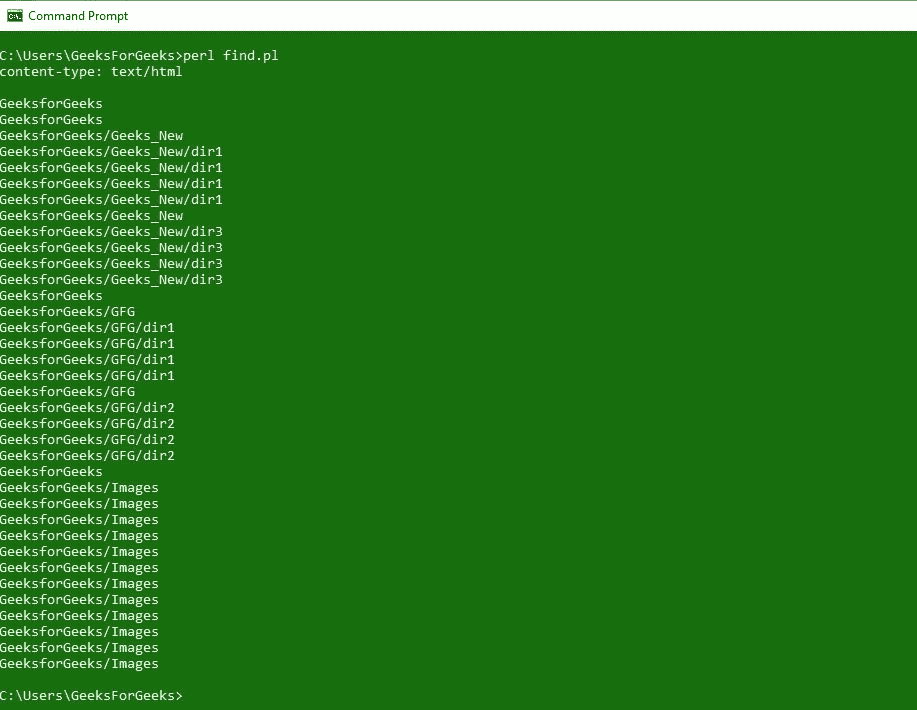
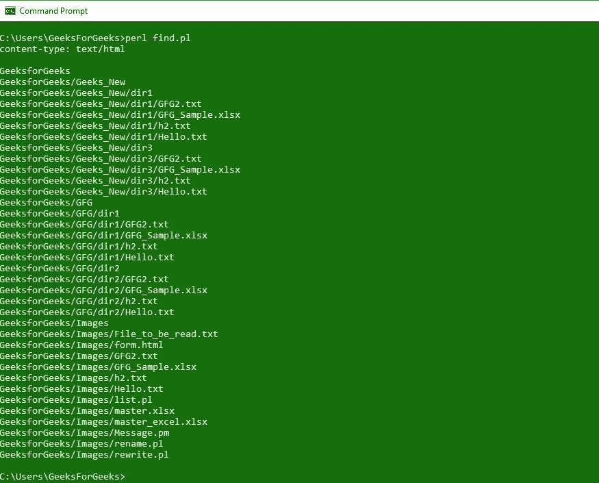
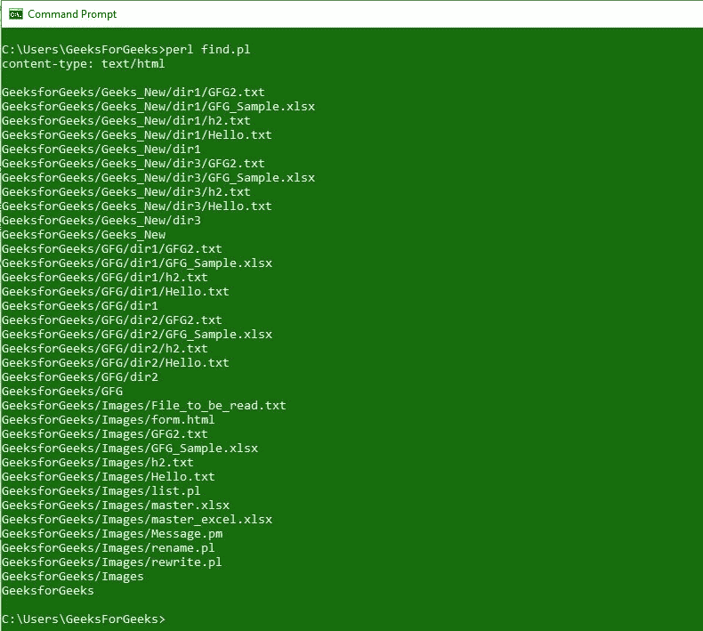
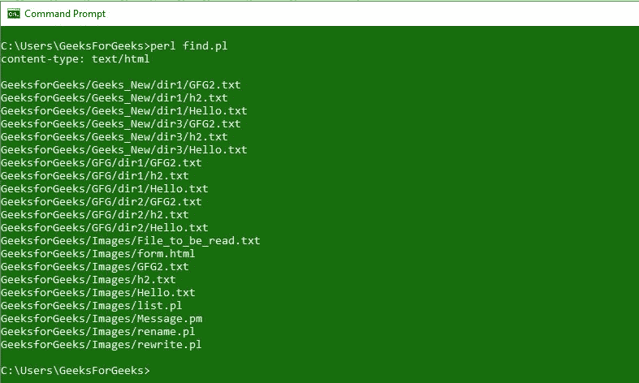

# Perl |查找文件和目录

> 原文:[https://www . geesforgeks . org/perl-find-file-and-directory/](https://www.geeksforgeeks.org/perl-finding-files-and-directories/)

在 [Perl](https://www.geeksforgeeks.org/introduction-to-perl/) 中遍历目录树有几种方法。遍历可以通过函数调用 **opendir** 和 **readdir** 来执行，它们是 Perl 编程语言的一部分。在 Perl 中遍历文件和目录也可以通过 Perl 语言自带的 **`File::Find`** 模块来完成。

**文件::查找包含 2 个模块:**

*   **查找:** `**find()**`功能对提到的/定义的@目录执行深度优先搜索。它为目录中的每个文件或子目录调用`**"&wanted"**`函数。 **`find()`** 作品自上而下。
*   **Finddepth:** `**finddepth()**`执行顺序后遍历，而不是执行顺序前遍历，自下而上工作。 **`finddepth()`** 函数的工作方式几乎与`**find()**`函数相似，除了它首先为目录内容调用`**&wanted**`而不是为目录调用它。

这两个模块之间唯一的区别是文件和目录的解析顺序。在 Perl 中查找模块具有类似于 Unix `**Find**`命令的所有功能。
**`Find`函数接受两个参数:**

*   第一个参数是为我们通过`**find**`函数找到的每个文件调用的子程序。
*   第二个参数是`**find**`函数要搜索文件的目录列表。

**以下是 Perl 查找文件和目录的一些示例脚本:**

**示例 1:** 打印搜索到的文件夹中所有可用的目录。

```
#!usr/bin/perl
print "content-type: text/html\n\n";

use strict;
use warnings;
use File::Find;

find(
{
    wanted => \&findfiles,
},
'GeeksforGeeks'
);

sub findfiles
{

    #To search only the directory
    print "$File::Find::dir\n";  
}
exit;
```

**输出:**


**示例 2:** 打印出目录中可用的文件

```
#!usr/bin/perl
print "content-type: text/html\n\n";

use strict;
use warnings;
use File::Find;

find(
{
    wanted => \&findfiles,
},
'GeeksforGeeks'
);

sub findfiles
{

    #To search the files inside the directories
    print "$File::Find::name\n";  
}
exit;
```

**输出:**


**示例 3:** 只打印一次我们正在访问的文件夹/目录中所有可用/存在的目录。

```
#!usr/bin/perl
print "content-type: text/html\n\n";

use strict;
use warnings;
use File::Find;

find(
{
    wanted => \&findfiles,
},
'GeeksforGeeks'
);

sub findfiles
{

    # To search all the available directories 
    # in the given directory without accessing them
    print "$File::Find::name\n" if -d;  

}
exit;
```

**输出:**


**示例 4:** 访问目录中的文件，而不访问同一目录中的其他可用目录。

```
#!usr/bin/perl
print "content-type: text/html\n\n";

use strict;
use warnings;
use File::Find;

find(
{
    wanted => \&findfiles,
},
'GeeksforGeeks'
);

sub findfiles
{
    # Not accessing Geeks_New and Image directory
    # present inside the dir GeeksforGeeks
    $File::Find::prune = 1 if /Geeks_New/;
    $File::Find::prune = 1 if /Images/;

    # To print the files present in dir GeekforGeeks
    print "$File::Find::name\n";

}
exit;
```

**输出:**


**示例 5:** 使用`**finddepth()**`功能查找目录中的文件和子目录。

```
#!usr/bin/perl
print "content-type: text/html\n\n";

use strict;
use warnings;
use File::Find;

finddepth(
{
    wanted => \&findfiles,
},
'GeeksforGeeks'
);

sub findfiles
{
    print "$File::Find::name\n";
}
exit;
```



**例 6:** 查找所有类型的文本文件。

```
#!usr/bin/perl
print "content-type: text/html\n\n";

use strict;
use warnings;
use File::Find;

find(
{
    wanted => \&findfiles,
},
'GeeksforGeeks'
);

sub findfiles
{   
    print "$File::Find::name\n" if -T;
}
exit;
```

**输出:**
