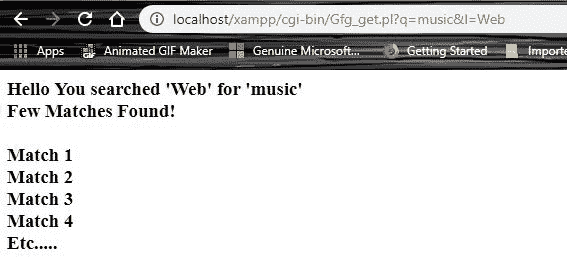
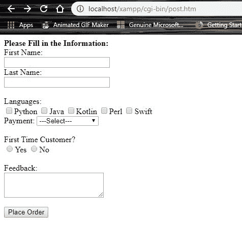
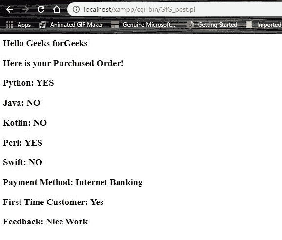

# CGI 中 Perl | GET vs POST

> 原文:[https://www.geeksforgeeks.org/perl-get-vs-post-in-cgi/](https://www.geeksforgeeks.org/perl-get-vs-post-in-cgi/)

在[Perl](https://www.geeksforgeeks.org/introduction-to-perl/)[中，公共网关接口(CGI)](https://www.geeksforgeeks.org/perl-cgi-programming/) 只不过是一个协议，定义了网络服务器与一些可执行程序的交互，以产生动态网页。基本上，它显示了网络服务器如何向程序发送信息，程序如何将信息发送回网络服务器，而网络服务器又可以将信息发送回浏览器。
**`GET`** 和`**POST**`不可互换，两者类型不同。代理服务器可以缓存`**GET**`请求的输出。`**GET**`方法是所有 web 请求将信息从浏览器传递到 web 服务器的默认方法，它还会创建一个显示在浏览器 URL 框中的长字符串。它发送附加到页面请求的加密用户信息。页面和加密信息用**隔开？**字符:
**示例:**

> **http://servername.com/cgi-bin/script_name.cgi 还是 pl？键 1 =值 1 &键 2 =值 2…。**

该信息通过 **`QUERY_STRING`** 头传递，通过使用`**QUERY_STRING**`环境变量，可以在您的 CGI 程序中轻松访问。请求字符串中只能有 1024 个字符，因为 **`GET`** 方法有大小限制。只需将**键值**对与任何网址连接起来，就可以传递信息。

> **注意:**如果您正在处理密码或任何其他敏感信息，以便将其传递给服务器，那么使用`**GET**`方法不是一个好的选择。

**示例:**

```perl
<html>
<head></head>
<body>
<b> Search Your Query:</b><br>
<FORM action="Gfg_get.pl" method = "GET">
<input type="text" name="q" size="20" maxlength="120">
<input type="submit" value="Search"><br>
<input type="radio" name="l" value="Web" checked>Web
<input type="radio" name="l" value="India">IND
</FORM>
</body>
</html>
```

**输出:**


**上述 GET 方法形式的 Perl-CGI 脚本:**

```perl
#!"c:\xampp\perl\bin\perl.exe"

$buffer = $ENV{'QUERY_STRING'};
#split information into key/value pairs
@pairs = split(/&/, $buffer);
foreach $pair (@pairs) 
{
    ($name, $value) = split(/=/, $pair);
    $value =~ tr/+/ /;
    $value =~ s/%([a-fA-F0-9] [a-fA-F0-9])/pack("C", hex($1))/eg;
    $value =~ s/~!/ ~!/g;
    $FORM{$name} = $value;
}

$SearchTerm = $FORM{'q'};
$Location = $FORM{'l'};

print "Content-type:text/html\r\n\r\n";
print "<html>";
print "<head>";
print "<title>GeeksForGeeks - Get Method</title>";
print "</head>";
print "<body>";
print "<h3>Hello You searched '$Location' for '$SearchTerm'<br>
Few Matches Found!<br>
<br>
Match 1<br>
Match 2<br>
Match 3<br>
Match 4<br>
etc.....</h3>";
print "</body>";
print "</html>";

1;
```

**输出:**

如上图所示，在输出图像中，信息随 URL 一起传递:

```perl
http://localhost/xampp/cgi-bin/Gfg_get.pl?q=music&l=Web
```

相比之下，`**POST**`方法是向 CGI 程序传递信息最可靠的方法。一般当需要在服务器上上传信息时，采用 **`POST`** 方式。针对上传数据量较大的情况，`**POST**`方法被认为比 **`GET`** 方法更适合，因为网址框中没有出现任何数据。类似于 **`GET`** 方法，信息也打包在这个里面，但是不要在**之后作为文本字符串发送？**在 URL 框中，它通过一个不同的路由将它作为一个单独的消息发送到服务器，这个路由可以被您的 Perl/CGI 程序访问。

**示例:**

```perl
<head></head>
<body>
<b>Please Fill in the Information:</b><br>
<form action="GfG_post.pl" method="post">
First Name:<br>
<input type="text" name="first_name" size="25" maxlength="100"><br>

Last Name:<br>
<input type="text" name="last_name" size="25" maxlength="100"><br>
<br>
Languages:<br>
<input type="checkbox" name="python" value="yes">Python
<input type="checkbox" name="java" value="yes">Java
<input type="checkbox" name="kotlin" value="yes">Kotlin
<input type="checkbox" name="perl" value="yes">Perl
<input type="checkbox" name="swift" value="yes">Swift
<br>
Payment: <select name=payment>
<option>---Select---</option>
<Option value="Paypal"> Paypal </option>
<Option value="Internet Banking"> Internet Banking </option>
<Option value="Credit Card"> Credict Card </option>
<Option value="Paytm"> Paytm </option>
</select><br>
<br>
First Time Customer?<br>
<input type="radio" name="first_time" value="Yes">Yes
<input type="radio" name="first_time" value="No">No<br>
<br>
Feedback:<br>
<textarea wrap= "virtual" name="feedback" cols="25" rows="3"></textarea><br>
<br>
<input type="submit" value="Place Order">
</form>
</body>
</html>
```

**输出:**


**上述 POST 方法的 Perl-CGI 脚本:**

```perl
#!"c:\xampp\perl\bin\perl.exe"

read (STDIN, $buffer, $ENV{'CONTENT_LENGTH'});
@pairs = split(/&/, $buffer);
foreach $pair (@pairs) 
{
    ($name, $value) = split(/=/, $pair);
    $value =~ tr/+/ /;
    $value =~ s/%([a-fA-F0-9] [a-fA-F0-9])/pack("C", hex($1))/eg;
    $value =~ s/~!/ ~!/g;
    $FORM{$name} = $value;
}

if($FORM{python}) 
{
   $python_flag ="YES";
} 
else 
{
   $python_flag ="NO";
}

if($FORM{java}) 
{
   $java_flag ="YES";
}
else 
{
   $java_flag ="NO";
}

if($FORM{kotlin})
{
   $kotlin_flag ="YES";
} 
else
{
   $kotlin_flag ="NO";
}

if($FORM{perl}) 
{
   $perl_flag ="YES";
} 
else 
{
   $perl_flag ="NO";
}

if($FORM{swift}) 
{
   $swift_flag ="YES";
} 
else
{
   $swift_flag ="NO";
}

$first_name= $FORM{'first_name'};
$last_name= $FORM{'last_name'};
$payment_method= $FORM{'payment'};
$first_time= $FORM{'first_time'};
$feed_back= $FORM{'feedback'};

print "Content-type:text/html\r\n\r\n";
print "<html>";
print "<head>";
print "<title>GeeksForGeeks - Post Method</title>";
print "</head>";
print "<body>";
print "<h3>Hello $first_name $last_name</h3>";
print "<h3>Here is your Purchased Order!</h3>";
print "<h3>Python: $python_flag</h3>";
print "<h3>Java: $java_flag</h3>";
print "<h3>Kotlin: $kotlin_flag</h3>";
print "<h3>Perl: $perl_flag</h3>";
print "<h3>Swift: $swift_flag</h3>";
print "<h3>Payment Method: $payment_method</h3>";
print "<h3>First Time Customer: $first_time</h3>";
print "<h3>Feedback: $feed_back</h3>";
print "</body>";
print "</html>";

1;
```

**输出:**


从上图可以看出，使用 **`POST`** 方法后，信息上传到服务器，没有出现在网址框中。与`**GET**`方法相比，这使得通过互联网发送的数据更加安全。