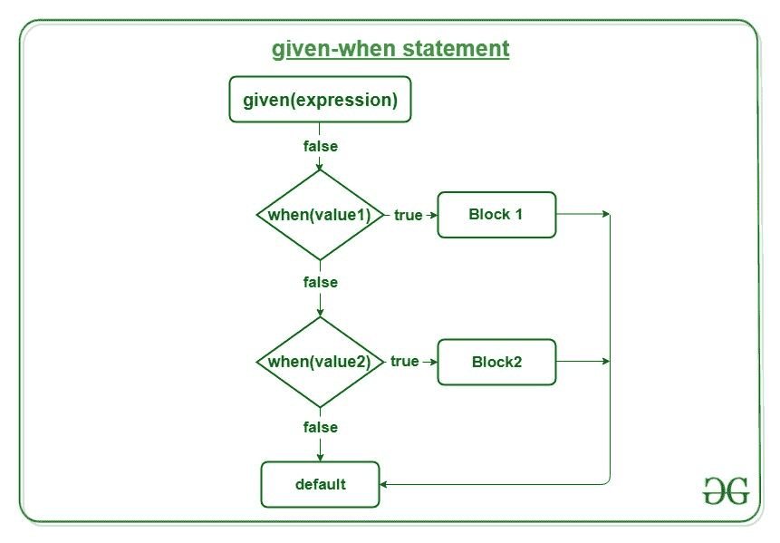

# Perl |给定时间语句

> 原文:[https://www.geeksforgeeks.org/perl-given-when-statement/](https://www.geeksforgeeks.org/perl-given-when-statement/)

Perl 中的`**given-when**`语句是将一个变量与几个整数值进行比较的长 if 语句的替代语句。

*   `**given-when**`语句是多路分支语句。它提供了一种简单的方法，可以根据表达式的值将执行分派到代码的不同部分。
*   `**given**`是允许值改变执行控制的控制语句。

Perl 中的 **`given-when`** 类似于**的`**switch-case**`C/c++**、 **Python** 或者 **PHP** 。就像`**switch**`语句一样，它也用不同的情况替换多个 if 语句。

**语法:**

```
given(expression)
{
    when(value1) {Statement;}
    when(value2) {Statement;}

    default {# Code if no other case matches}
}

```

**`given-when`** 语句还使用了另外两个关键词，即 **break** 和 **continue** 。这些关键字维持程序的流程，并帮助退出程序执行或以特定值跳过执行。

**破防:**破防关键字用来破防出一个 **`when`** 区块。在 Perl 中，不需要在每个 **`when`** 块后显式写 break。它已经被隐式定义了。
**继续:**继续，另一方面，移动到下一个 **`when`** 块如果第一个 **`when`** 块是正确的。



在 **`given-when`** 语句中，一个条件语句不能在多个 **`when`** 语句中重复，这是因为 Perl 只检查该条件的第一次出现，下一个重复的语句将被忽略。此外，默认语句必须放在所有 **`when`** 语句之后，因为编译器会按顺序检查每个 **`when`** 语句的条件匹配，如果我们将`default`放在两者之间，那么它会在那里取一个`break`并打印默认语句。

**示例:**

```
#!/usr/bin/perl

# Perl program to print respective day
# for the day-code using given-when statement
use 5.010;

# Asking the user to provide day-code
print "Enter a day-code between 0-6\n";  

# Removing newline using chomp
chomp(my $day_code = <>);  

# Using given-when statement
given ($day_code) 
{  
    when ('0') { print 'Sunday' ;}  
    when ('1') { print 'Monday' ;}  
    when ('2') { print 'Tuesday' ;}  
    when ('3') { print 'Wednesday' ;} 
    when ('4') { print 'Thursday' ;}  
    when ('5') { print 'Friday' ;} 
    when ('6') { print 'Saturday' ;}
    default { print 'Invalid day-code';}  
}  
```

**输入:**

```
4
```

**输出:**

```
Enter a day-code between 0-6
Thursday

```

### 嵌套`given-when`语句

嵌套的 **`given-when`** 语句是指 **`given-when`** 语句里面的另一个 **`given-when`** 语句。这可用于维护用户为特定输出集提供的输入层次结构。

**语法:**

```
given(expression)
{
    when(value1) {Statement;}
    when(value2) {given(expression)
                  {
                     when(value3) {Statement;}   
                     when(value4) {Statement;}   
                     when(value5) {Statement;} 
                     default{# Code if no other case matches}
                  }
                 }
    when(value6) {Statement;}

    default {# Code if no other case matches}
}

```

以下是嵌套 **`given-when`** 语句的示例:

```
#!/usr/bin/perl

# Perl program to print respective day
# for the day-code using given-when statement
use 5.010;

# Asking the user to provide day-code
print "Enter a day-code between 0-6\n";  

# Removing newline using chomp
chomp(my $day_code = <>);  

# Using given-when statement
given ($day_code) 
{  
    when ('0') { print 'Sunday' ;}  
    when ('1') { print "What time of day is it?\n";
                 chomp(my $day_time = <>);

                 # Nested given-when statement
                 given($day_time)
                 {
                     when('Morning') {print 'It is Monday Morning'};
                     when('Noon')    {print 'It is Monday noon'};
                     when('Evening') {print 'It is Monday Evening'};
                     default{print'Invalid Input'};
                 }
                }  
    when ('2') { print 'Tuesday' ;}  
    when ('3') { print 'Wednesday' ;} 
    when ('4') { print 'Thursday' ;}  
    when ('5') { print 'Friday' ;} 
    when ('6') { print 'Saturday' ;}
    default { print 'Invalid day-code';}  
}  
```

**输入:**

```
1
Morning
```

**输出:**

```
Enter a day-code between 0-6
What time of day is it?
It is Monday Morning

```

**输入:**

```
3
```

**输出:**

```
Enter a day-code between 0-6
Wednesday

```

在上面给出的例子中，当输入日期代码不是 1 时，代码将不会进入嵌套的`**given-when**`块，并且输出将与前面的例子相同，但是如果我们给出 1 作为输入，那么它将执行嵌套的`**given-when**`块，并且输出将与前面的例子不同。