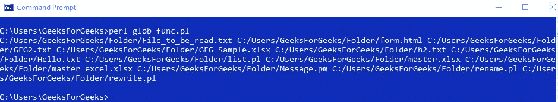

# Perl | glob()函数

> 原文:[https://www.geeksforgeeks.org/perl-glob-function/](https://www.geeksforgeeks.org/perl-glob-function/)

[Perl](https://www.geeksforgeeks.org/introduction-to-perl/) 中的 glob()函数用于打印作为参数传递给它的目录中存在的文件。这个函数可以打印扩展名已经被传递给它的所有或特定文件。

> **语法:**glob(Directory _ name/File _ type)；
> 
> **参数:**要打印文件的目录路径。
> 
> **返回:**给定目录中存在的文件列表

**示例 1:** 打印目录中所有文件的名称

```
#!/usr/bin/perl

# To store the files
# from the directory in the array
@files = glob('C:/Users/GeeksForGeeks/Folder/*');

# Printing the created array
print "@files\n";
```

**输出:**

以上示例将打印所请求目录的所有文件。

**示例 2:** 打印目录中特定文件的名称

```
#!/usr/bin/perl

# To store the files of a specific extension
# from the directory in the array
@Array = glob('C:/Users/GeeksForGeeks/Folder/*.txt');

# Printing the created array
print "@Array\n";
```

**输出:**

以上示例将打印请求目录中以结尾的所有文件。txt 扩展名。