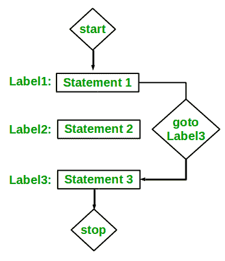

# Perl | goto 语句

> 原文:[https://www.geeksforgeeks.org/perl-goto-statement/](https://www.geeksforgeeks.org/perl-goto-statement/)

[Perl](https://www.geeksforgeeks.org/introduction-to-perl/) 中的`**goto**`语句是一个跳转语句，有时也被称为无条件跳转语句。`**goto**`语句可用于在函数中从任何地方跳转到任何地方。
**语法:**

```
LABEL:
Statement 1;
Statement 2;
.
.
.
.
.
Statement n;
goto LABEL;

```

在上面的语法中，`**goto**`语句将指示编译器立即转到/跳转到标记为 LABEL 的语句。这里的标签是用户定义的标识符，表示目标语句。紧跟在“label:”后面的语句是目标语句。

**`goto`**Perl 中的语句有三种形式——标签、表达式和子程序。

1.  **Label:** 它将简单地跳转到用 Label 标记的语句，并将从该语句继续执行。
2.  **表达式:**在这种形式下，会有一个表达式在求值后返回一个 Label 名称，goto 会使其跳转到 Label 语句。
3.  **子程序:** goto 将把编译器从当前运行的子程序转移到给定名称的子程序。

**语法:**

```
goto LABEL

goto EXPRESSION

goto Subroutine_Name

```

**`goto`使用 LABEL 名称:** LABEL 名称用于跳转到代码中的特定语句，并将从该语句开始执行。不过，它的影响范围有限。它只能在调用它的范围内工作。
**例:**

```
# Perl program to print numbers 
# from 1 to 10 using goto statement 

# function to print numbers from 1 to 10 
sub printNumbers() 
{ 
    my $n = 1; 
label: 
    print "$n "; 
    $n++; 
    if ($n <= 10) 
    {
        goto label;
    }
} 

# Driver Code
printNumbers(); 
```

**Output:**

```
1 2 3 4 5 6 7 8 9 10

```