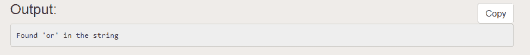
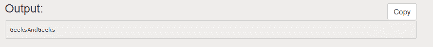
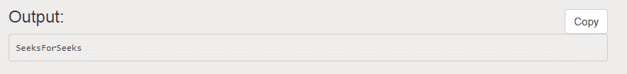
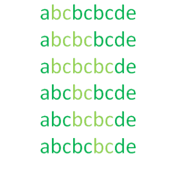
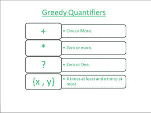
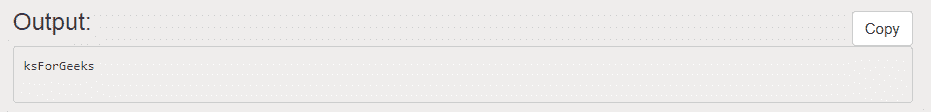
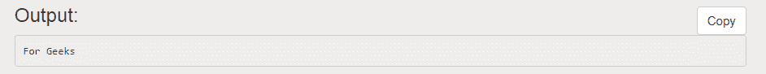

# Perl |贪婪和非贪婪匹配

> 原文:[https://www . geesforgeks . org/perl-贪婪和非贪婪-匹配/](https://www.geeksforgeeks.org/perl-greedy-and-non-greedy-match/)

[正则表达式](https://www.geeksforgeeks.org/perl-regular-expressions/) (Regex/RE)是用于模式匹配的字符序列。或者我们可以说，它是一种描述一组字符串的方式，而不必列出程序中的所有字符串。我们可以使用模式绑定操作符 **=~** 和**来应用正则表达式！~** 。Regex 运算符 **=~** 用于测试正则表达式匹配。
**例:**我们来考虑一下**/极客/** 作为正则表达式。会匹配的

```
Geeksforgeeks
Computergeeks
```

但不能

```
Ge12eksg22eeks
Geeksg*eks
```

而**！~** 确定正则表达式应用于哪个变量，并否定匹配结果；如果匹配成功，则返回 false，如果匹配失败，则返回 true。考虑上面的例子，我们得到的表达式为真将被认为是假，假正则表达式为真。它否定了使用 **=~** 时获得的结果。

**模式匹配:**这是一种在给定字符串中找出特定字符序列或模式的方法。在 Perl 中，我们有三个正则表达式运算符。它们是:

```
Match Regular Expression - m//
Substitute Regular Expression - s///
Transliterate Regular Expression - tr///
```

**示例 1:使用匹配运算符**

```
#!usr/bin/perl

# Perl program to search the substring "or" 
# in the word GeeksForGeeks

# String to find pattern from
$a = "GeeksForGeeks";

# Using m operator to find substring
if($a = ~m/or/)
{
    print "Found 'or' in the string "; 
}
```


在上面的示例中，使用匹配运算符“**m/**搜索字符串中的特定子字符串。如果在字符串中找到模式，它将返回 true。

**示例 2:使用替代运算符**

```
#!/usr/bin/perl

# Perl program to replace the substring "For" 
# in the word GeeksForGeeks

# String to perform substitution on
$a = "GeeksForGeeks";

# Using substitution operator to replace
$a = ~s/For/And/; 
print "$a";
```



这里，替换运算符“ **s///** ”用于用给定的文本替换字符串中的模式。如果模式存在，那么它将被替换，否则它将返回 false。

**例 3:使用音译运算符**

```
#!/usr/bin/perl

# Perl program to replace all occurrences
# of a pattern in the string

# String to be used
$string = 'GeeksForGeeks';

# Replace 'G' with 'S' using 
# transliterator operator
$string =~ tr/G/S/;

# Printing the final string
print "$string\n";
```


在这里，搜索字符串中出现的所有字符“G”，并使用音译运算符“ **tr///** 将其替换为另一个字符“S”。即使没有替换，它也不会返回 false。

<font size="3&quot;">**【贪婪匹配和非贪婪匹配】**</font>
REs 中通常的匹配规则有时被称为“**最左边最长的**”:当一个模式可以在字符串中的多个位置匹配时，所选择的匹配将是从字符串中最早可能的位置开始，然后尽可能延伸的匹配。通常 Perl 模式匹配是贪婪的。我们所说的贪婪是指解析器试图尽可能地匹配。以字符串**中的 abbcbcbcde**为例，模式
贪婪与非贪婪匹配 **/(bc)+/** 可以通过六种不同的方式进行匹配，如图所示:


在上图中，这些匹配的图案中的第三个是“**最左边最长的，**”也被称为贪婪。然而，在某些情况下，可能希望获得“最左最短”或最小匹配。我们可以用“**”把贪婪匹配变成非贪婪匹配？**' RE 结尾即' ***？**'匹配前面子表达式的最小数量的实例，这将允许整体匹配成功。同样，' **+？**“至少匹配一个实例，但不超过允许整体匹配成功所必需的数量”，以及“**？？**'匹配零个或一个实例，优先选择零。


**示例:贪婪模式匹配**

```
#!/usr/bin/perl

# Perl program to show greedy matching
$var = "Geeks For Geeks";

# Matching pattern from k to s
$var =~ /(k.*s)(.*)$/;

# Printing the resultant string
print($1, "\n");
```


这里我们可以看到代码会从 k 开始匹配到 s，并且会尽可能匹配。

**示例:非贪婪模式匹配**

```
#!/usr/bin/perl

# Perl program to show non-greedy matching
my $str = "Geeks For Geeks";

# Matching pattern from k to s
$str =~ /.*?\s(.*)/; 

# Printing Resultant string
print($1);
```


与非贪婪算子比较时，匹配代码最少。