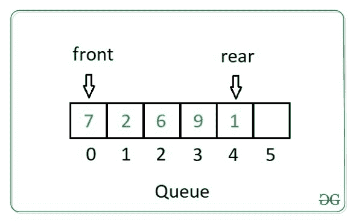
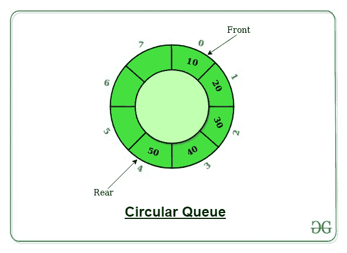

# Perl |实现队列

> 原文:[https://www.geeksforgeeks.org/perl-implementing-a-queue/](https://www.geeksforgeeks.org/perl-implementing-a-queue/)

**先决条件:** [堆栈](https://www.geeksforgeeks.org/stack-data-structure-introduction-program/)
**队列**在 [Perl](https://www.geeksforgeeks.org/introduction-to-perl/) 中是一个线性抽象数据结构，遵循 **FIFO** (先进先出)顺序。它类似于我们在日常生活中遇到的排队，先到者先得。两端都是开放的。与堆栈中插入和删除操作发生在堆栈顶端**的同一端不同，队列中这些操作发生在队列前端**和后端**的不同端。******

### ****队列上的操作:****

****对队列执行以下基本操作:****

1.  ******入队(插入):**向队列中添加一个项目。如果队列已满，则会出现**溢出**情况。****
2.  ******出列(删除):**从队列中删除一个项目。如果队列为空，则会出现**下溢**情况。****
3.  ******前置:**从队列中获取前置项目。****
4.  ******后方:**从队列中获取最后一个物品。****

********

### ****创建队列****

****在 Perl 中创建队列非常简单。这可以通过声明一个数组来实现，该数组可以是空的，也可以用一些预填充的数据初始化。****

```
**@queue;        # Queue is empty.

@queue = (1, 2, 3);      # Queue with initialized values.**
```

### ****队列的类型****

****根据插入和删除的标准，队列可以是以下类型:****

### ****简单队列****

****简单队列只是一个队列，其中插入发生在前面，删除发生在队列的末尾。
在 Perl 中，队列的操作可以使用 **push** 和 **shift** 函数来实现。
推**推**功能用于在队列末尾添加一个或多个值。
**shift**功能将队列向左移动一个单位，删除(弹出)第一个元素。如果队列为空，将返回**取消**。****

******示例:******

## ****Perl 语言****

```
**#!/usr/bin/perl
use strict;
use warnings;

# Intitialising the Queue
my @queue = (1, 2, 3);

# Original queue
print "Original Queue: @queue";

# Pushing values into queue
push(@queue, (4, 5, 6)); 

# Updated Queue after 
# Push operation
print("\nUpdated Queue after Push: @queue");

# Popping values from queue
my $val1 = shift(@queue);
print("\nElement popped is: $val1");
my $val2 = shift(@queue);
print("\nElement popped is: $val2"); 

# Updated Queue after 
# Pop operations
print("\nUpdated Queue after Pop: @queue");**
```

******Output:** 

```
Original Queue: 1 2 3
Updated Queue after Push: 1 2 3 4 5 6
Element popped is: 1
Element popped is: 2
Updated Queue after Pop: 3 4 5 6
```**** 

### ****循环队列****

****在循环队列中，队列的最后一个位置连接到第一个位置形成一个圆，也称为**环形缓冲区**。如果队列从前面看是空的，但最后却是满的，那么我们也可以在循环队列中插入元素，而在简单队列中则不是这样。循环队列将是**固定大小的**，不像普通队列。
除了**推**和**移**功能外，循环队列还有两个变量**前置**和**后置**来存储队列的前后位置。****

********

******示例:******

## ****Perl 语言****

```
**#!/usr/bin/perl
use strict;
use warnings;

# Intitialising the Queue
my @queue = (1, 2, 3);
my $size = 7; # No. of elements to be stored in queue

# Initially queue has three elements
my $front = 0;
my $rear = 2;

# Original queue
print "Original Queue: @queue";

# Pushing values into queue
$rear = ($rear + 1) % $size;
my $val = 4;
while(1)
{
    if ($rear == $front)
    {
        print("\nQueue is full.");
        last;
    }
    else
    {
        print("\nPushed $val in queue");
        $queue[$rear] = $val;
        $rear = ($rear + 1) % $size;
        $val += 1;
    }
}

# Updated Queue after
# Push operation
print("\nUpdated Queue after Push: @queue");

# Popping values from queue
my $val1 = $queue[$front];
$queue[$front] = -1;
$front = ($front + 1) % $size;
print("\nElement popped is: $val1");

my $val2 = $queue[$front];
$queue[$front] = -1;
$front = ($front + 1) % $size;
print("\nElement popped is: $val2");

# Updated Queue after
# Pop operations
print("\nUpdated Queue after Pop: @queue");
while(1)
{
    if ($rear % $size == $front)
    {
        print("\nQueue is full.");
        last;
    }
    else
    {
        print("\nPushed $val in queue");
        $queue[$rear] = $val;
        $rear += 1;
        $val += 1;
    }
}
print("\nUpdated Queue after Push: @queue");**
```

******Output:** 

```
Original Queue: 1 2 3
Pushed 4 in queue
Pushed 5 in queue
Pushed 6 in queue
Pushed 7 in queue
Queue is full.
Updated Queue after Push: 1 2 3 4 5 6 7
Element popped is: 1
Element popped is: 2
Updated Queue after Pop: -1 -1 3 4 5 6 7
Pushed 8 in queue
Pushed 9 in queue
Queue is full.
Updated Queue after Push: 8 9 3 4 5 6 7
```**** 

### ****优先级队列****

****在优先级队列中，每个项目都有一个与之关联的定义的**优先级**。优先级最低的项目将首先从优先级队列中删除。具有相同优先级的项目将按照其在队列中的
位置的顺序进行处理。****

******示例:******

## ****Perl 语言****

```
**#!/usr/bin/perl
use strict;
use warnings;

# Initialising queue with priority
my @queue = ([1, 3], [2, 7], [4, 3], [5, 2]);

sub pull_highest_prio
{
    my $max = 0;
    for (my $i = 0; $i < scalar(@queue); $i++)
    {
        if ($queue[$i][1] > $queue[$max][1])
        {
            $max = $i;
        }
    }
    print("\nPopped item: $queue[$max][0], ",
          "Priority: $queue[$max][1]");
    splice @queue, $max, 1;
}

# Driver Code
print("\nOriginal Queue is ");
for (my $i = 0; $i < 4; $i++)
{
    print("$queue[$i][0] ");
}
push(@queue, [11, 9]);
push(@queue, [7, 0]);

print("\nUpdated Queue after push is ");
for (my $i = 0; $i < 6; $i++)
{
    print("$queue[$i][0] ");
}
pull_highest_prio;
pull_highest_prio;
pull_highest_prio;
pull_highest_prio;

print("\nUpdated Queue after pop is ");
for (my $i = 0; $i < 2; $i++)
{
    print("$queue[$i][0] ");
}**
```

******Output:** 

```
Original Queue is 1 2 4 5 
Updated Queue after push is 1 2 4 5 11 7 
Popped item: 11, Priority: 9
Popped item: 2, Priority: 7
Popped item: 1, Priority: 3
Popped item: 4, Priority: 3
Updated Queue after pop is 5 7
```**** 

### ****双端队列****

****双端队列只是简单队列的一般化版本，除了插入和删除操作，可以在队列的**前端**和**后端**完成。这是一种非常重要的数据结构类型，因为它既可以用作堆栈，也可以用作队列。****

******示例:******

## ****Perl 语言****

```
**#!/usr/bin/perl
use strict;
use warnings;

# Intitialising the Queue
my @queue = (1, 2, 3);
my $front = 0;
my $rear = 2;
sub insert_front
{
    my $val = $_[0];
    unshift(@queue, $val);
    $rear += 1;
}

sub insert_rear
{
    my $val = $_[0];
    push(@queue, $val);
    $rear += 1;
}

sub delete_front
{
    print("\nElement popped is: $queue[0]");
    splice @queue, 0, 1;
    $rear -= 1;
}

sub delete_rear
{
    print("\nElement popped is: $queue[$rear]");
    splice @queue, scalar(@queue) - 1, 1;
    $rear -= 1;
}

# Original queue
print "Original Queue: @queue";

# Pushing values into queue
&insert_rear(4);
&insert_rear(3);
print("\nRear element is $queue[$rear]");
&insert_front(1);
&insert_front(7);
print("\nFront element is $queue[$front]");

# Updated Queue after
# Push operation
print("\nUpdated Queue after Push: @queue");

# Popping values from queue
delete_rear;
delete_front;
print("\nFront element is $queue[$front]");

&insert_front(20);
delete_rear;
print("\nRear element is $queue[$rear]");

# Updated Queue after
# Pop operations
print("\nUpdated Queue after Pop: @queue");**
```

******Output:** 

```
Original Queue: 1 2 3
Rear element is 3
Front element is 7
Updated Queue after Push: 7 1 1 2 3 4 3
Element popped is: 3
Element popped is: 7
Front element is 1
Element popped is: 4
Rear element is 3
Updated Queue after Pop: 20 1 1 2 3
```**** 

### ****抽象实现****

******抽象**是指对正常用户隐藏操作的功能，即提供操作功能而不定义功能背后的逻辑。
在 Perl 中，队列的抽象实现可以使用 Perl 的内置模块 **Thread::Queue** 来实现，该模块提供线程安全的 FIFO 队列，可以被任意数量的线程访问。****

******基本方法:******

1.  ******新建(列表)**–使用提供的项目列表创建新队列，如果未列出，则创建新的空队列。****
2.  ******入队(列表)**–将项目列表添加到队列末尾。****
3.  ******出列(计数)**–从队列头部移除请求的项目数，并返回它们，如果未提及，则从队列中出列一个元素。****
4.  ******pending()**–返回队列中还剩下的项目数或者我们可以说，它基本上返回队列的大小。****
5.  ******end()**–声明不再向队列中添加项目。****

******示例:******

## ****Perl 语言****

```
**#!/usr/bin/perl
use strict;
use warnings;

use Thread::Queue;

# A new pre-populated queue
my $q = Thread::Queue->new(1, 2, 3);    

sub head
{
    if ($q->pending() == 0)
    {
        print("\nThe queue is empty.");
    }
    else
    {
        my $item = $q->dequeue();
        print("\nHead of the Queue is $item.");
    }
}
my $isize = $q->pending();
print("Initial size of the queue is $isize");

# insert three items at the back of the queue
$q->enqueue(5, 6, 7);    
&head();

my $size = $q->pending();
print("\nThe size of the queue is $size");

# delete the head item of the queue
$q->dequeue();            
&head();

# delete two items from the front
$q->dequeue(2);        
my $size2 = $q->pending();
print"\nThe size of the queue is $size2";

&head();
&head();
$q->end();**
```

******Output:** 

```
 size of the queue is 3
Head of the Queue is 1.
The size of the queue is 5
Head of the Queue is 3.
The size of the queue is 1
Head of the Queue is 7.
The queue is empty.
```**** 

### ****并行或异步处理****

******并联**表示同时或同时，**异步**表示连续或非阻塞。队列的实现操作是阻塞的，即在执行一个操作时，另一个操作必须先等待它结束，然后再执行。这对于少量任务来说没问题，但是对于大量任务或操作来说，这种类型的处理有点忙乱和耗时。
为了克服这个问题，Perl 提供了一些并行或异步处理的方法，以便这些操作可以同时运行，或者不等待其他操作结束。对此的两个主要解决方案是**穿线**和**分叉**。分叉是为某个进程创建完全相同的副本，然后这两个进程并行执行，它们的变量之间没有太多联系，尽管它们操作或处理相同的变量(副本)。使用**叉()**功能完成。****

******示例:******

## ****Perl 语言****

```
**#!/usr/bin/perl
use strict;
use warnings;
use 5.010;

say "PID $";
my $pid = fork();
die if not defined $pid;
say "PID $ ($pid)";**
```

******Output:** 

```
PID 22112
PID 22112 (22113)
PID 22113 (0)
```**** 

****在调用 **fork()** 之前，我们得到了一个 PID (22112)，这是当前进程的进程 ID，分叉之后我们得到了两行。第一个打印行来自与当前相同的进程(它具有相同的 PID)，第二个打印行来自子进程(具有 PID 63779)。第一个从 fork 收到一个$pid，包含子进程的编号。第二，子进程得到了数字 0。
Perl 还通过 [POE](https://metacpan.org/pod/POE) 框架支持事件驱动编程。****