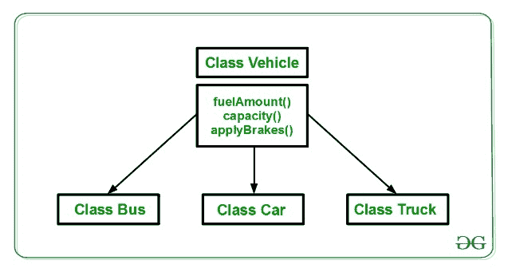

# Perl | OOPs 中的继承

> 原文:[https://www.geeksforgeeks.org/perl-inheritance-in-oops/](https://www.geeksforgeeks.org/perl-inheritance-in-oops/)

继承是任何类提取和使用其他类的特性的能力。这是从名为*基类*的现有类创建名为*派生类*的新类的过程。这里的基本概念是，程序员能够将一个类的特性用于另一个类，而无需在不同的类中一次又一次地声明或定义相同的东西。我们可以从基类继承成员函数，而不是在每个类声明中编写成员函数。继承是面向对象编程最重要的特征之一。

**子类:**从另一个类继承属性的类称为子类或派生类。
**超类:**属性被子类继承的类称为基类或超类

> 继承最基本的概念是 ***使用另一个类作为基础创建或派生一个新类。*T3】**

## 基类和派生类

**基类**用于派生额外的继承子类，称为**派生类**。一个基类可以有多个派生类，这种类型的继承称为**层次继承**。这些派生类共享一个父类或基类。如果一个派生类共享多个父类并从多个父类继承其特性，那么这种继承被称为**多重继承**。


上图显示了类从基类派生的顺序。每当需要从理论上描述继承的顺序时，就会使用上图所示的顺序和指称。

考虑一类车辆。现在我们需要为公共汽车、汽车、卡车等创建一个类。所有车辆的燃油计数()方法、容量()方法、应用制动()方法都是相同的。如果我们在没有继承知识的情况下创建这些类，那么我们可以按照图中所示的方式来做:

上图显示了在没有继承概念的情况下创建这些类

可以清楚地看到，上述过程导致同一代码重复 3 次。这增加了出错和数据冗余的机会。为了避免这种情况，使用了继承。如果我们创建一个 vehicle 类，并在其中写入这三个函数，然后从 Vehicle 类继承其余的类，那么我们就可以简单地避免数据的重复，并增加可重用性。请看下图，其中三个类继承自车辆类:


使用继承，我们只需要编写一次函数，而不是三次，因为我们已经从基类(Vehicle)继承了其余的三个类。

## 多级继承

Perl 中的继承可以有多种类型，但多级继承是一种有基类和派生类链的继承。在多级继承中，一个派生类将继承一个基类，并且该派生类也作为其他类的基类。在下图中，类 A 作为派生类 B 的基类，而派生类 B 又作为派生类 C 的基类


### 在 Perl 中实现继承:

Perl 中的继承可以通过使用[包](https://www.geeksforgeeks.org/packages-in-perl/)来实现。包用于创建父类，该父类可以在派生类中用来继承功能。

```
use strict;
use warnings;

# Creating parent class
package Employee;

# Creating constructor
sub new
{
    # shift will take package name 'employee' 
    # and assign it to variable 'class'
    my $class = shift;

    my $self = {
                'name' => shift,
                'employee_id' => shift
               };

    # Bless function to bind object to class
    bless $self, $class;

    # returning object from constructor
    return $self;
}
1;
```

上面的代码是基类的定义。这里的基类是*员工*，数据成员是员工 id 和员工姓名。父类的代码需要保存为*。pm，这里我们将其保存为 **employee.pm** 。我们现在将看到如何从已经声明的基类雇员派生一个类。

```
# Creating parent class
package Department;

use strict;
use warnings;

# Using class employee as parent 
use parent 'employee';

1;
```

如上例所示，班级部门使用已经声明的班级员工的特征。因此，在声明类 Department 时，我们没有再次声明所有的数据成员，而是从基类 employee 继承了它们。要运行此代码，请将中间类代码保存为*。pm，这里保存为 **Department.pm** 。这个类是中间类，并将进一步作为下面给定的派生文件**的父类。**

```
use strict;
use warnings;

# Using Department class as parent
use Department;

# Creating object and assigning values 
my $a = Department->new("Shikhar",18017);

# Printing the required fields
print "$a->{'name'}\n";
print "$a->{'employee_id'}\n";
```

**输出:**


因此，继承在处理一个大项目时起着非常重要的作用，程序员希望缩短代码。