# Windows、Linux 和 MacOS 中的 Perl 安装和环境设置

> 原文:[https://www . geesforgeks . org/perl-安装和环境-windows 中的安装-linux 和-macos/](https://www.geeksforgeeks.org/perl-installation-and-environment-setup-in-windows-linux-and-macos/)

**先决条件:**[Perl 简介](https://www.geeksforgeeks.org/introduction-to-perl/)

之前，我们从在我们的系统上安装 Perl 的过程开始，无论是 Windows、Linux 还是 Macintosh。我们必须对什么是 Perl 语言以及它实际上做什么有第一手的知识？。Perl 是一种通用、高级解释和动态编程语言。Perl 最初是为文本处理而开发的，比如从指定的文本文件中提取所需的信息，以及将文本文件转换成不同的形式。Perl 支持过程编程和面向对象编程。Perl 在语法上与 C 非常相似，对于有 C、C++知识的用户来说很容易。

Perl 程序可以写在任何纯文本编辑器上，如****记事本++*** 或任何类似的东西。人们也可以使用在线的 **IDE** 来编写 Perl 代码，或者甚至可以在他们的系统上安装一个，使编写这些代码更加可行。使用一个 **IDE** 使得编写 Perl 代码变得更加容易，因为 IDE 提供了很多功能，比如直观的代码编辑器、调试器、编译器等等。
首先，编写 Perl 代码并执行各种有趣而有用的操作，必须在他们的系统上安装 Perl。这可以通过遵循下面提供的逐步说明来完成:*

### *检查预安装的 Perl 版本:*

*在我们开始安装 Perl 之前，最好检查一下它是否已经安装在您的系统上，因为现在许多软件应用程序都需要 Perl 来执行它们的操作，因此软件的安装包中可能包含一个版本的 Perl，因此当 Perl 已经存在时，没有必要重新加载和安装它。许多 Linux 系统都预装了 Perl，Macintosh 也提供了一个预装 Perl 的系统。
要检查您的设备是否预装了 Perl，只需转到**命令行**(对于 **Windows** ，在运行对话框中搜索**cmd**(<link rel="stylesheet" href="https://maxcdn.bootstrapcdn.com/font-awesome/4.6.1/css/font-awesome.min.css">***+R**)对于 **Linux** 使用`**Ctrl+Alt+T**`打开终端，对于 **MacOS** 使用`**Control+Option+Shift+T**` )
现在运行以下命令:**

```perl
****perl -v****
```

**如果已经安装了 Perl，它将生成一条消息，提供 Perl 版本的所有细节，否则如果没有安装 Perl，将出现一个错误，说明 ***错误的命令或文件名***
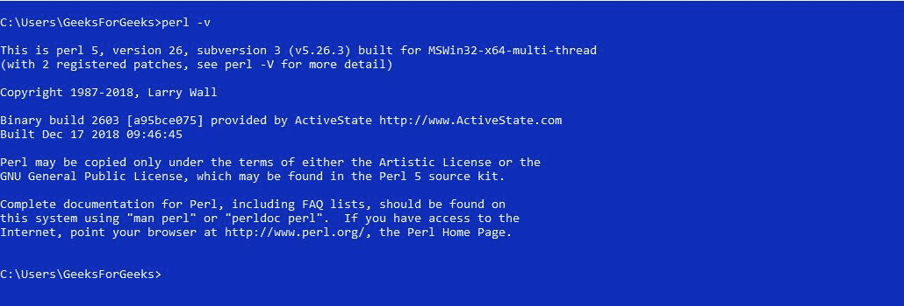**

### **下载和安装 Perl:**

****下载 Perl:**
在开始安装过程之前，您需要下载它。为此，适用于 Windows、Linux 和 MacOS 的所有 Perl 版本都可以在[perl.org](https://www.perl.org/get.html)
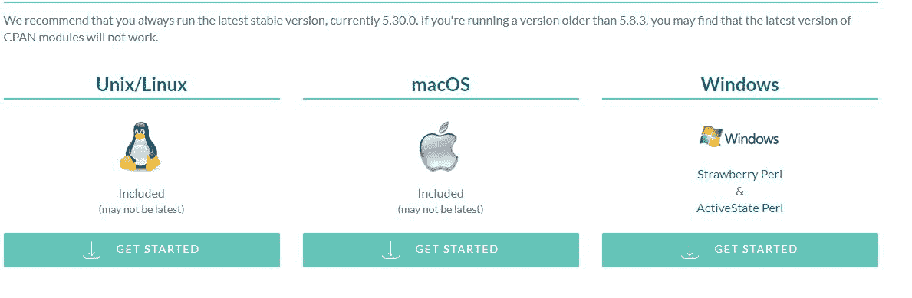
上获得。下载 Perl 并按照进一步的说明安装 Perl。**

****从安装开始:**** 

## **Windows 操作系统**

*   ****入门:**
    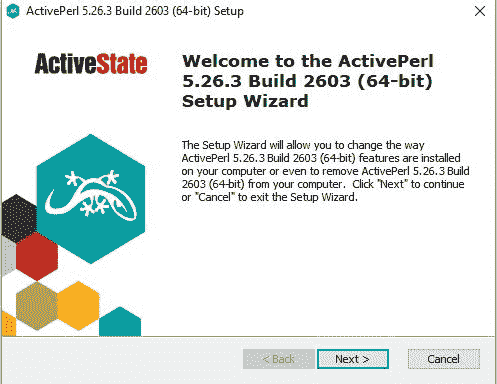**
*   ****完成用户许可协议:**
    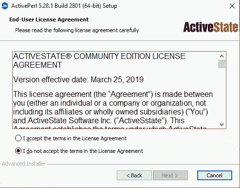**
*   ****选择安装什么:**
    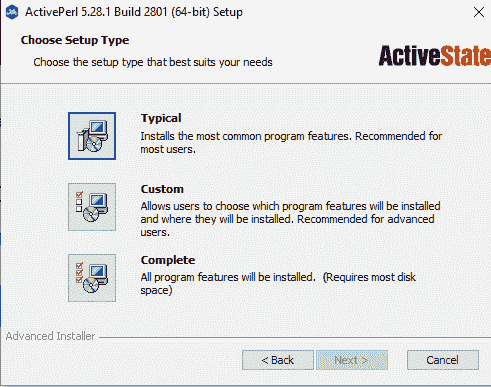**
*   ****安装流程:**
    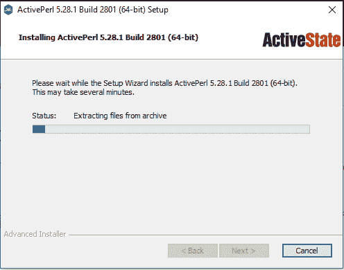**
*   ****安装完毕:**
    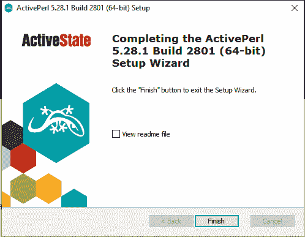**

## **Linux 操作系统**

*   ****更改目录以安装 Perl:**
    **
*   ****开始安装过程:**
    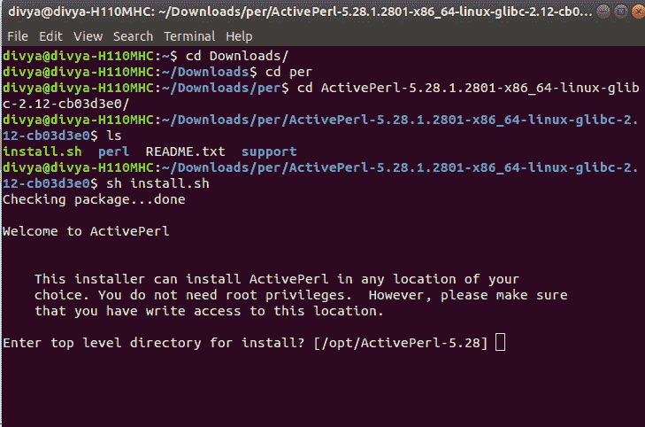**
*   ****选择安装 Perl 的目录:**
    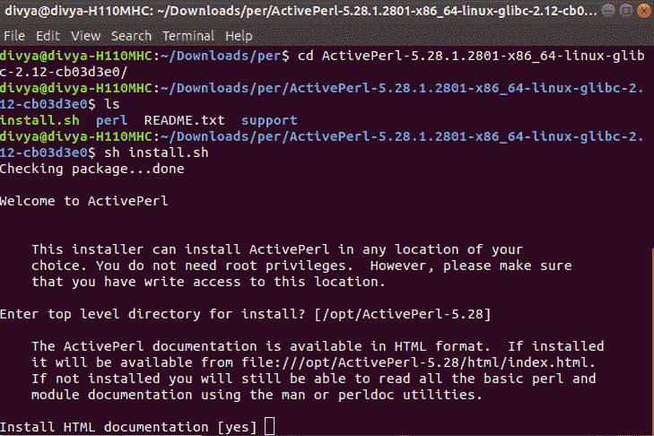**
*   ****完成安装:**
    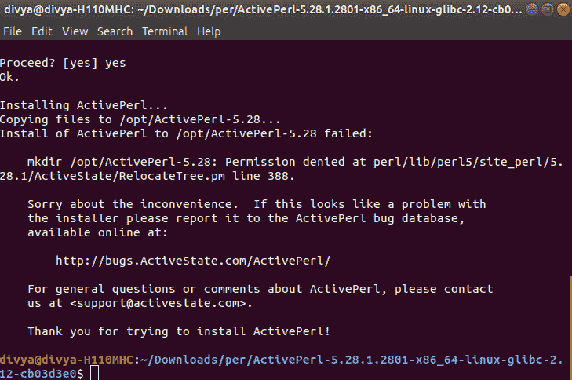**

## **苹果电脑**

*   ****入门:**
    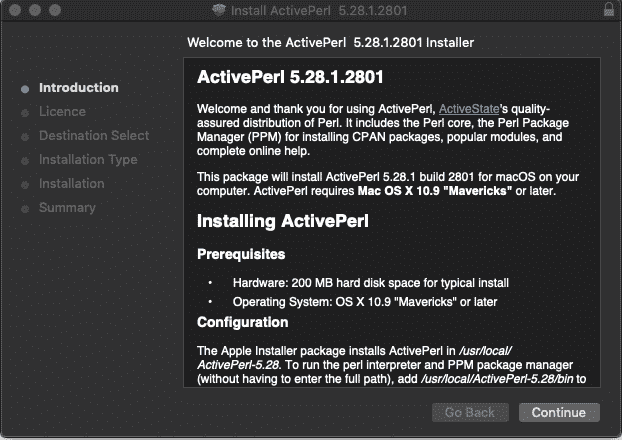**
*   ****完成用户许可协议:**
    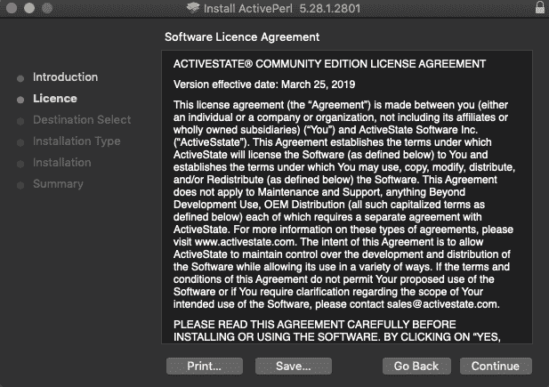
    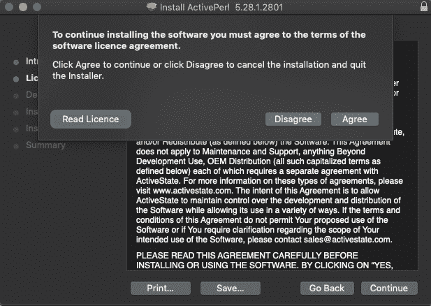**
*   ****选择安装地点:**
    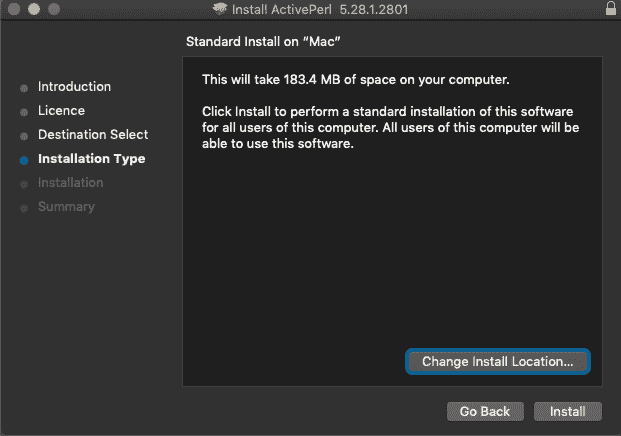**
*   ****安装流程:**
    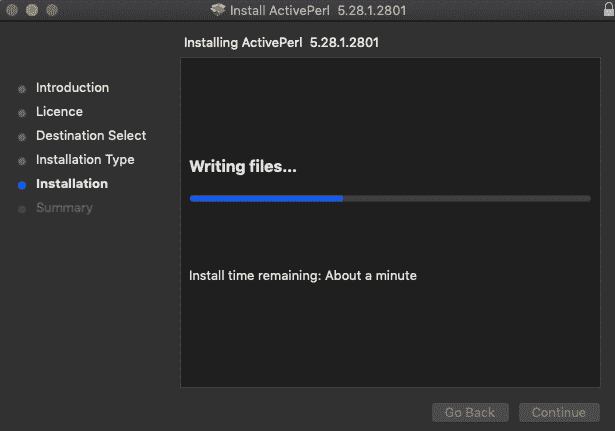**
*   ****完成安装:**
    **

**完成安装过程后，可以使用任何 IDE 或文本编辑器编写 Perl 代码，并使用以下命令在 IDE 或命令提示符下运行这些代码:**

```perl
**perl file.pl**
```

**这里有一个示例程序，从使用 **Perl 编程**开始:[你好 Perl 世界程序](https://www.geeksforgeeks.org/hello-world-program-in-perl/)**