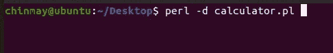
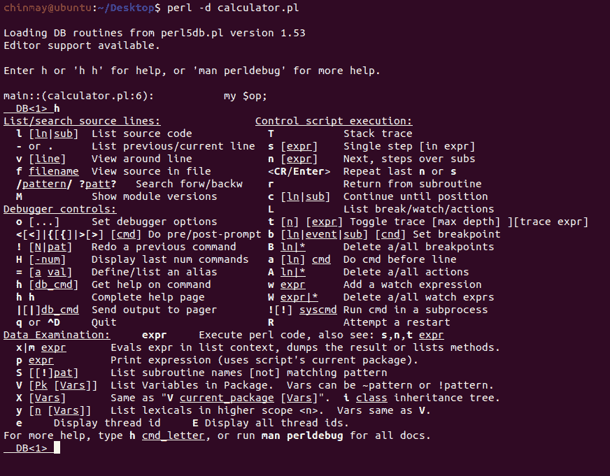

# Perl–调试器简介

> 原文:[https://www . geesforgeks . org/perl-调试器简介/](https://www.geeksforgeeks.org/perl-introduction-to-debugger/)

[Perl](https://www.geeksforgeeks.org/introduction-to-perl/) 是一种通用、高级解释和动态编程语言。由于 Perl 在语法上与其他广泛使用的语言非常相似，所以用 Perl 进行编码和学习更容易。但是完美的程序很难在第一次尝试中得到。他们必须经历各种调试步骤来修复所有错误。这些程序可能包含一些导致代码执行失败的错误。

#### 什么是 bug？

软件中的 **bug** 是导致软件无法执行指定任务的缺陷、错误、故障或失败。简单地说，当我们在编码过程中出错时，我们称之为 bug。我们通过两个参数来衡量缺陷对软件的影响，即严重性和优先级。

#### 什么是调试？

发现并消除导致软件失败的软件错误的过程称为**调试。**调试阶段在收到 bug 报告后立即开始，当 bug 被消除并且程序正常工作时结束。

#### 是怎么做到的？

调试过程包括检测和清除软件程序中的错误。调试步骤如下:

*   **bug 的复制:**这是调试的第一步，我们尝试通过给出相同的一组输入来重新创建导致程序失败的步骤。
*   **理解 bug:** 这一步我们尝试分析导致程序失败的原因。为此，我们可能需要彻底了解程序的执行。因此，调试器通过提供更好的理解程序的机制来帮助这个过程。它逐行检查程序，可以使用断点暂停程序，使用 watch 跟踪变量、寄存器等。
*   **定位 bug:** 知道错误行为后，我们的目标是找到产生这个错误的那部分源代码。这个活动被称为定位 bug。为此，我们可能需要检查源代码，观察变量的变化等。
*   **修复 bug 并重新测试程序:**这是调试的最后一步，在这里我们修复软件程序中的 bug。然后我们必须重新测试程序，看看 bug 是否被删除，所有的修正是否到位。在这个步骤中，程序的其他部分也可能受到影响。因此，可能必须进行影响分析，以识别受影响的部分并重新测试它们。这个过程被称为*回归测试。*

#### 进入和退出调试器

要进入调试器，我们可以键入以下命令:

```
perl -d program_name
```





**退出调试器**
要退出调试器，我们可以按 **q** 或使用:

```
Ctrl+D or Ctrl+Z
```