# 调试器中的 Perl |行操作命令

> 原文:[https://www . geesforgeks . org/perl-line-action-commands-in-a-debugger/](https://www.geeksforgeeks.org/perl-line-action-commands-in-a-debugger/)

[Perl](https://www.geeksforgeeks.org/introduction-to-perl/) 中的调试器为我们提供了**行动作命令**的特性，但是在深入探讨它们之前，让我们先来谈谈实际的动作是什么:因此，动作基本上是一条指令，只要它到达特定的行，就被给予调试器来执行它。执行这些操作的原因是为了使调试变得容易。
例如

```perl
$i = 0;
for($i = 0; $i <= 9; $i++)
{

}
print($i);
```

以上是 for 循环的基本程序。现在，如果我们在第 4 行指定一个行操作，要求调试器在每次迭代后打印 I 的值，那么我们可以检查循环是否正确执行。所以通过这种方式，它们有助于调试。
因此，为了指定这些行动作，Perl 调试器为您提供了**行动作命令**的功能。这些命令有助于指定行操作。行操作命令是我们指定在程序执行到达指定行时执行的语句。最常见的行操作是打印变量值并将不正确的变量值重置为所需值。
以下是线路动作命令:

1.  **[a] Command**
2.  **[a] Command**
3.  **< command**
4.  **> command**

### 命令

**`'a' command`** 指定特定代码行的动作。这个动作可以是任何有效的 Perl 命令。每次执行指定的行时，都会执行指定的操作。

**语法**

```perl
a line no. command to be executed [condition]
```

如果未指定行，则默认情况下，每次执行当前行时都会执行该操作。

**例:**
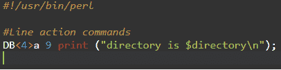

**输出:**
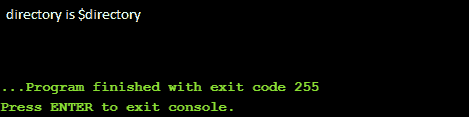

**解释:**
在上面的例子中，调试器一到达第九行就执行上面的行。因此，调试器将显示上述语句。

要创建多行的行操作，只需一个接一个地指定语句。如果您需要多行来编写要执行的完整动作，请在第一行末尾使用**\ '**。

**示例:**

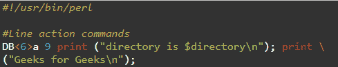
**输出:**

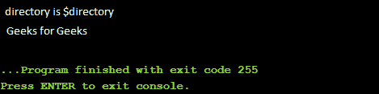

您也可以为动作的执行指定一个条件(**是可选的**)。首先评估该条件，如果结果为真，则仅对指定行执行操作，否则不执行任何操作。
在默认情况下，当没有条件时，调试器认为条件已经为真。因此，每次执行到达指定行时，都会执行该操作。

**注:**

```perl
There can be only one action per line.
```

### 命令

**`'A' command`** 用于删除之前使用`**'a' command**`指定的线动作。它会删除命令中指定的行的行操作。
**语法:**

```perl
 A lineno.;
```

**例:**
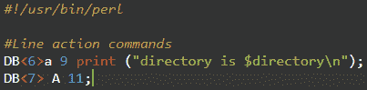

在上面的示例中，为第 11 行指定的行操作将被删除。

请注意，在 5.6.1 之前的 Perl 版本中， **`'A' command`** 会删除所有指定的行操作。
在 Perl 5.6.1 及以后的版本中，只有当星号作为参数给出时，所有的动作才会被删除。

**例**

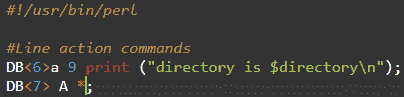

### < and >命令

**`< and > commands`** 在你知道其中一个变量有错误值，但是你不知道哪个语句给变量赋值错误的时候很有用。因此，通过使用`**< and > command**`您可以在语句执行前后打印变量值。

**<命令**
`**'<' command**`用于指定在 Perl 调试器完成执行语句之后，调试器进一步要求更多调试语句之前要执行的行操作。

**语法:**

```perl
 < action to be performed;
```

**例:**
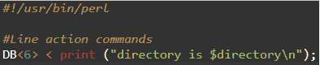

**输出:**
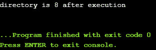

上面示例中给出的命令告诉 Perl 调试器在再次停止程序执行并开始调试之前打印指定的语句。

**>命令**
`**'>' command**`用于指定在执行代码的进一步语句之前要执行的操作。因此，该动作将在执行某一行代码后执行，
**语法:**

```perl
> action to be performed;
```

**例:**
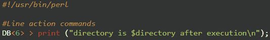

**输出**
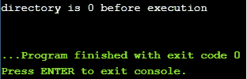

要删除使用`**< and > command**`指定的动作，只需重新输入用于指定该动作的命令。

```perl
DB<8> < ;
```

这将删除使用`**< command**`指定的动作。

```perl
DB<9> > ;
```

这将删除使用`**> command**`指定的动作。

### 使用“L”命令显示行操作

**`'L' command`** 用于显示断点、动作和观察点。从而帮助用户查看代码中的所有操作、断点和观察点。现在让我们学习如何使用它来显示动作。

**示例:**

```perl
DB<3> L a;
```

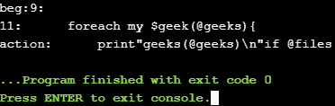

使用`**'L' command**`在调试中显示动作效益。例如:如果您想删除某个特定的操作，但不知道它对应于哪一行。因此，您可以首先使用`**'L' command**`显示所有动作，然后使用`**'A' command**`删除所需的动作。