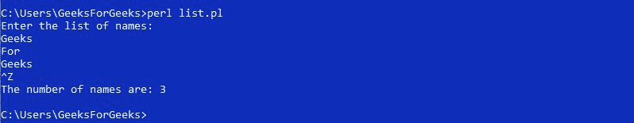

# Perl |列表上下文敏感度

> 原文:[https://www . geesforgeks . org/perl-list-context-sensitivity/](https://www.geeksforgeeks.org/perl-list-context-sensitivity/)

**简介**
在 Perl 中，*函数调用*、*术语*和*语句*的解释不一致，这取决于其上下文。Perl 中有两个关键的上下文，即列表上下文和标量上下文。在列表上下文中，Perl 给出了元素列表。但是在标量上下文中，它返回数组中元素的数量。
Perl 假定*在“列表上下文”中列出*值，因为列表可以有任意数量的元素，或者它可以只有一个元素，或者它甚至可以被去相关。

**Creating List Context**

可以使用数组和列表生成列表上下文。

*   **Assignment to an array:**
    **Example:**

    ```perl
    @y = LIST;
    ```

    ```perl
    @y = @z;
    ```

    ```perl
    @y = localtime();
    ```

    这里，localtime()是 Perl 中的一个函数名，它揭示了数组中时间的数字描述。

*   **Assignment to a list:**
    **Example:**

    ```perl
    ($x, $y) = LIST;
    ```

    ```perl
    ($x) =  LIST;
    ```

    在这里，列表还可以创建列表上下文，即使列表只有一个元素。

**示例:**

```perl
#!/usr/bin/perl
# Perl program of creating List Context

# array of elements
my @CS = ('geeks', 'for', 'geeks', 'articles'); 

# Assignment to a list 
my ($x, $y) = @CS; 

# Assignment to an Array
my @z = @CS;        

# Assignment of a function
# to an Array
my @t = localtime();

# Displays two elements of an
# array in List
print "$x $y\n";

# Displays an array of elements
print "@z\n";    

# Displays time stored in array 
# in number format
print @t;
```

**Output:**

```perl
geeks for
geeks for geeks articles
201761121191690

```

这里，在分配给 List 时，List 中有两个标量，即$x 和$y，因此只分配了数组的两个元素。

**Arrays in List Context:**

为了用一个数组激发 List Context，我们需要将一个数组赋给另一个数组。
**例:**

```perl
#!/usr/bin/perl

# Program for arrays in List Context
use strict;
use warnings;
use 5.010;

my @x = ('computer_', 'science_', 'portal_',
         'for_', 'GeeksforGeeks');

# Assignment of an array to 
# another array
my @y = @x; 

# Printing the new array
print @y;
```

**Output:**

```perl
computer_science_portal_for_GeeksforGeeks

```

这里，一个数组中的元素被复制到另一个数组中。

**Use of if-statement in List Context**

if-语句用于列表上下文中，仅当数组中存在元素时，才显示包含在“if”中的语句。
**例:**

```perl
#!/usr/bin/perl

# Program to display content of if-statement
use strict;
use warnings;
use 5.010;

my @x = ('G', 'f', 'G');

# Statement within 'if' will be executed 
# only if the array is not empty
if (@x)
{
    print "GeeksforGeeks";
}
```

**Output:**

```perl
GeeksforGeeks

```

这里，如果指定的数组有一定数量的元素，那么 if-condition 为真，它会激发 if-语句的内容，但是如果数组为空，那么 if-condition 为假，因此它不会执行 if-语句中的语句。

**Reading in List Context:**

*“STDIN”*是 Perl 中的一个 readline 运算符。为了将读线操作符置于列表上下文中，需要将该操作符指定给一个数组。
**例:**

```perl
#!/usr/bin/perl
use strict;
use 5.010;

# Asking user to provide input 
print "Enter the list of names:\n";

# Getting input from user 
my @y = <STDIN>;

# Used to remove extra line of spaces
chomp @y;

# Printing the required output
print "The number of names are: " . 
                 scalar(@y) . "\n"; 
```

**Output:**

**这个程序是这样工作的:**
**第一步:**用回车键一个一个输入要存储在数组中的名字。
**第二步:**在 Linux 系统下按 Ctrl-D，而在 Windows 系统下按 Ctrl-Z，表示输入结束。
**第三步:** chomp 用于删除每次输入后添加的多余行。
**步骤 4:** 使用标量打印数组中的元素个数，因为“标量上下文中的数组”只能返回数组的长度。