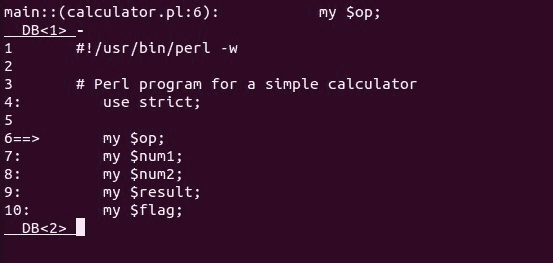

# Perl–用调试器列出您的程序

> 原文:[https://www . geesforgeks . org/perl-listing-你的程序带调试器/](https://www.geeksforgeeks.org/perl-listing-your-program-with-a-debugger/)

完美的程序很难在第一次尝试中得到。他们必须经历各种调试步骤来修复所有错误。有两种类型的错误——语法错误和逻辑错误。语法错误很容易修复，而且很快就能找到。另一方面，逻辑错误很难发现和修复。因此，需要调试器来修复这些错误。

在 [Perl](https://www.geeksforgeeks.org/introduction-to-perl/) 中，**调试器**是一个逐行执行程序的环境。这个过程也称为*单步执行*通过程序。要进入调试器，请遵循下面给出的语法:

**语法:**

```
perl -d <program_name>
```

**要调试的示例程序:**

```
#!/usr/bin/perl -w

# Perl program for a simple calculator
use strict;

my $op;
my $num1;
my $num2;
my $result;
my $flag;

calculator();

sub calculator 
{
    print "Enter operation you want to perform -Add, Sub, Mult, Div - ";
    chomp($op = <>);
    print "Enter first number: ";chomp($num1 = <>);
    print "Enter second number: ";chomp($num2 = <>);

    # Check for arithmetic operation
    if ($op =~ /^a/) {
        $result = $num1 + $num2;
    } elsif ($op =~ /^s/) {
        $result = $num1 - $num2;
    } elsif ($op =~ /^m/) {
        $result = $num1 * $num2;
    } elsif ($op =~ /^d/) {
        $result = $num1 / $num2;
    }

    # Print the answer of above operation
    print "Result: $result\n";

    # Calling the function recursively
    print "Do another calculation ? ";chomp($flag = <>);
    if ($flag =~ /^y/) {
        calculator();
    } else {
        print "Thank You !!\n";
    }
}
```

#### 使用调试器列出示例代码

1.  **‘l’ command :**
    The ‘l’ command lets us print a partial part of our scripts. There are several versions of this command that we can use –

    *   使用“l”——从光标位置开始显示 10 行脚本。
    *   使用 l4+6–从第 4 行开始显示 6 行脚本。
    *   使用 l4-7–显示脚本的第 4 行到第 7 行。
    *   使用 l20–在第 20 行显示脚本。
    *   使用 foo–显示 foo()函数的前 10 行。

    

2.  **‘-‘ command :**
    Outputs 10 lines of script before the current line. Suppose that you are current on line 20, then, lines 9 to 19 will be displayed.

    

3.  **‘w’ command :**
    Adds a watch expression.
    **Syntax:**

    ```
    w $variable_name
    ```

    

4.  **‘//’ and ‘??’ :**
    // and ?? search for a given pattern in the script. The /pattern/ searches for a pattern in forward direction while, the ?pattern? searches for a pattern in the backward direction from the current position of cursor.
    **Syntax:**

    ```
    /pattern/ or ?pattern?
    ```

    

5.  **‘S’ command :**
    This command lists all the subroutines not matching a given pattern.
    **Syntax:**

    ```
    S expression 
    ```

    