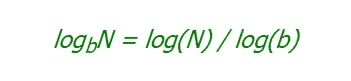

# Perl | log()函数

> 原文:[https://www.geeksforgeeks.org/perl-log-function/](https://www.geeksforgeeks.org/perl-log-function/)

[Perl](https://www.geeksforgeeks.org/introduction-to-perl/) 中的 log()函数返回传递给它的值的自然对数。如果在不传递值的情况下调用，则返回$_。log()函数可以通过公式
找到任意基地的日志

> **语法:**日志(值)
> 
> **参数:**
> **值:**要计算的对数
> 
> **在标量上下文中返回:**
> 浮点数

**例 1:**

```perl
#!/usr/bin/perl -w

# Calculating log of base 10 
# using log function
print "log10(2): ", log10(2), "\n";
print "log10(7): ", log10(7), "\n";
print "log10(9): ", log10(9), "\n";

# Function for log10 calculator
sub log10 
{
    my $n = shift;

    # using pre-defined log function
    return log($n) / log(10);
}
```

**输出:**

```perl
log10(2): 0.301029995663981
log10(7): 0.845098040014257
log10(9): 0.954242509439325

```

**例 2:**

```perl
#!/usr/bin/perl -w

# Calculating log of different 
# base using log function
print "log3(2): ", log3(2), "\n";
print "log5(7): ", log5(7), "\n";
print "log2(9): ", log2(9), "\n";

# Function for log3 calculator
sub log3 
{
    my $n = shift;

    # using pre-defined log function
    return log($n) / log(3);
}

# Function for log5 calculator
sub log5
{
    my $n = shift;

    # using pre-defined log function
    return log($n) / log(5);
}

# Function for log2 calculator
sub log2 
{
    my $n = shift;

    # using pre-defined log function
    return log($n) / log(2);
}
```

**输出:**

```perl
log3(2): 0.630929753571457
log5(7): 1.20906195512217
log2(9): 3.16992500144231

```