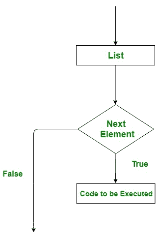
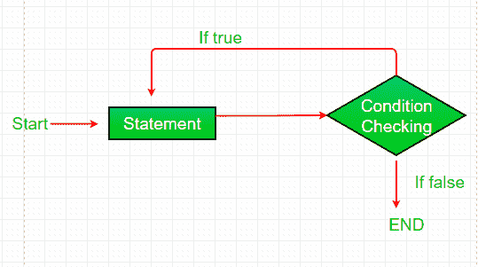
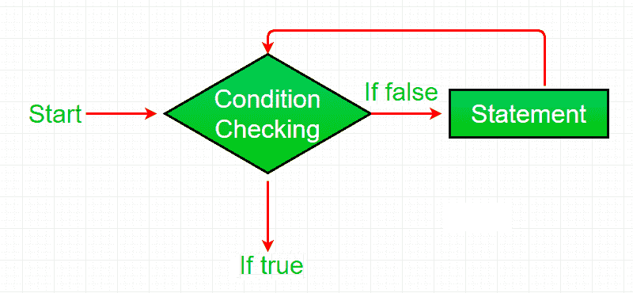

# Perl |循环(for，foreach，while，do…while，直到，嵌套循环)

> 原文:[https://www . geeksforgeeks . org/perl-loops-for-foreach-while-do-while-to-nested-loops/](https://www.geeksforgeeks.org/perl-loops-for-foreach-while-do-while-until-nested-loops/)

编程语言中的循环是一种功能，当某些条件评估为真时，它有助于重复执行一组指令或函数。循环使程序员的任务更简单。Perl 提供了不同类型的循环来处理程序中基于条件的情况。Perl 中的循环是:

用于循环

**“for”循环**提供了编写循环结构的简洁方式。与 while 循环不同，for 语句在一行中消耗初始化、条件和增量/减量，从而提供一个更短、更易于调试的循环结构。
**语法:**

```perl
for (init statement; condition; increment/decrement ) 
{
    # Code to be Executed
}
```

**流程图:**


for 循环作用于预定义的控制流。控制的流程可以通过以下方式确定:

*   **init 语句:**这是执行的第一条语句。在这一步中，我们初始化一个控制循环的变量。
*   **条件:**在此步骤中，评估给定的条件，如果条件为真，则运行 for 循环。这也是一个**入口控制循环**，因为在执行循环语句之前会检查条件。
*   **语句执行:**一旦条件评估为真，循环体中的语句就被执行。
*   **递增/递减:**此处循环控制变量发生变化(递增或递减)，用于更新下一次迭代的变量。
*   **循环终止:**当条件变为假时，循环终止，标志着其生命周期的结束。

**例:**

## Perl 语言

```perl
# Perl program to illustrate
# the for loop

# for loop
for ($count = 1 ; $count <= 3 ; $count++)
{
    print "GeeksForGeeks\n"
}
```

**输出:**

```perl
GeeksForGeeks
GeeksForGeeks
GeeksForGeeks
```

foreach 循环

foreach 循环用于迭代一个列表，变量一次保存一个列表元素的值。它主要用于当我们在一个列表中有一组数据，并且我们想要迭代列表的元素，而不是迭代它的范围。每个元素的迭代过程由循环自动完成。
**语法:**

```perl
foreach variable 
{
    # Code to be Executed
}
```

**流程图:**



**例:**

## Perl 语言

```perl
# Perl program to illustrate
# the foreach loop

# Array
@data = ('GEEKS', 'FOR', 'GEEKS');

# foreach loop
foreach $word (@data)
{
    print $word
}
```

**输出:**

```perl
GEEKSFORGEEKS
```

while 循环

while 循环通常使用括号中的表达式。如果表达式为真，则执行 while 循环体中的代码。当我们不知道希望循环执行的次数，但是我们知道循环的终止条件时，就使用 while 循环。也称为**入口控制循环**，因为在执行循环之前会检查条件。while 循环可以看作是一个重复的 if 语句。
**语法:**

```perl
while (condition)
{
    # Code to be executed
}
```

**流程图:**


**例:**

## Perl 语言

```perl
# Perl program to illustrate
# the while loop

# while loop
$count = 3;
while ($count >= 0)
{
    $count = $count - 1;
    print "GeeksForGeeks\n";
}
```

**输出:**

```perl
GeeksForGeeks
GeeksForGeeks
GeeksForGeeks
GeeksForGeeks
```

**无限 While 循环:** While 循环可以执行无限次，这意味着该循环没有终止条件。换句话说，我们可以说有些条件总是成立的，这会导致 while 循环执行无限次，或者我们可以说它永远不会终止。

*   **示例:**下面的程序将无限时间打印指定的语句，并在联机 IDE
    上给出运行时错误为*超出输出限制*

## Perl 语言

```perl
# Perl program to illustrate
# the infinite while loop

# infinite while loop
# containing condition 1
# which is always true
while(1)
{
    print "Infinite While Loop\n";
}
```

*   **输出:**

```perl
Infinite While Loop
Infinite While Loop
Infinite While Loop
Infinite While Loop
.
.
.
.
```

做…while 循环

做..while 循环与 while 循环几乎相同。唯一不同的是..而循环至少运行一次。第一次执行后检查条件。做..当我们希望循环至少运行一次时，使用 while 循环。也称为**退出受控循环**，因为在执行循环后会检查条件。
**语法:**

```perl
do {

    # statements to be Executed

} while(condition);
```

**流程图:**



**例:**

## Perl 语言

```perl
# Perl program to illustrate
# do..while Loop

$a = 10;

# do..While loop
do {

    print "$a ";
    $a = $a - 1;
} while ($a > 0);
```

**输出:**

```perl
10 9 8 7 6 5 4 3 2 1
```

直到循环

**直到循环**与 while 循环相反。它在括号中带一个条件，并且只运行到条件为假。基本上，它重复一条指令或一组指令，直到条件为假。它也是入口控制器循环，即首先检查条件，然后执行块内的指令集。
**语法:**

```perl
until (condition) 
{
   # Statements to be executed
}
```

**流程图:**



**例:**

## Perl 语言

```perl
# Perl program to illustrate until Loop

$a = 10;

# until loop
until ($a < 1)
{
    print "$a ";
    $a = $a - 1;
}
```

**输出:**

```perl
10 9 8 7 6 5 4 3 2 1
```

嵌套循环

嵌套循环是循环中的循环。Perl 编程也支持嵌套循环。并且上面讨论的所有循环都可以嵌套。
**Perl 中不同嵌套循环的语法:**

*   **嵌套为循环**

```perl
for (init statement; condition; increment/decrement ) 
{
    for (init statement; condition; increment/decrement ) 
    {
         # Code to be Executed
    }
}
```

*   **嵌套 foreach 循环**

```perl
foreach variable_1 (@array_1) {

    foreach variable_2 (@array_2) 
   {

       # Code to be Executed
   } 
}
```

*   **嵌套 while 循环**

```perl
while (condition)
{
    while (condition)
    {
        # Code to be Executed
    }
}
```

*   **嵌套 do..【while 循环** 

```perl
do{
    do{

        # Code to be Executed

       }while(condition);

}while(condition);
```

*   **嵌套直到循环**

```perl
until (condition) {

    until (condition) 
    {
       # Code to be Executed
    }
}
```

**例:**

## Perl 语言

```perl
# Perl program to illustrate
# nested while Loop

$a = 5;
$b = 0;

# outer while loop
while ($a < 7)
{
   $b = 0;

   # inner while loop
   while ( $b <7 )
   {
      print "value of a = $a, b = $b\n";
      $b = $b + 1;
   }

   $a = $a + 1;
   print "Value of a = $a\n\n";
}
```

**输出:**

```perl
value of a = 5, b = 0
value of a = 5, b = 1
value of a = 5, b = 2
value of a = 5, b = 3
value of a = 5, b = 4
value of a = 5, b = 5
value of a = 5, b = 6
Value of a = 6

value of a = 6, b = 0
value of a = 6, b = 1
value of a = 6, b = 2
value of a = 6, b = 3
value of a = 6, b = 4
value of a = 6, b = 5
value of a = 6, b = 6
Value of a = 7
```