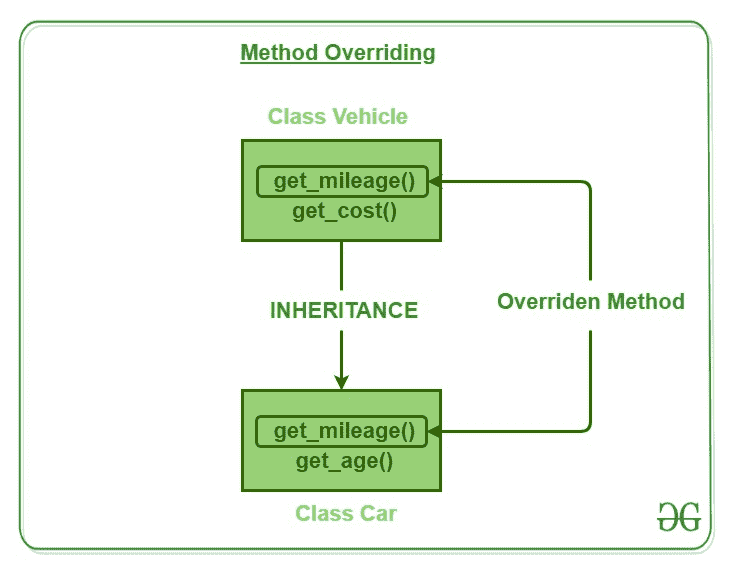

# Perl | OOPs 中的方法覆盖

> 原文:[https://www . geesforgeks . org/perl-method-override-in-oops/](https://www.geeksforgeeks.org/perl-method-overriding-in-oops/)

在任何面向对象的编程语言中，Overriding 都是一种允许子类或子类提供某个方法的特定实现的特性，该方法已经由其超类或父类之一提供。当子类中的方法与其超类中的方法具有相同的名称、相同的参数或签名以及相同的返回类型(或子类型)时，那么子类中的方法被称为覆盖超类中的方法。

**方法覆盖**意味着代码由两个或多个同名的方法组成，但是每个方法都有一个特殊的任务，并且任务之间有所不同。因此，从名称本身的字面意思来看，这意味着一个方法必须重写另一个方法。这个概念代表用完全相同的方法签名在派生类中重新定义基类方法。

方法重写是 Perl 实现**运行时多态性**的方法之一。执行的方法版本将由用于调用它的对象决定。如果父类的对象被用来调用方法，那么父类中的版本将被执行，但是如果子类的对象被用来调用方法，那么子类中的版本将被执行。换句话说，是被引用对象的类型(而不是引用变量的类型)决定了被重写方法的哪个版本将被执行。

Perl 中的方法重写可以通过下面的例子得到最好的解释:

我们有一辆方法为`get_mileage()`和`get_cost()`的基础级车辆和方法为`get_mileage()`和`get_age()`的衍生级汽车。现在，由于两个类的方法之一具有相同的名称，因此它们的执行将基于方法覆盖概念的原则。让我们看看这个例子，看看它们是如何执行的。


*   **Creation of Base class:**

    ```
    # Declaration and definition of Base class
    use strict;
    use warnings;

    # Creating parent class
    package vehicle;

    sub new
    {

        # shift will take package name 'vehicle' 
        # and assign it to variable 'class'
        my $class = shift;

        my $self = {
                    'distance'=> shift,
                    'petrol_consumed'=> shift
                   };

        # Bless function to bind object to class
        bless $self, $class;

        # returning object from constructor
        return $self;
    }

    # Method for calculating the mileage
    sub get_mileage
    {
        my $self = shift;

        # Calculating result
        my $result = $self->{'distance'} /
                     $self->{'petrol_consumed'};

        print "The mileage by your vehicle is: $result\n";

    }

    # Method for calculating the cost
    sub get_cost
    {
        my $self = shift;

        # Calculating result
        my $result = $self->{'petrol consumed'} * 70;

        print "The cost is: $result\n";
    }
    1;
    ```

*   **Creation of Derived Class:**

    ```
    # Declaring and defining derived class

    # Creating derived class
    package car;

    use strict;
    use warnings;

    # Using parent class
    use parent 'vehicle';

    # Overriding the method
    sub get_mileage
    {
        my $self = shift;

        # Calculating the result
        my $result = $self->{'distance'} /
                     $self->{'petrol_consumed'};

        print "The mileage by your car is: $result";
    }

    # Function to get age from user
    sub get_age
    {
        my $self = shift;

        # Taking input from user
        my $age = <>;

        # Printing the age
        print "Age is: $age\n";
    }
    1;
    ```

*   **用物体说明方法覆盖的过程:**

    ```
    # Calling the objects and
    # the methods of each class 
    # using the corresponding objects.

    use strict;
    use warnings;

    # Using the derived class as parent
    use car;

    # Object creation and initialization
    my $ob1 = vehicle -> new(2550, 170);
    my $ob2 = car -> new(2500, 250);

    # Calling methods using Overriding
    $ob1->get_mileage();
    $ob2->get_mileage();
    ```

**输出:**


可以看到，使用对象调用的类中的方法覆盖了不同类中同名的其他方法。在目标车辆上执行“获取里程”方法会通过在车辆类别中声明的方法打印出“您车辆的里程为:15”。而当在汽车对象上执行“获取里程”时，我们通过类汽车中的方法得到输出“你的汽车的里程是:10”。

### 为什么方法覆盖？

如前所述，被覆盖的方法允许 Perl 支持运行时多态性。**多态性**对于面向对象编程来说是必不可少的，原因有一个:它允许一个通用类指定对其所有派生方法通用的方法，同时允许子类定义这些方法中的一些或全部的具体实现。重写方法是 Perl 实现多态的 ***“一个接口，多个方法”*** 方面的另一种方式。

**动态方法调度**(运行时多态)是面向对象设计对代码重用和健壮性带来的最强大的机制之一。现有代码库无需重新编译就能在新类的实例上调用方法，同时保持干净的抽象接口，这是一个非常强大的工具。

重写的方法允许我们调用任何派生类的方法，甚至不知道派生类对象的类型。
因此，方法重写使得编程变得非常容易，因为不需要记住不同的名称，而创建不同的方法，记住方法中的过程要重要得多。